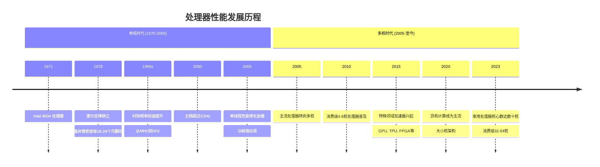
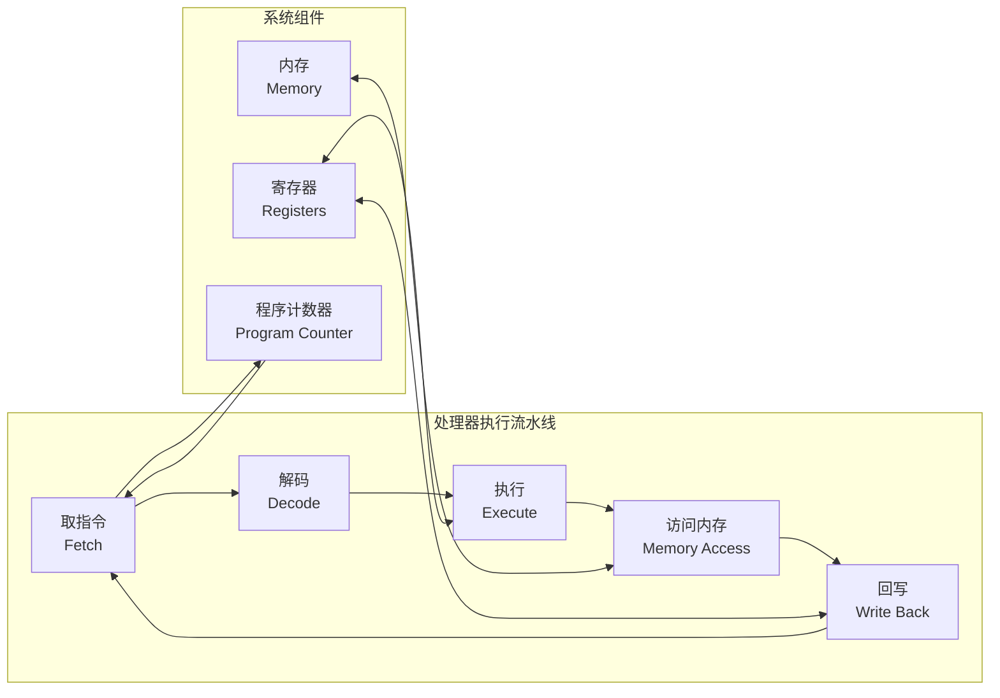
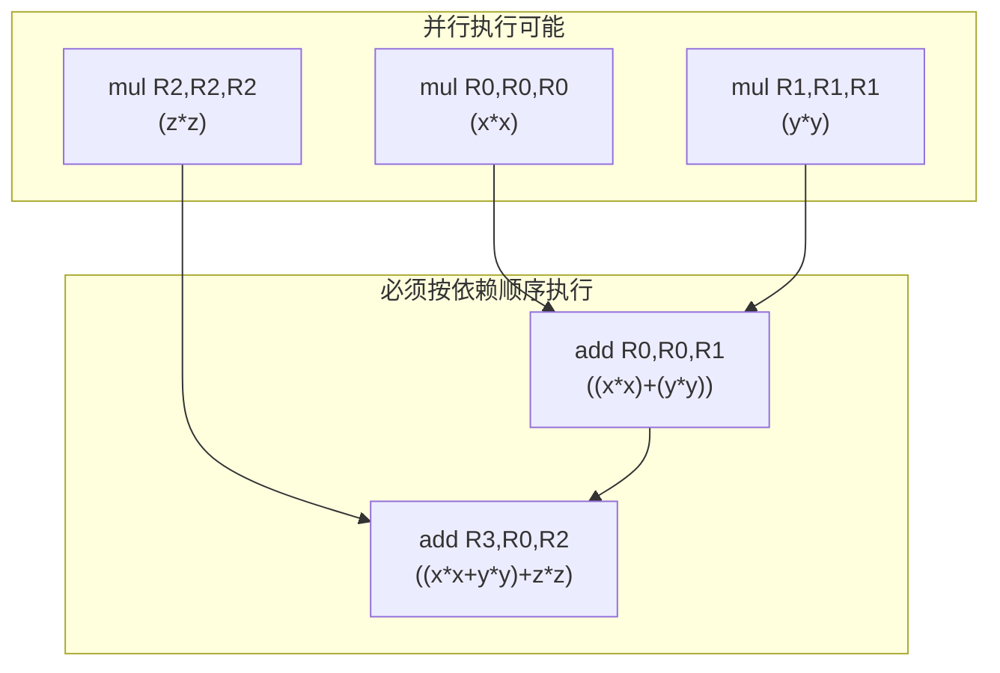
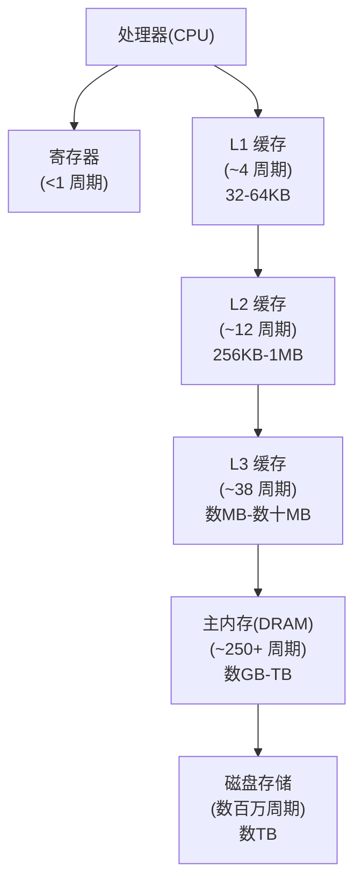

# 斯坦福CS149：并行计算 - 第一讲

## 引言：并行计算的时代背景与核心概念

在计算机硬件发展历程中，我们经历了从单处理器性能提升到多核并行计算的范式转变。本讲介绍并行计算的基础概念、历史背景和技术动机，探讨为什么现代软件必须拥抱并行计算才能获得持续的性能提升，以及并行计算面临的核心挑战和解决思路。同时，我们将了解处理器工作原理、内存层次结构等基础知识，为后续讲解高效并行算法与编程打下基础。

## 1. 并行计算基础概念

并行计算机是指"一组协作解决问题的处理单元"，具有以下关键特性：
- 使用**多个处理单元**
- 注重**性能**（快速解决问题）
- 需要处理单元间的**协作**
- 强调**效率**的重要性

并行计算的主要动机是**加速**，其基本公式为：
`加速比(使用P个处理器) = 执行时间(1个处理器) / 执行时间(P个处理器)`

## 2. 并行计算的核心挑战

并行计算面临几个根本性挑战和对应的解决方案：

| 挑战 | 问题描述 | 解决方案 | 效果 |
|------|---------|---------|------|
| **通信成本** | 处理器间的通信需要时间，成为瓶颈 | 降低通信频率与数据量 | 减少通信开销，提高加速比 |
| **工作分配不平衡** | 处理器负载不均，部分处理器空闲等待 | 平衡工作分配，动态负载均衡 | 提高系统整体利用率 |
| **扩展性限制** | 通信成本随处理器数量增加而增加 | 改进算法设计，降低通信依赖 | 实现更好的并行扩展性 |
| **同步开销** | 同步点导致处理器等待 | 减少同步频率，使用异步算法 | 减少等待时间 |
| **内存访问竞争** | 多个处理器访问同一内存位置导致争用 | 数据分区，利用局部性优化 | 减少内存访问冲突 |

并行思维的核心要素包括：
- **分解**：将工作分解为可安全并行运行的块
- **分配**：将这些块分配给处理器
- **管理通信/同步**：确保数据共享和协调不会限制加速比

## 3. 并行时代的到来：历史背景

### 历史视角
在过去（直到约15-20年前），单线程CPU性能大约每18个月翻倍：
- **意义**：几乎没有动力手动并行化软件；代码随着新硬件自然变快（"免费午餐"）
- **过去性能提升的两大驱动力**：
  1. **指令级并行化(ILP)**：超标量执行（同时执行单个线程内的多条指令）
  2. **提高CPU时钟频率**：提高处理器"滴答"速度

### 为什么需要并行化
摩尔定律仍在继续（晶体管数量约每2年翻倍），但单线程性能增长已停滞：
- **ILP已耗尽**：单个指令流内的可用并行性有限
- **频率扩展终结（"功耗墙"）**：
  - **动态功耗**：∝ `电容负载 × 电压² × 频率`。增加频率会大幅增加功耗
  - **静态功耗**：漏电流意味着晶体管即使不活动也会消耗功率
  - **高功耗 = 高热量**：热量限制了晶体管运行的速度和密度
  - 功率是关键设计约束（TDP示例：笔记本13W，台式机95W，GPU 450W，超级计算机兆瓦级）

**结论**：架构师必须添加**并行运行的更多执行单元**才能提高性能；软件开发者**必须**编写并行程序才能在现代硬件上获得显著性能提升。

## 4. 处理器工作原理与指令级并行

### 处理器基础知识
- **程序**：处理器指令的列表
- **指令**：描述处理器要执行的操作，通常修改状态（寄存器/内存）
- **处理器基础（简化模型）**：
  - **取指/解码**：获取下一条指令
  - **ALU（执行单元）**：执行操作
  - **执行上下文（寄存器）**：保存程序状态（变量值）
- **顺序执行**：简单处理器每个时钟周期执行一条指令

### 指令级并行(ILP)
- **核心理念**：如果指令相互独立，能否同时执行多条指令？
- **示例**：`a = x*x + y*y + z*z`
  - `mul R0, R0, R0` (x*x)
  - `mul R1, R1, R1` (y*y)
  - `mul R2, R2, R2` (z*z)
  - `add R0, R0, R1` ((x*x) + (y*y))
  - `add R3, R0, R2` (((x*x)+(y*y)) + (z*z))
  - 三条`mul`指令相互独立，可并发运行
  - 第一条`add`依赖于前两条`mul`
  - 第二条`add`依赖于第三条`mul`和第一条`add`

- **超标量执行**：处理器自动找出并在多个内部执行单元上并行执行独立指令（需要尊重程序依赖性）
- **指令依赖图**：可视化哪些指令必须等待其他指令
- **ILP收益递减**：大多数实用ILP被能够每时钟发出~4条指令的处理器捕获。添加更多执行单元对典型单线程代码几乎没有进一步益处

## 5. 现代并行硬件架构

现代系统通过并行和专业化实现性能提升：

| 架构类型 | 代表产品 | 核心/线程数 | 并行特点 | 主要应用场景 |
|---------|----------|------------|----------|------------|
| **多核CPU** | Intel Core i9 | 10核/20线程 | 大核心，强单线程性能 | 通用计算，单线程性能敏感应用 |
| **多核服务器** | AMD Threadripper | 64核/128线程 | 高核心密度，大缓存 | 虚拟化，服务器工作负载 |
| **GPU** | NVIDIA RTX 4090 | 16384 CUDA核心 | 大量简单核心，高内存带宽 | 图形渲染，深度学习，科学计算 |
| **移动SoC** | Apple A15 | 大核+小核混合，加速器 | 异构架构，能效优先 | 移动设备，电池供电设备 |
| **超级计算机** | Frontier | 9400+ GPU + CPU节点 | 分布式多GPU架构 | 大规模科学模拟，气候模型 |
| **专用加速器** | Google TPU | 矩阵运算单元 | 为特定任务优化 | 机器学习训练与推理 |

## 6. 效率的重要性

现代软件必须**并行且高效**。

### 功耗考量
- **为什么节省功耗？**
  1. **以更高性能运行（固定时间）**：避免热节流（芯片过热时会降频）
  2. **以足够性能运行（更长时间）**：电池寿命（移动设备关键因素）
- 移动设备严重依赖专用高效处理器（如Apple A15的NPU、GPU、图像/视频处理器）

### 专用硬件
- 核心主题：使用专用单元提高效率
- 示例：数据中心（Google TPU）、各种深度神经网络加速器（GraphCore、AWS Trainium、Cerebras、SambaNova、Apple神经引擎）

**实现效率 ≈ 高效访问数据**

## 7. 数据移动与内存层次结构

- **内存**：程序数据的存储
- **内存地址空间**：组织为字节数组，每个字节都有地址
- **加载/存储指令**：在处理器寄存器和内存之间移动数据
- **内存访问延迟**：内存提供数据的时间延迟（例如，数百个周期，数百纳秒）
- **停顿**：处理器等待（无法取得进展）因为所需数据尚未就绪（通常由内存延迟导致）

### 缓存系统
- 小型、快速的片上存储，保存主内存数据的子集
- 硬件实现细节 – 不改变程序正确性，仅影响性能
- 如果请求的数据在缓存中（"缓存命中"），则减少内存访问延迟（和停顿）
- 以**缓存行**为单位操作（数据块，例如64字节）

### 数据局部性
- **时间局部性**：最近访问的数据可能很快再次被访问（缓存将其保留在附近）
- **空间局部性**：最近访问数据附近的数据可能很快被访问（加载缓存行会带入附近数据）

### 内存层次结构

| 内存层级 | 典型容量 | 访问延迟(周期) | 访问延迟(时间) | 能量消耗(pJ/位) | 相对L1能耗 |
|---------|----------|--------------|--------------|--------------|-----------|
| 寄存器   | 数KB     | <1           | <1 ns        | ~0.1         | 1倍        |
| L1 缓存  | 32-64KB  | ~4           | ~1-2 ns      | ~0.5         | 5倍        |
| L2 缓存  | 256KB-1MB| ~12          | ~3-5 ns      | ~2-3         | 20-30倍    |
| L3 缓存  | 数MB-数十MB| ~38         | ~10-20 ns    | ~10          | 100倍      |
| DRAM    | 数GB-TB  | ~250+        | ~100 ns      | ~20-50       | 200-500倍  |
| 磁盘存储 | 数TB+    | 数百万+       | ~10-100 ms   | N/A          | N/A        |

### 数据移动的能量成本
- 移动数据（尤其是从DRAM）消耗的能量远超计算（从DRAM读取64位约1200 pJ）
- **意义**：减少数据移动对效率（功率/能量）至关重要。利用局部性是关键

## 总结

- 单线程性能增长极其缓慢
- 需要并行和专业化才能获得显著加速
- 编写**并行且高效**的代码现已成为必要
- 挑战包括分区、通信、同步和理解硬件（特别是数据移动/内存）
- 现代计算机具有巨大的处理能力，**如果能高效利用** 