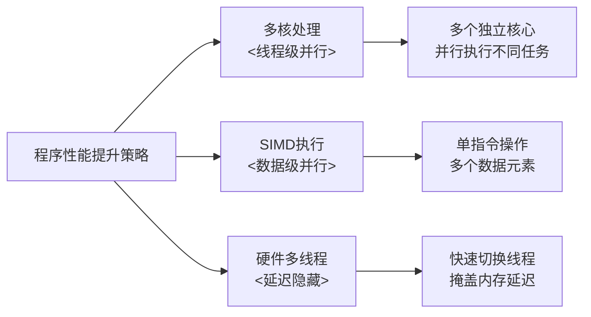
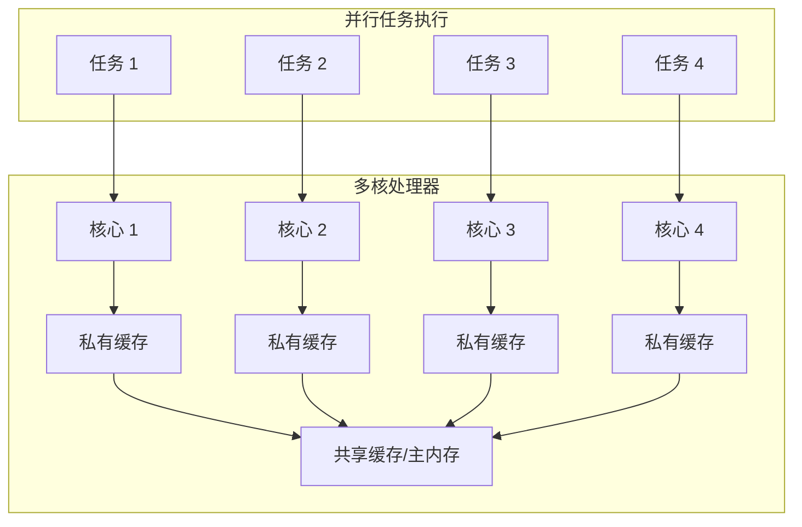
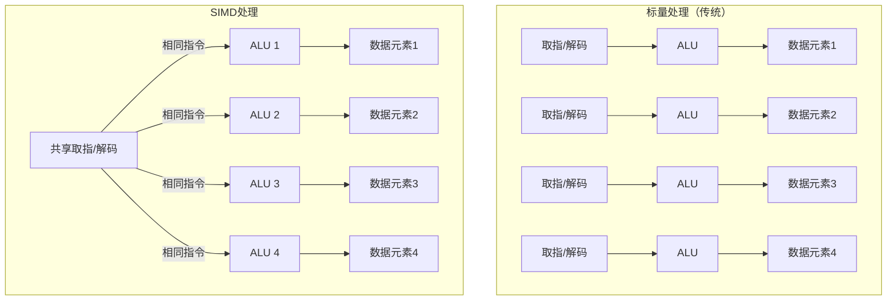
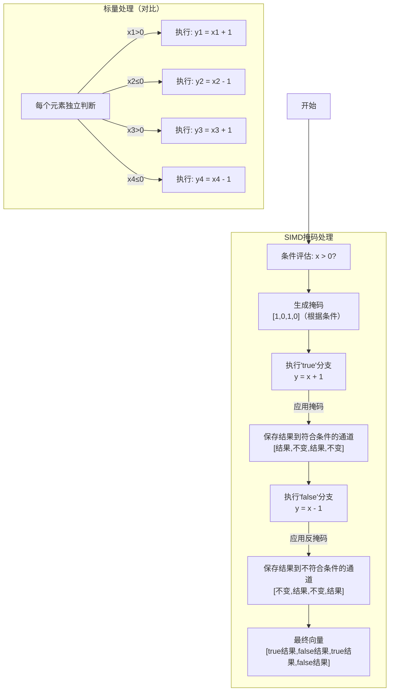
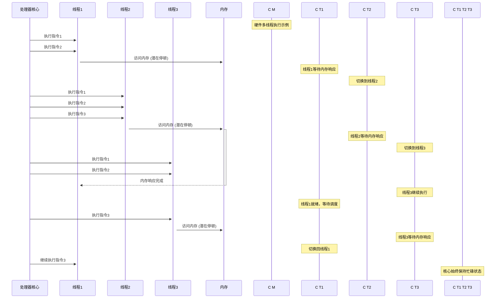
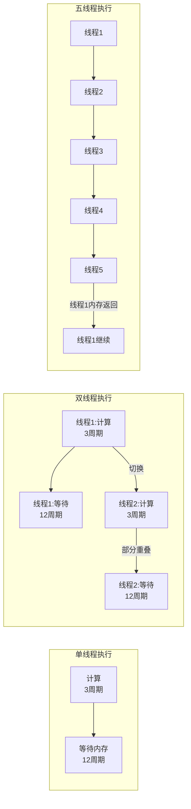
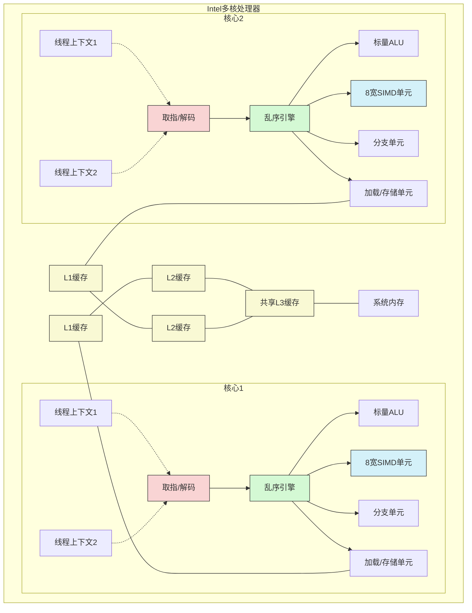
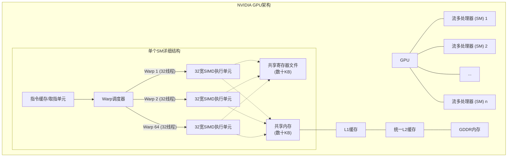
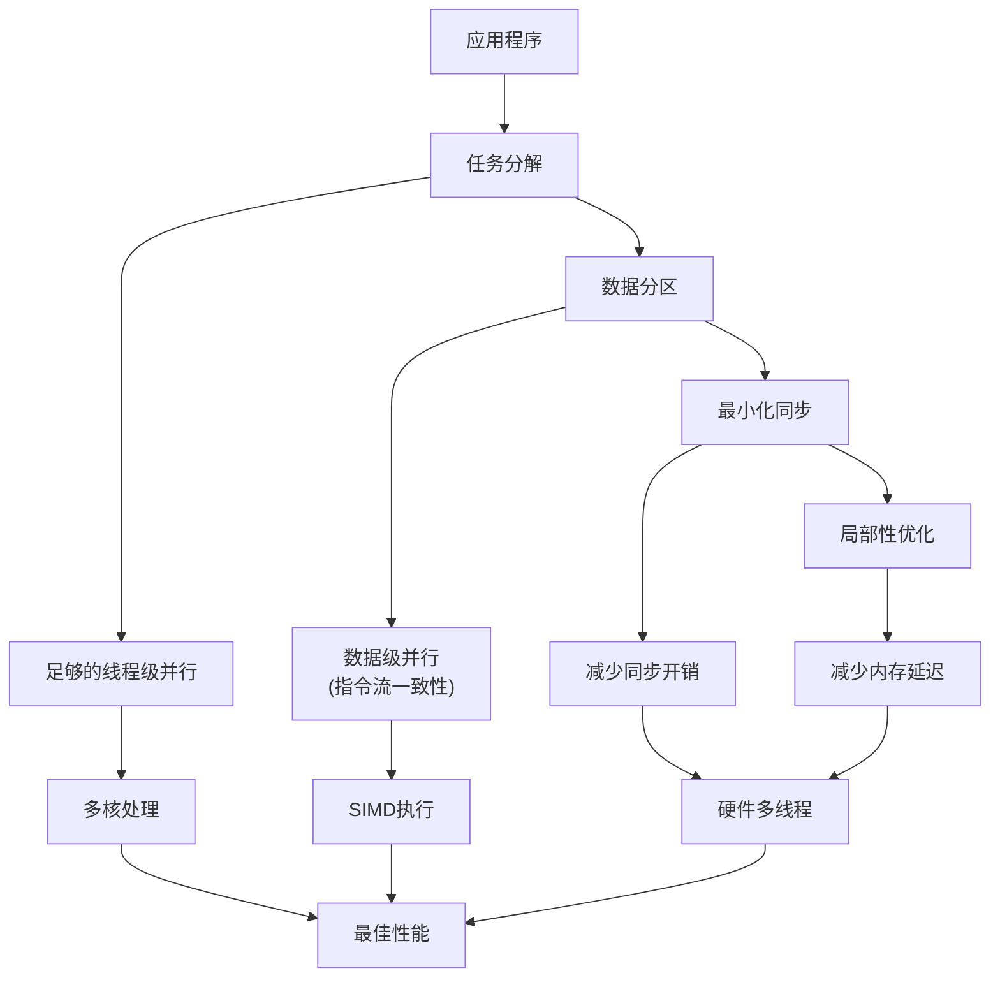

# 斯坦福CS149：并行计算 - 第二讲

## 引言：现代多核处理器的设计原理

现代处理器通过多种并行技术提高计算性能。本讲从软件工程师视角，深入剖析现代多核处理器如何实现高吞吐量，重点介绍三种关键的并行执行方式：多核处理、SIMD执行和硬件多线程。理解这些概念对于编写高效并行程序、充分利用现代处理器架构至关重要。

## 1. 核心概念复习

### 处理器基础架构
- **计算机程序**：本质是处理器指令的列表，通过编译器从高级语言转换为机器指令
- **处理器基本组件**：
  - **取指/解码**：确定下一条要执行的指令
  - **执行单元(ALU)**：执行实际计算操作
  - **执行上下文(寄存器)**：维护程序状态，存储操作数和结果
- **超标量执行**：处理器自动发现并并行执行同一指令流中的独立指令，同时保证结果与顺序执行一致

## 2. 核心思想一：多核处理器

### 概念与动机
在功耗墙和ILP挖掘殆尽的背景下，处理器厂商转向了一种新策略：不再将额外晶体管用于提升单核复杂度，而是制造更多处理器核心，实现线程级并行。

### 工作原理
- 多个独立处理核心同时执行不同的指令流
- 每个核心处理不同的数据元素或任务片段
- 即使单个核心性能略低，总体吞吐量仍可大幅提升（例如：2核×0.75性能=1.5倍潜在加速）

### 挑战与解决方案
- **挑战**：传统串行程序无法自动利用多核，甚至可能因单核性能降低而变慢
- **解决方案**：
  - **显式多线程编程**：程序员手动创建线程，将工作分配给不同核心
  - **数据并行抽象**：使用特定语言构造（如`forall`）声明迭代独立性，编译器自动生成多线程代码
  
### 现代多核处理器示例
- **通用CPU**：Intel Core i9（10核）
- **GPU**：NVIDIA GeForce RTX 4090（144个SM）
- **异构多核**：Apple A15（2大核+4小核）、Apple M1（4大核+4小核）
  - 大核心追求高性能，小核心追求能效
  - 适合不同计算负载和功耗需求

## 3. 核心思想二：SIMD处理

### 概念与动机
在单个核心内进一步提高并行度，特别适用于相同操作应用于多个数据元素的场景。

### 工作原理
- **SIMD**（Single Instruction, Multiple Data）：一条指令同时操作多个数据元素
- 通过增加执行单元（ALU）数量，但共享指令获取和解码逻辑，提高效率
- 同一指令广播到所有ALU，每个ALU处理不同的数据元素

### 实现方式
- **标量程序**：传统方式，每条指令处理一个数据元素
- **向量程序**：使用专门的向量指令和向量寄存器
  - 例如：AVX指令集的`_mm256_load_ps`可一次加载8个float值
  - 编译器将内在函数转换为硬件SIMD指令，操作宽位寄存器

### SIMD处理中的分支挑战
- **问题**：当不同数据元素需要执行不同代码路径时，SIMD效率降低
- **解决方案：掩码技术**
  1. 为每个数据通道生成条件掩码
  2. 执行所有分支的指令
  3. 通过掩码选择性保存符合条件的结果
- **性能影响**：
  - 分支导致部分ALU工作被浪费
  - 最坏情况下性能降至1/N（N为SIMD宽度）
  - 分支后代码可恢复全速执行

### SIMD关键术语
- **指令流一致性**：同一指令序列应用于多个数据元素的特性，高效SIMD的关键
- **发散执行**：不同数据元素执行不同指令的情况，通常由分支引起，降低SIMD效率

### SIMD实现方式对比
- **显式SIMD**：编译时由编译器执行向量化
  - 来源：程序员使用内在函数、语言构造或编译器自动向量化
  - 在二进制代码中可见专门的SIMD指令
- **隐式SIMD**（常见于GPU）：
  - 编译器生成标量指令
  - 硬件将多个线程的相同指令映射到SIMD单元
  - GPU的SIMD宽度通常为8到32

## 4. 核心思想三：硬件多线程

### 概念与动机
- **问题**：即使有缓存和预取，内存访问延迟仍然很高（DRAM约250+周期）
- **目标**：在一个线程等待内存时，让处理器继续执行有用工作

### 工作原理
在同一个核心上交错执行多个硬件线程：
- 当一个线程因内存访问停顿时，快速切换到另一个准备就绪的线程
- 核心为每个硬件线程维护独立的执行上下文（寄存器状态等）
- 通过充分利用ALU资源，提高整体吞吐量

### 吞吐量计算的权衡
- **优势**：提高系统整体吞吐量（单位时间完成的总工作量）
- **代价**：单个线程的完成时间可能增加，因为在可运行时可能需要等待调度

### 硬件资源平衡
- 片上存储线程上下文的空间有限，存在两种设计选择：
  - **多小上下文**：每线程工作集小，支持更多线程，更强的延迟隐藏能力
  - **少大上下文**：每线程工作集大，但线程数少，延迟隐藏能力较弱

### 核心利用率分析
- **示例**：假设线程执行3条算术指令（3周期），然后是内存加载（12周期延迟）
- **单线程情况**：核心利用率 = 3/(3+12) = 20%
- **多线程情况**：
  - 需要5个线程才能完全覆盖停顿时间（15/3=5）
  - 更高算术密度的程序需要更少的线程（如6指令+12周期延迟只需3线程）

| 线程数量 | 计算周期 | 内存延迟周期 | 总执行周期 | 核心利用率 | 说明 |
|---------|----------|------------|-----------|------------|------|
| 1 | 3 | 12 | 15 | 20% | 大部分时间CPU空闲等待内存 |
| 2 | 6 | 12 | 18 | 33% | 第二个线程部分覆盖等待时间 |
| 3 | 9 | 12 | 21 | 43% | 三个线程进一步提高利用率 |
| 4 | 12 | 12 | 24 | 50% | 计算时间与延迟时间平衡 |
| 5 | 15 | 12 | 27 | 56% | 计算时间开始超过延迟时间 |
| 6 | 18 | 12 | 30 | 60% | 继续提高利用率 |
| ∞ | ∞ | 12 | ∞ | 100% | 理论上无限线程可达到满利用 |

### 关键结论
1. 多线程处理器通过执行其他线程指令来避免停顿，但内存操作本身的延迟未变
2. 程序的算术密集度越高，隐藏内存延迟所需的线程数越少

### 硬件多线程类型
- **交错多线程**：每个时钟周期，核心选择一个线程执行一条指令
- **同时多线程(SMT)**：每周期从多个线程选择指令填充多个执行单元
  - Intel的超线程技术是SMT的一个实现，每核心通常支持2个硬件线程

## 5. 现代处理器架构整合

现代处理器通常结合上述三种技术，以最大化计算性能。

### 多种并行技术的组合比较
- **单核超标量**：执行单指令流，利用ILP
- **多核**：每核心执行不同指令流
- **SIMD多核**：每核心执行包含SIMD指令的指令流

### Intel现代处理器核心
- 典型特点：
  - 支持2路SMT（每核2个硬件线程）
  - 同时拥有标量ALU和多个8宽SIMD ALU
  - 超标量执行能力，每周期可执行多条指令

### NVIDIA GPU架构
- **SM(流多处理器)**是GPU的基本处理单元
- **典型特点**：
  - 支持大量硬件线程（每SM约64个warp）
  - 包含大量SIMD ALU（通常组织为32宽的SIMD）
  - 使用隐式SIMD映射
  - 大量寄存器和共享内存
- 整个GPU可支持数十万并发线程，提供极强的延迟隐藏能力

### 三种并行技术对比

| 特性 | 多核处理 | SIMD执行 | 硬件多线程 |
|------|---------|---------|-----------|
| **基本原理** | 多个独立核心执行不同指令流 | 单条指令同时操作多个数据元素 | 单核心快速切换多个线程执行 |
| **并行级别** | 线程级并行 | 数据级并行 | 指令级并行 |
| **硬件成本** | 高（完整的独立核心） | 中（仅增加执行单元和寄存器） | 低（仅增加上下文存储） |
| **编程复杂度** | 高（需处理线程创建、同步等） | 中（向量化、数据对齐） | 低（对程序员基本透明） |
| **适用场景** | 任务并行、异构计算 | 规则数据并行计算（如图像处理） | 内存延迟隐藏、IO密集型应用 |
| **局限性** | 通信开销、负载平衡挑战 | 分支降低效率、数据不规则时效率低 | 单线程性能可能下降 |
| **典型实现** | CPU多核、GPU多SM | AVX指令集、GPU的SIMT | Intel超线程、GPU的warp调度 |
| **性能瓶颈** | 线程间通信、同步成本 | 指令流发散、内存访问模式 | 共享资源争用 |

## 6. 高效利用现代并行处理器的要求

要充分发挥现代并行处理器的性能，软件需要满足三个关键要求：

1. **足够的并行工作**：提供充足的并行任务填满所有核心及其执行单元
2. **指令流一致性**：并行工作项应执行相同的指令序列，以高效利用SIMD资源
3. **超额并行**：暴露比处理器ALU总数更多的并行任务，以启用硬件多线程，隐藏内存访问延迟

## 关键术语总结

- **指令流**：处理器执行的指令序列
- **多核处理器**：包含多个独立处理核心的处理器
- **SIMD执行**：单指令多数据并行处理
- **指令流一致性**：多个数据元素执行相同指令的特性
- **硬件多线程**：处理器支持快速切换多个线程执行上下文的能力
  - **交错多线程**：时间上交替执行多个线程
  - **同时多线程(SMT)**：同时执行来自多个线程的指令 