# 斯坦福CS149：并行计算 - 第三讲

## 引言

本讲内容分为两大主题：计算机内存系统的延迟与带宽问题，以及并行编程抽象与实现。理解这两个主题对编写高效并行程序至关重要。第一部分解释为什么内存系统性能对计算性能有决定性影响；第二部分探讨如何通过编程抽象高效地利用并行硬件。

## 第一部分：内存系统性能 - 延迟与带宽

### 核心问题

现代处理器（如NVIDIA V100 GPU）拥有海量计算单元（5120个FP32 ALU），但真正的挑战是：如何为这些ALU提供足够的数据？元素级向量乘法（A[i]*B[i]）等简单操作是否能有效利用这些计算资源？理解这些问题需要我们深入延迟与带宽的概念。

### 延迟与带宽的概念

#### 基本定义
- **内存延迟(Memory Latency)**：传输一项数据所需的时间，从请求发出到数据到达的完整时间
- **内存带宽(Memory Bandwidth)**：内存系统向处理器提供数据的速率（单位时间传输的数据量，例如GB/sec）

| 特性 | 延迟 (Latency) | 带宽 (Bandwidth) |
|------|--------------|----------------|
| **定义** | 完成单次传输所需时间 | 单位时间内完成的传输量 |
| **单位** | 时间 (ns, μs) | 数据量/时间 (GB/s) |
| **影响因素** | 距离、介质物理特性、信号传播速度 | 通道数量、每通道传输率、并行度 |
| **优化方法** | 减少物理距离、使用更快介质 | 增加通道数、提高时钟频率、流水线传输 |
| **程序影响** | 单次内存请求的等待时间 | 整体计算速度的上限 |
| **改进难度** | 较难（受物理约束限制） | 相对容易（可通过并行化提高） |

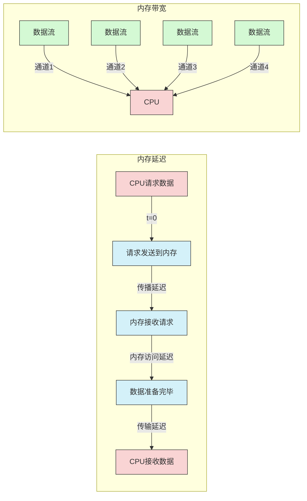

#### 高速公路类比
- **延迟**：单辆车从旧金山到斯坦福所需的时间（如0.5小时），取决于距离和速度
- **吞吐量/带宽**：单位时间内到达斯坦福的车辆数量（如2辆/小时）
- **提高吞吐量的方法**：
  1. **提高速度（减少延迟）**：将车速加倍，吞吐量加倍（4辆/小时）
  2. **增加"并行度"（增加通道）**：增加车道数量，总吞吐量成倍增加（4车道×2辆/小时=8辆/小时）
  3. **流水线（高效利用通道）**：让车辆紧密排列（保持安全距离），大幅提高单车道吞吐量（如100辆/小时）

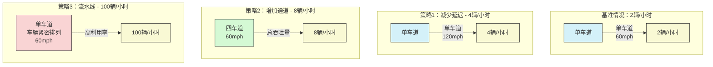

#### 关键洞察
高带宽可以通过增加并行传输通道实现，即使单项数据的传输延迟保持不变。理想的处理器利用率需要内存系统提供足够的数据带宽。

### 流水线与瓶颈

#### 洗衣服类比
- **操作序列**：洗衣→烘干→叠衣，每个步骤有独立的耗时
- **延迟**：完成一整批衣物的总时间（如2小时）
- **流水线优势**：当第一批衣物进入烘干机时，第二批可以开始洗涤，提高整体吞吐量
- **瓶颈效应**：整个系统的吞吐量受限于最慢的那个阶段

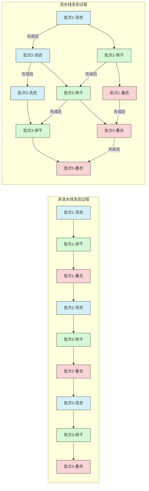

#### 在计算机中的应用
考虑多线程核心执行指令序列：`Load → Add → Add`：
- 加载指令发出后，需等待数据从内存传回
- 如果数据未到位，依赖于这些数据的计算指令将导致ALU停顿
- 即使有足够的硬件线程隐藏内存延迟，但如果内存带宽跟不上指令消耗数据的速度，核心仍会停顿

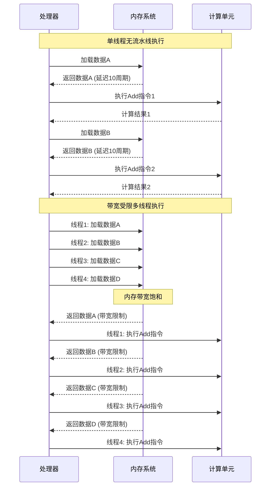

#### 带宽限制执行
- 当程序执行速率由内存系统提供数据的速率决定时，称为**带宽限制**
- 在这种情况下，即使内存系统100%工作传输数据，处理器仍会部分闲置
- 稳态下，处理器利用率不足是指令吞吐率和内存带宽共同作用的结果，与内存延迟或未完成请求数量无关

### 高带宽内存与实际应用分析

#### 高带宽内存技术
现代GPU（如NVIDIA V100）使用靠近处理器的高带宽内存技术（如HBM2，提供900 GB/s带宽）来缓解带宽瓶颈。

#### 元素级向量乘法案例分析
- 每次乘法需3次内存操作（2次加载，1次存储），假设float类型共12字节
- V100每时钟可执行5120次FP32乘法
- 为保持ALU完全忙碌，需要约98 TB/sec的内存带宽（5120乘法/时钟×12字节/乘法×1.6 GHz）
- V100实际带宽约900 GB/s（0.9 TB/s）
- 结论：此计算严重受带宽限制，GPU利用率不到1%，但由于其巨大的原始计算能力，仍远快于CPU

| 性能参数 | 理论值（无带宽限制） | 实际值（带宽限制） | 差距 |
|---------|-------------------|-----------------|------|
| **V100 FP32峰值** | 5120 ALU × 1.6 GHz = 8.2 TFLOPS | ~82 GFLOPS | ~1% 利用率 |
| **需求带宽** | 8.2 TFLOPS × 12 bytes/op = 98 TB/s | 900 GB/s | 实际带宽仅为需求的~0.9% |
| **操作频率** | 每周期5120操作 | 每周期~50操作 | ~1% 效率 |
| **指令执行方式** | 计算限制 | 带宽限制 | - |
| **加速选项** | 计算优化 | 带宽优化、减少内存访问 | - |

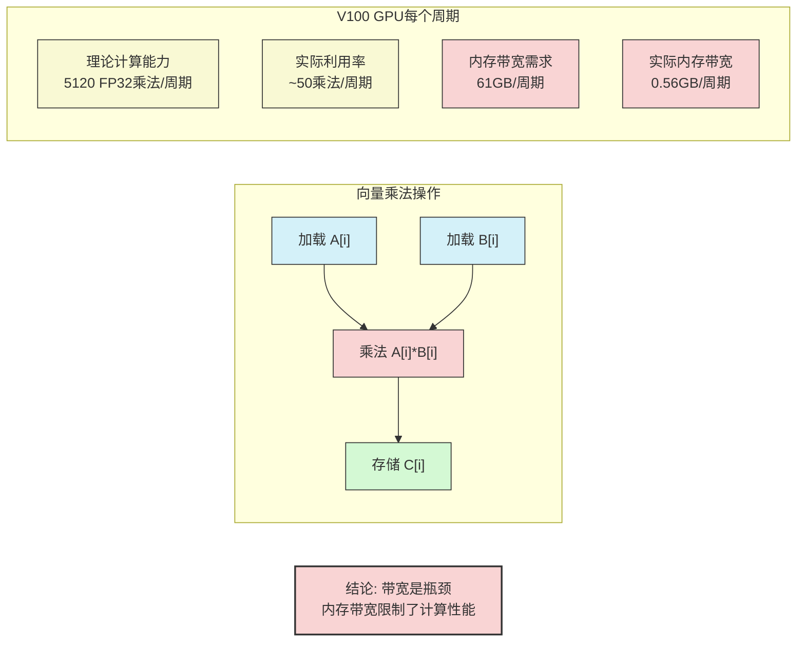

### 编程启示：带宽是关键资源

#### 高性能并行程序策略
- **减少内存访问频率**：
  - 重用已加载的数据（优化时间局部性）
  - 在线程间共享数据（需要线程协作）
- **倾向于执行额外的计算**来避免加载/存储（利用"计算相对便宜"的特性）

#### 核心要点
程序必须**不频繁地访问内存**才能高效利用现代处理器。

### 补充：指令流水线

- 现代处理器使用流水线技术：将指令执行分解为多个阶段（取指IF、解码ID、执行EX、写回WB等）
- **指令延迟**：单条指令完成需要多个周期（如4周期）
- **指令吞吐率**：通过流水线，理想情况下每个时钟周期可以完成一条指令
- 实际流水线可能更长（约20级）

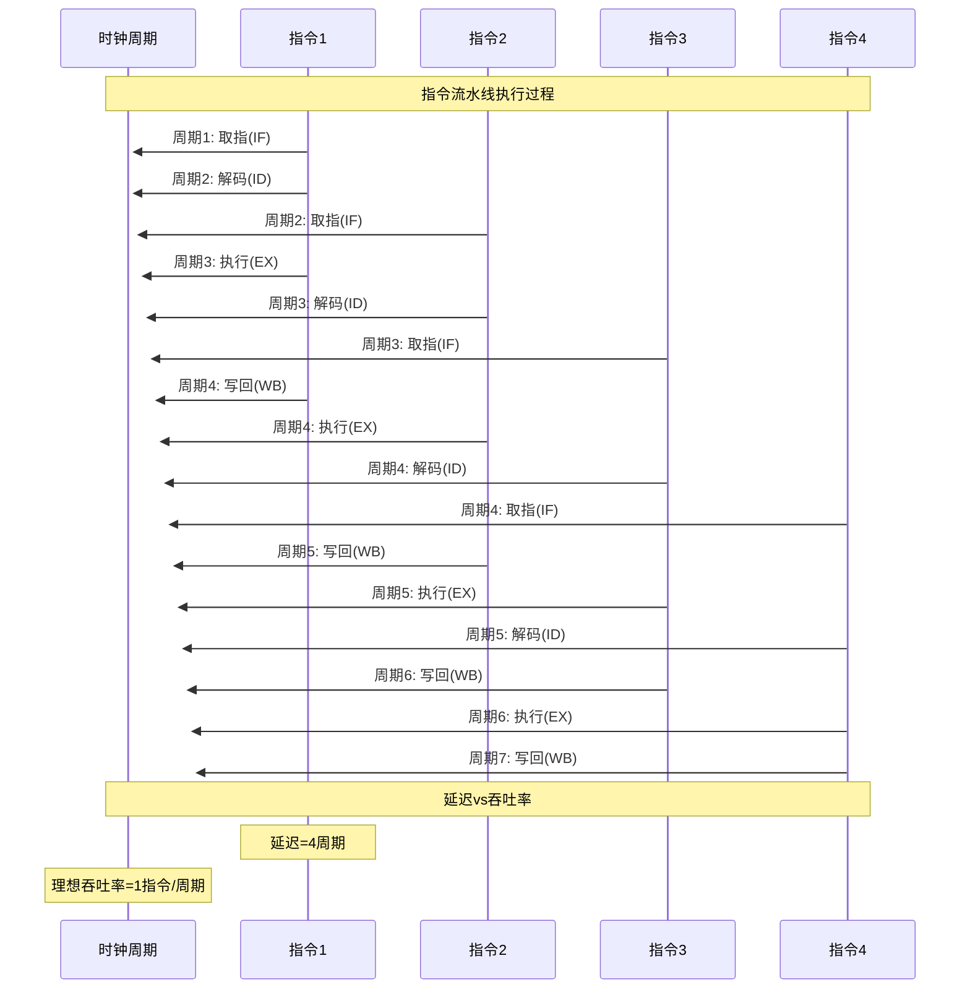

| 指标 | 非流水线处理器 | 流水线处理器 |
|------|--------------|------------|
| **指令延迟** | 4周期 | 4周期 |
| **4条指令总耗时** | 16周期 | 7周期 |
| **最大吞吐率** | 0.25条/周期 | 1条/周期 |
| **首条指令完成时间** | 4周期 | 4周期 |
| **处理器利用率** | 100% | 100% |
| **指令并行度** | 1 | 4 |

## 第二部分：并行编程抽象与实现

### 核心概念：抽象与实现的区别

- **抽象（Abstraction）**：编程模型提供的操作的含义是什么？给定程序和操作语义，程序应该计算出什么结果？
- **实现（Implementation/Scheduling）**：结果将如何在并行机器上计算出来？操作将以何种顺序执行？由哪些执行单元计算？

理解抽象与实现的区别是掌握并行编程的关键。混淆两者是学习并行编程常见的困惑来源。

### ISPC：一种SPMD编程模型

#### ISPC基本概念
- **ISPC（Intel SPMD Program Compiler）**：一种实现SPMD（Single Program Multiple Data）编程模型的编译器
- **SPMD编程抽象**：定义一个函数，然后在不同输入参数上并行运行该函数的多个实例

#### SPMD执行模型
- 调用ISPC函数会派生一个"gang"（一组）ISPC"程序实例"
- 所有实例并发运行ISPC函数代码
- 每个实例拥有自己本地变量的副本
- 函数返回时，所有实例已完成

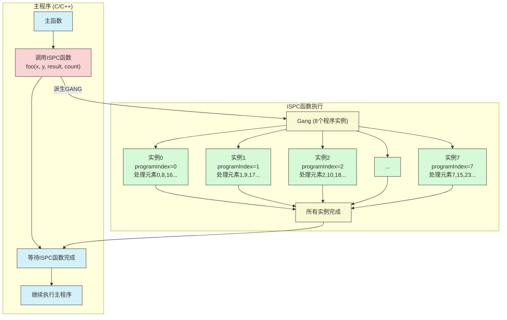

#### ISPC关键字
- **programCount**：同时执行的实例数量（gang的大小，uniform值）
- **programIndex**：当前实例在gang中的索引（0到programCount-1，varying值）
- **uniform**：类型修饰符，表示该变量在所有实例中具有相同的值（主要用于优化）

### ISPC的实现方式

#### SIMD实现
- ISPC gang抽象是使用SIMD指令在CPU的一个核心上的一个线程内实现的
- gang中的实例数量通常等于硬件的SIMD宽度（或其倍数）
- ISPC编译器生成包含SIMD指令的C++函数体

#### 循环迭代分配策略
- **交错分配（默认方式）**：实例k处理迭代k, k+programCount, k+2*programCount, ...
  - 优势：gang中的实例访问连续的内存地址，对SIMD的load/store指令非常高效
- **块状分配**：将迭代分成块，每个实例处理一个连续的块
  - 缺点：实例访问非连续内存地址，需要更复杂、更昂贵的"gather"SIMD指令

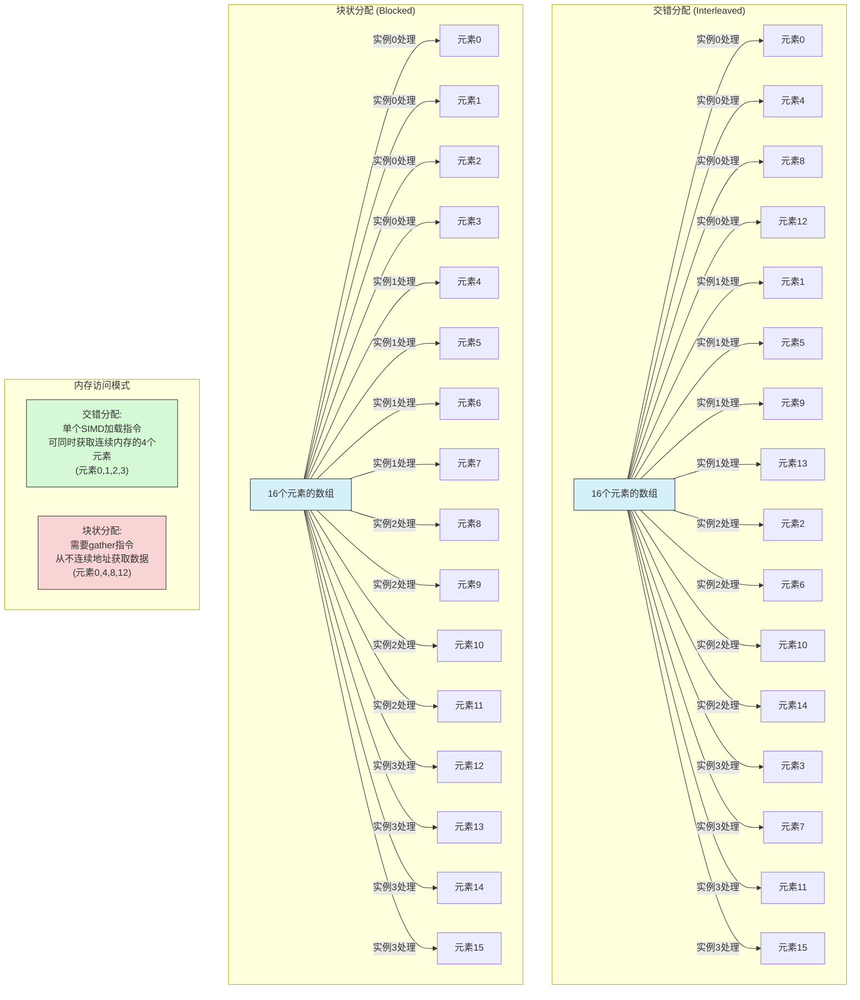

### 高级抽象：foreach

- **foreach(i = 0 ... N)**：ISPC语言构造，声明并行循环迭代
- **语义**：程序员声明这些迭代构成了整个gang需要执行的工作（而非单个实例）
- **实现**：ISPC负责将迭代分配给gang中的程序实例（可使用交错、块状或动态分配等策略）
- **优势**：允许程序员像编写串行程序一样思考循环体内的逻辑，ISPC处理并行化细节

### 并行编程中的陷阱

#### 数据依赖与竞争条件
- **正确示例**：计算绝对值并复制结果到不同位置。每个foreach迭代写入不同的内存位置，没有冲突
- **错误示例**：负值左移。`y[i-1] = x[i]`存在数据依赖/竞争条件。由于foreach迭代可能并行执行，一个实例可能读取y[i-1]，而另一个实例正在写入它，导致未定义行为

#### 并行归约
- **错误求和方式**：
  - 如果sum是非uniform变量，每个实例有自己的副本，无法返回多个值
  - 如果sum是uniform变量，所有实例并发地`+=x[i]`会导致数据竞争
- **正确求和方式**：
  - 每个实例计算一个私有的部分和
  - 使用ISPC的跨实例通信原语（如`reduce_add`）将所有实例的部分和相加
- **其他跨实例操作**：`reduce_min`, `broadcast`, `rotate`（shift）等

执行归约操作如对数组元素求和时，用ISPC的`reduce_add`需小心：
- ISPC task的本质是异步启动一个gang执行SPMD程序
- 正确归约需考虑线程间的同步和原子操作

#### 错误示例：

```cpp
export void compute_sum(uniform float* x, 
                       uniform float* result, 
                       uniform int N) {
    // 初始化所有实例的累加值为0
    float sum = 0.f;
  
    // 在每个实例中累加分配的元素
    foreach (i = 0 ... N) {
        sum += x[i];
    }
  
    // 错误：每个实例都在尝试更新同一个内存位置
    // 导致数据竞争（data race）
    *result = sum;
}
```

#### 正确示例：

```cpp
export void compute_sum(uniform float* x, 
                       uniform float* result, 
                       uniform int N) {
    // 初始化所有实例的累加值为0
    float sum = 0.f;
  
    // 在每个实例中累加分配的元素
    foreach (i = 0 ... N) {
        sum += x[i];
    }
  
    // 正确：使用特殊的归约函数将所有实例的sum值合并
    *result = reduce_add(sum);
}
```

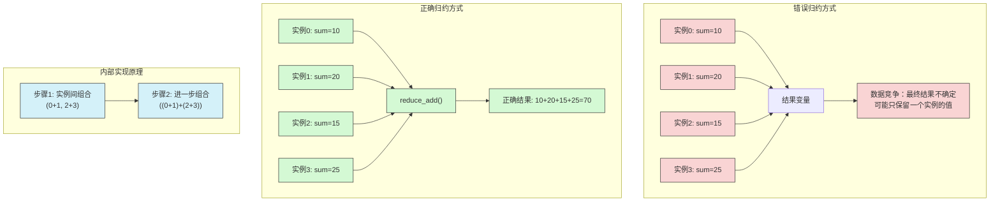

#### ISPC归约操作的特性

- `reduce_add(x)` - 返回gang中所有程序实例中x的累加值
- `reduce_min(x)` - 返回最小值
- `reduce_max(x)` - 返回最大值
- 这些操作会同步gang中的所有实例

### ISPC多核并行

ISPC支持两种并行执行模式:
- **直接执行**: main函数调用ISPC函数，直接在当前线程上执行
- **任务并行**: 使用`launch[N]`语法创建任务，在多线程上执行

#### 任务系统原理

```cpp
export void mandelbrot_ispc(uniform float x0, uniform float y0, 
                           uniform float x1, uniform float y1,
                           uniform int width, uniform int height,
                           uniform int maxIterations,
                           uniform int output[])
{
    // 为图像划分任务（这里创建了2*3=6个任务）
    uniform int dh = height / 3;
    uniform int dw = width / 2;
    
    // 启动多个任务，每个任务处理图像的一部分
    launch[6] mandelbrot_task(x0, y0, x1, y1,
                             width, height,
                             dw, dh,
                             maxIterations,
                             output);
}

// 任务函数：处理图像的一部分
task void mandelbrot_task(uniform float x0, uniform float y0, 
                         uniform float x1, uniform float y1,
                         uniform int width, uniform int height,
                         uniform int dw, uniform int dh,
                         uniform int maxIterations,
                         uniform int output[])
{
    // 计算此任务负责的图像区域
    uniform int ystart = taskIndex / 2 * dh;
    uniform int yend = taskIndex / 2 == 2 ? height : (taskIndex / 2 + 1) * dh;
    uniform int xstart = (taskIndex % 2) * dw;
    uniform int xend = (taskIndex % 2) == 1 ? width : (taskIndex % 2 + 1) * dw;
    
    // 计算任务负责的区域内的所有像素
    foreach (j = ystart ... yend, i = xstart ... xend) {
        // 进行具体计算...
        // ...
    }
}
```

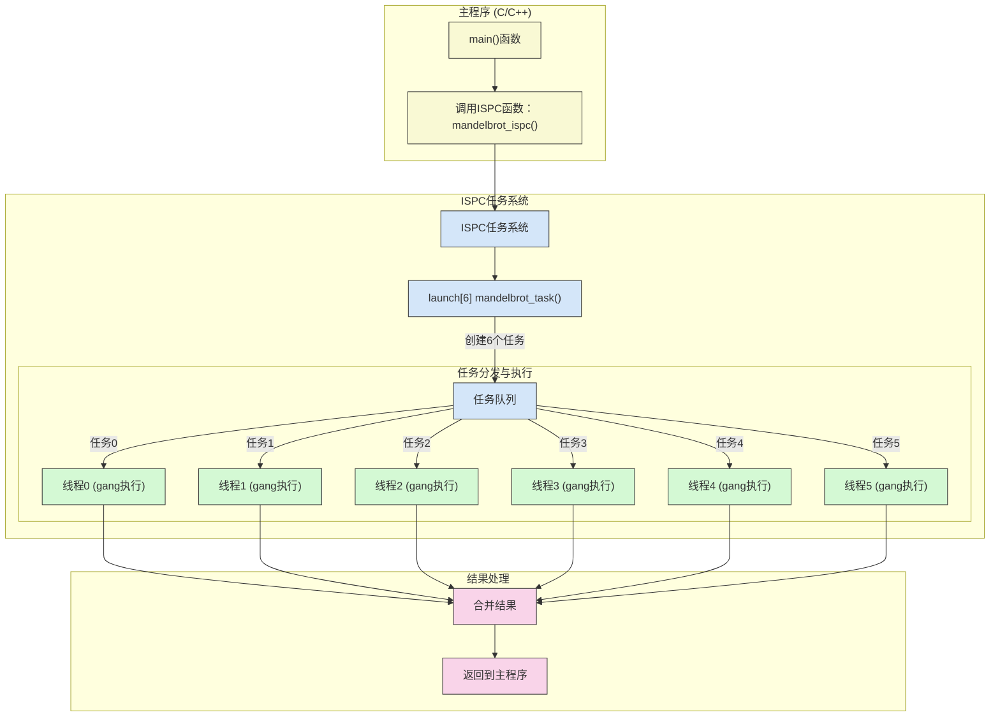

#### 任务并行的特点

- 每个任务在一个CPU线程上执行一个完整的gang
- 任务之间无需显式同步，适合独立的数据块处理
- 使用`taskIndex`变量确定当前任务ID（从0开始）
- 结合SIMD和多线程，实现两级并行

### ISPC抽象层次的提升

- **foreach的价值**：接近串行编程思维，思考"对每个元素独立地执行操作"
- **ISPC作为低级语言**：暴露programIndex和programCount允许精确控制，但可能导致未定义行为
- **更高层次抽象**：
  - 隐藏programIndex/programCount，只提供foreach
  - 函数式/集合式抽象：提供map, reduce等高阶函数，完全不允许数组索引

```cpp
// 使用基础的programIndex接口（低级）
export void saxpy_ispc_low(uniform int N,
                          uniform float a, 
                          uniform float* uniform x,
                          uniform float* uniform y,
                          uniform float* uniform result)
{
    // 每个程序实例负责一部分元素
    for (uniform int i=0; i<N; i+=programCount) {
        // 获取当前实例要处理的元素索引
        int idx = i + programIndex;
        if (idx < N)
            result[idx] = a * x[idx] + y[idx];
    }
}

// 使用foreach抽象（高级）
export void saxpy_ispc_high(uniform int N,
                           uniform float a, 
                           uniform float* uniform x,
                           uniform float* uniform y,
                           uniform float* uniform result)
{
    // 简单声明对哪些元素并行操作
    foreach (i = 0 ... N) {
        result[i] = a * x[i] + y[i];
    }
}
```

### 并行归约操作

ISPC提供了专门的归约(reduction)原语，用于安全地将每个程序实例的局部结果合并为一个值：

```cpp
// 错误的并行求和示例（存在数据竞争）
export uniform float sum_ispc_wrong(uniform int N, 
                                   uniform float* uniform values)
{
    uniform float sum = 0;
    
    foreach (i = 0 ... N) {
        // 危险！多个程序实例同时尝试更新sum
        sum += values[i];  // 数据竞争
    }
    
    return sum;
}

// 正确的并行求和示例（使用reduce_add）
export uniform float sum_ispc_correct(uniform int N, 
                                     uniform float* uniform values)
{
    uniform float sum = 0;
    float local_sum = 0;
    
    foreach (i = 0 ... N) {
        // 每个实例先在本地累加
        local_sum += values[i];
    }
    
    // 安全地将所有实例的local_sum合并到sum
    sum = reduce_add(local_sum);
    
    return sum;
}
```

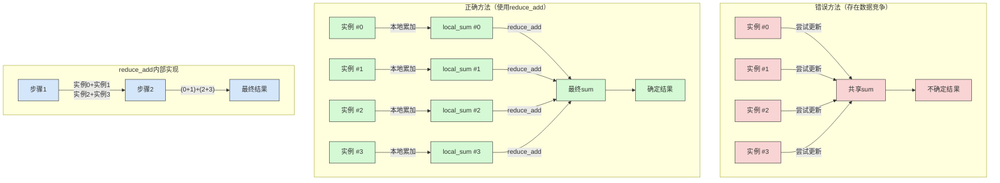

ISPC提供的归约操作特点：

- 提供多种归约函数：`reduce_add`、`reduce_min`、`reduce_max`等
- 同步所有gang中的实例
- 对于不同的归约操作使用不同的函数，确保正确性
- 比手动同步更高效，利用了硬件特性

## 总结

- **内存系统性能关键点**：
  - 延迟和带宽是两个不同但相关的概念
  - 带宽限制是现代处理器的主要瓶颈之一
  - 减少内存访问频率是高效程序的关键策略
  
- **并行编程抽象与实现**：
  - 区分编程模型提供的抽象和其在硬件上的实现
  - SPMD是一种强大的并行编程模型，ISPC是其一种实现
  - 更高层次的抽象可以简化并行编程，但可能牺牲一些灵活性
  
- **核心启示**：
  - 编程模型提供了思考并行程序组织的方法
  - 编程模型提供抽象，允许多种有效的实现
  - 高效并行程序需要考虑硬件特性，特别是内存系统性能 