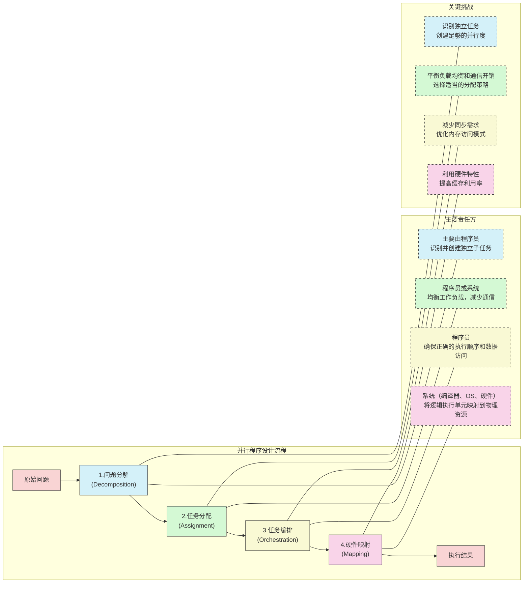
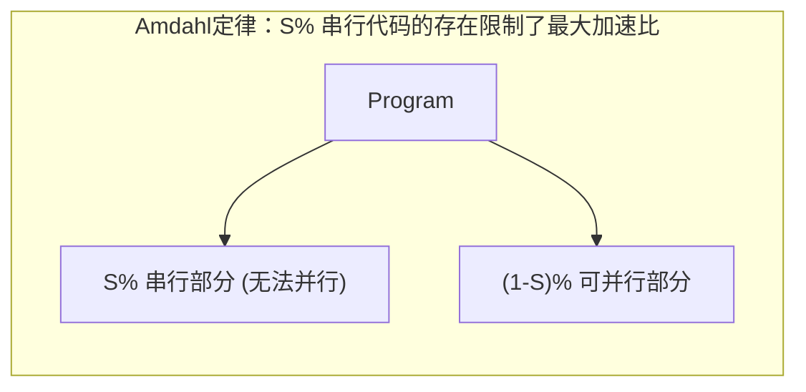
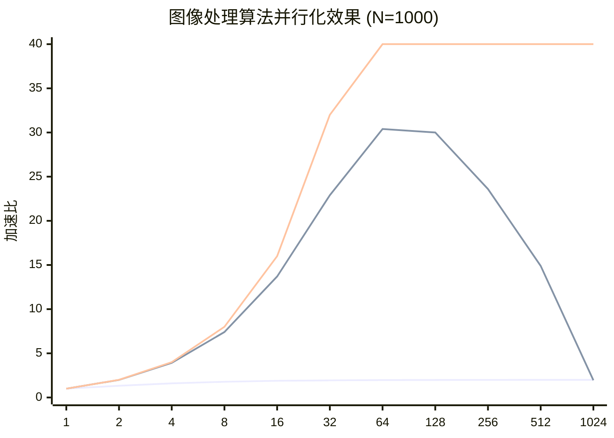
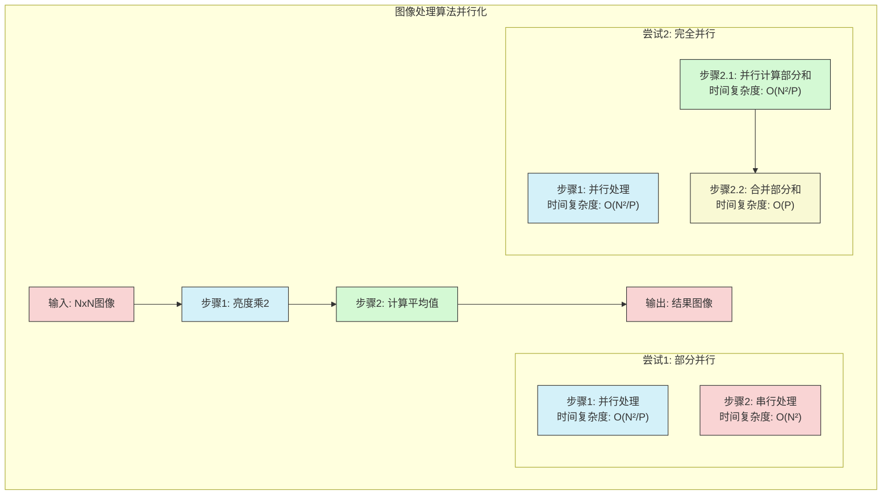
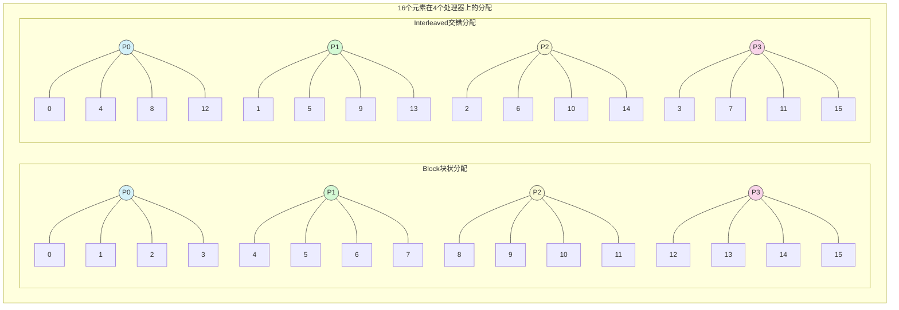
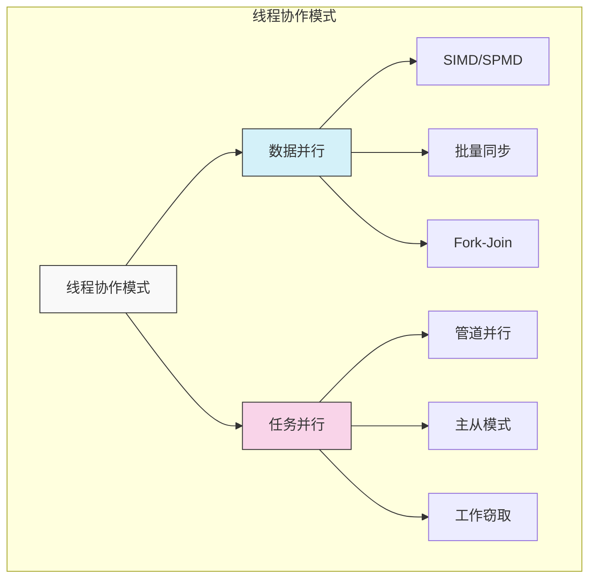
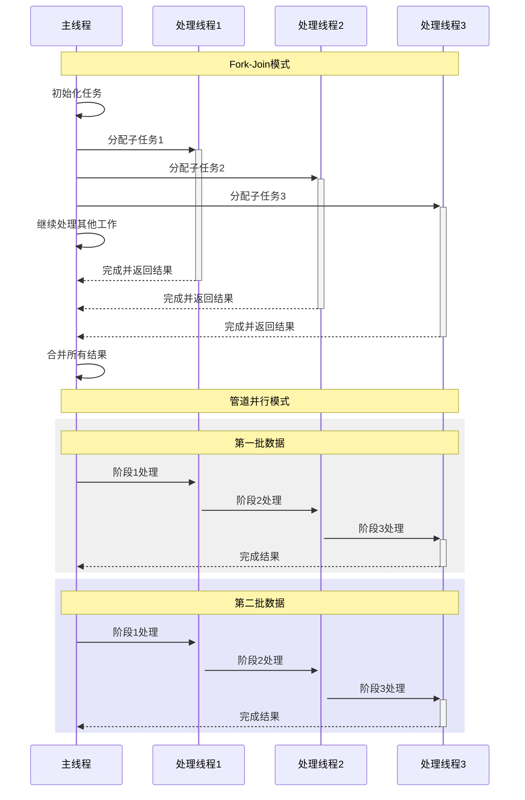

# 斯坦福CS149：并行计算 - 第四讲

## 引言：并行编程基础

本讲通过案例研究介绍并行程序的设计与实现方法，重点关注数据并行和共享地址空间两种并行编程模型。掌握高效并行程序设计的关键在于理解工作分解、任务分配、线程协作以及性能优化的原则与方法。本讲的主要目标是最大化并行程序的加速比，即：

`加速比(P个处理器) = 执行时间(1个处理器) / 执行时间(P个处理器)`

## 1. 并行程序设计的基本流程

并行程序的设计通常遵循一个系统化的流程，从问题分析到程序执行，包括以下几个关键步骤：

### 问题分解（Decomposition）
- **定义**：将问题分解为可以并行执行的子问题或任务
- **关键挑战**：识别任务间的依赖关系，或证明它们可以独立执行
- **目标**：创建足够多的任务以充分利用所有可用处理资源
- **责任**：通常由程序员完成（自动并行化在一般情况下仍然是困难的研究问题）

### 任务分配（Assignment）
- **定义**：将分解后的任务分配给并行执行单元（如线程、程序实例、向量通道等）
- **目标**：
  - 实现良好的工作负载均衡
  - 减少执行单元间的通信成本
- **分配方式**：
  - **静态分配**：程序运行前确定分配方案
  - **动态分配**：程序执行过程中根据实际情况动态调整分配
- **责任**：可以由程序员或系统（语言运行时、库）完成

### 任务编排（Orchestration）
- **定义**：组织执行单元之间的通信与同步，确保正确的执行顺序和数据访问
- **关键内容**：
  - 构建合适的通信结构
  - 添加必要的同步机制以维护依赖关系
  - 组织高效的内存数据结构
  - 调度任务执行
- **目标**：
  - 降低通信和同步成本
  - 保持数据访问的局部性
  - 减少并行执行的额外开销

### 硬件映射（Mapping）
- **定义**：将程序的逻辑执行单元（线程）映射到物理硬件执行单元上
- **执行者**：
  - **操作系统**：映射线程到CPU核心
  - **编译器**：映射程序实例到向量指令通道
  - **硬件**：映射逻辑计算单元到物理处理单元（如GPU线程块到SM）
- **映射策略考量**：
  - 将需要频繁协作的线程放在同一核心（最大化局部性，最小化通信开销）
  - 将计算特性互补的线程（如一个计算密集，一个内存密集）放在同一核心（提高资源利用效率）

## 2. Amdahl定律与并行性限制

### Amdahl定律（Amdahl's Law）
- **核心思想**：程序中固有的串行部分限制了通过并行化能获得的最大加速比
- **公式表达**：
  - 设S为程序中必须串行执行的部分所占比例
  - 使用P个处理器时的最大加速比：`Speedup ≤ 1 / (S + (1-S)/P)`
  - 当P趋于无穷时的极限加速比：`Maximum Speedup ≤ 1/S`

```mermaid
xychart-beta
    title "Amdahl定律：不同串行比例下的加速比极限"
    x-axis [1, 2, 4, 8, 16, 32, 64, 128, 256, "∞"]
    y-axis "加速比" 0 --> 50
    bar "10%串行" [1, 1.8, 3.0, 4.7, 6.7, 8.5, 9.6, 10.2, 10.5, 10.6]
    bar "5%串行" [1, 1.9, 3.5, 5.9, 8.8, 11.6, 13.4, 14.4, 14.9, 15.4]
    bar "2.5%串行" [1, 1.96, 3.77, 6.96, 11.77, 18.36, 25.47, 31.35, 34.97, 40]
    bar "1.5%串行" [1, 1.98, 3.88, 7.41, 13.47, 23.03, 35.08, 46.67, 53.91, 67]
    bar "1%串行" [1, 1.99, 3.94, 7.76, 14.67, 26.59, 43.42, 62.29, 77.99, 100]
```

| 串行比例 | 理论最大加速比 | 使用2个处理器 | 使用8个处理器 | 使用64个处理器 | 使用无限处理器 |
|---------|--------------|-------------|--------------|---------------|--------------|
| **50%** | 2x | 1.33x | 1.78x | 1.97x | 2x |
| **20%** | 5x | 1.67x | 3.08x | 4.52x | 5x |
| **10%** | 10x | 1.82x | 4.71x | 8.63x | 10x |
| **5%** | 20x | 1.90x | 6.40x | 13.47x | 20x |
| **1%** | 100x | 1.98x | 7.48x | 39.22x | 100x |
| **0.1%** | 1000x | 2.00x | 7.94x | 86.42x | 1000x |

### 定律分析与启示
- 即使串行部分很小（如1%或0.1%），随着处理器数量增加，加速比也会迅速饱和
- 追求高加速比的关键是尽可能减少程序中的串行部分
- 对于固定问题规模，Amdahl定律表明并行化的收益是有上限的

### 示例：图像处理算法
假设一个NxN图像处理程序包含以下步骤：
1. 所有像素亮度乘以2（完全可并行，工作量为N²）
2. 计算所有像素的平均值（部分可并行，工作量为N²）

**串行实现**：总执行时间 ≈ 2N²

**并行尝试1**（只并行化步骤1）：
- 步骤1时间：N²/P
- 步骤2时间：N²（仍然串行）
- 总时间：N²/P + N²
- 结果：不论P多大，总加速比上限为2倍

**并行尝试2**（两个步骤都并行化）：
- 步骤1时间：N²/P
- 步骤2时间：N²/P（计算部分和）+ P（合并部分和，为并行引入的开销）
- 总时间：2N²/P + P
- 结果：当N远大于P时，加速比接近P，但仍受合并操作（串行部分）的影响

| 实现方式 | 执行时间 | P=2 | P=4 | P=16 | P=64 | P=1024 |
|---------|----------|-----|-----|------|------|--------|
| **串行** | 2N² | - | - | - | - | - |
| **尝试1** (仅第一步并行) | N²/P + N² | 1.5N² | 1.25N² | 1.06N² | 1.02N² | 1.00N² |
| **加速比** | - | 1.33x | 1.6x | 1.89x | 1.97x | 1.99x |
| **尝试2** (两步都并行) | 2N²/P + P | N² + 2 | 0.5N² + 4 | 0.13N² + 16 | 0.03N² + 64 | 0.002N² + 1024 |
| **加速比** (当N=1000) | - | 1.99x | 3.92x | 13.7x | 30.4x | 1.95x |

## 3. 任务分配的策略与实践

并行任务分配的目标是实现工作负载均衡和减少通信成本。不同的并行编程环境提供了不同的分配机制。

### 常见分配策略
- **块状分配**（Blocked）：将连续的数据块（如数组的连续段）分配给同一处理器
  - 优势：通常能更好地保持数据局部性，减少处理器间通信
  - 适用：处理器间通信成本高的情况
- **交错分配**（Interleaved）：以轮询方式将数据分配给处理器
  - 优势：在工作量不均匀时可能提供更好的负载均衡
  - 适用：处理器间负载可能不均衡的情况

| 特性 | 块状分配 (Blocked) | 交错分配 (Interleaved) |
|------|-------------------|----------------------|
| **数据访问模式** | 连续访问，良好的缓存局部性 | 跨步访问，可能导致较多缓存未命中 |
| **负载均衡** | 如果工作量不均匀分布，可能不平衡 | 工作分布更均匀，尤其是工作量不均匀时 |
| **通信开销** | 通常较低，边界处才需通信 | 可能较高，处理器间频繁数据交换 |
| **代码实现** | 简单，易于划分子问题 | 可能需要更复杂的索引计算 |
| **适用场景** | 数据访问较少依赖相邻块；显式数据分区 | 数据依赖复杂；自动负载均衡重要 |
| **SIMD友好性** | 在顺序访问模式下更优 | 在交错模式下可能需要gather/scatter操作 |
| **典型应用** | 矩阵块乘法，网格子区域计算 | 负载不均的图像处理，不规则数据结构处理 |

### 不同编程环境的分配实现
- **ISPC隐式循环**：程序员分解（指定循环迭代），静态分配给SIMD通道
- **ISPC foreach**：程序员暴露独立工作，系统负责分配
- **C++11线程**：程序员通常显式管理分解和静态块状分配
- **ISPC Tasks**：程序员创建任务列表，运行时动态分配给线程池中的工作线程

## 4. 线程协作模式

并行程序设计的一个重要方面是多线程如何协同工作。不同的协作模式适合不同的问题特性。

### 主要协作模式

#### 数据并行模式比较

| 协作模式 | 描述 | 同步需求 | 负载均衡 | 适用场景 | 实现例子 |
|---------|------|---------|---------|---------|---------|
| **SIMD/SPMD** | 同一操作应用于不同数据元素 | 隐式同步 | 静态分配 | 规则数据结构，同构操作 | ISPC, OpenMP并行区域 |
| **批量同步** | 交替执行计算和同步阶段 | 显式同步点 | 静态或动态 | 图算法，迭代求解器 | MPI Barrier, OpenMP barrier |
| **Fork-Join** | 任务分解为子任务，完成后合并 | 主要在join点 | 动态可能性高 | 递归问题，分治算法 | Cilk, TBB, C++异步 |

#### 任务并行模式比较

| 协作模式 | 描述 | 同步需求 | 负载均衡 | 适用场景 | 实现例子 |
|---------|------|---------|---------|---------|---------|
| **管道并行** | 任务构成流水线处理数据 | 队列/缓冲区 | 受最慢阶段限制 | 流处理，生产消费模型 | TBB pipeline, CUDA流 |
| **主从模式** | 主线程分配任务给工作线程 | 任务队列 | 动态性好 | 独立任务集，服务请求 | ThreadPool, OpenMP任务 |
| **工作窃取** | 空闲线程从忙线程"窃取"工作 | 分布式队列 | 自适应最优 | 不规则并行性，递归任务 | Cilk, TBB, Java ForkJoin |

### 线程间通信方式

## 5. 案例研究：2D网格求解器的并行实现

通过一个2D网格偏微分方程求解器的并行化过程，我们可以直观地理解并行程序设计的各个步骤。

### 问题描述
- 在(N+2)×(N+2)网格上求解偏微分方程
- 采用迭代方法，每一轮使用高斯-赛德尔（Gauss-Seidel）方法更新网格点
- 每个网格点的更新依赖于周围相邻点的值

### 依赖关系分析与算法改进
- **原始串行算法中的依赖**：在一次迭代中，点A[i,j]的计算依赖于本次迭代中已更新的A[i-1,j]和A[i,j-1]
- **初步并行化思路**：沿对角线的网格点相互独立，可以并行更新
  - 问题：对角线并行难以利用，并行度不均衡，需要频繁同步

- **算法改进：红黑着色法（Red-Black Coloring）**
  - 将网格点交替染成红色和黑色（类似国际象棋棋盘）
  - 并行更新所有红色点（红色点只依赖上一轮的黑色点）
  - 同步
  - 并行更新所有黑色点（黑色点依赖刚更新的红色点）
  - 同步后重复迭代直至收敛
  - 优势：每轮中可以大规模并行，同步点少，负载均衡

### 分配策略比较
- **块状分配**：每个处理器负责连续的行块
  - 优势：通信主要发生在块边界，总通信量较小
- **交错分配**：以轮询方式分配行
  - 可能导致更多的处理器间通信

## 6. 不同并行编程模型的实现比较

2D网格求解器可以用不同的并行编程模型实现，各有特点。

### 数据并行模型
- **语法特点**：使用高级抽象（如for_all）表达并行操作
- **分解**：通过for_all处理所有独立点
- **分配与编排**：主要由系统负责
- **优势**：
  - 抽象层次高，接近串行编程思维
  - 同步通常由系统隐式处理
  - 内置通信原语（如reduceAdd）简化编程

### 共享地址空间SPMD模型
- **语法特点**：显式创建多个线程，每个线程执行相同代码但处理不同数据
- **分解与分配**：程序员显式划分工作
- **编排**：
  - 程序员负责显式同步（锁、屏障）
  - 通信通过共享变量的读写隐式进行
- **关键挑战**：
  - 正确使用锁避免竞争条件
  - 高效使用屏障确保依赖关系
  - 减少同步开销

### 实现优化示例
- **锁优化**：使用局部变量累积中间结果，仅在最终合并时加锁
- **屏障优化**：使用多个结果副本轮换使用，减少迭代间的依赖

### 两种模型对比
- **数据并行**：更高级抽象，系统负责更多细节，更接近串行编程思维
- **共享地址空间**：更显式的控制，可能实现更高性能，但需要更多并行编程专业知识

## 总结

- **并行程序设计流程**包括分解、分配、编排和映射四个关键步骤
- **Amdahl定律**提醒我们程序中的串行部分将限制最大可能的加速比
- **有效的任务分配**需要平衡工作负载均衡和通信成本
- **线程协作**需要恰当的同步机制和通信模式以确保正确性和高性能
- **算法改进**往往是实现高效并行的关键，如红黑着色法大幅提高了2D网格求解器的并行度
- **不同并行编程模型**提供不同级别的抽象和控制，选择应基于问题特性、性能需求和编程复杂性 