# 斯坦福CS149：并行计算 - 第五讲

## 引言：并行程序性能优化 - 工作分配与调度

本讲关注高性能并行编程的核心挑战之一：如何有效地将工作分配给计算资源以实现最佳性能。优化并行程序性能是一个迭代过程，需要不断改进分解、分配和编排的策略，以平衡三个相互冲突的目标：平衡工作负载、减少通信成本和最小化额外开销。本讲首先介绍工作分配和负载均衡的不同策略，然后深入探讨Fork-Join并行模型及其高效实现。

> **核心原则：** 始终先实现最简单的解决方案，然后测量性能，以确定是否需要进行更复杂的优化。

## 1. 并行程序中的工作分配与负载均衡

### 1.1 负载均衡的重要性

理想的并行执行要求所有处理器在整个程序执行期间都在工作，并且同时完成各自的工作。负载不均衡会显著影响并行性能：

- 程序执行时间由**最慢的处理器**决定
- 即使少量的负载不均衡也会大幅限制最大加速比
- 示例：如果某个处理器的工作量是其他处理器的2倍，则约有50%的执行时间是实质上的串行执行（符合Amdahl定律）

### 1.2 工作分配策略

#### A. 静态分配 (Static Assignment)

**定义**：在程序执行前确定的工作分配方案，与程序的动态行为无关。

**特点**：
- 简单，几乎没有运行时开销
- 适用于工作单元执行成本可预测且差异不大的场景
- 可以是等量分配（每个线程相同数量的工作），也可以是基于预测的加权分配

**示例**：
- 将N×N图像处理划分为等大小的行块分配给每个线程
- 对于存在计算不均匀区域的问题（如Mandelbrot集），采用行交错分配能让每个线程都分到一些高成本和低成本的工作

#### B. 半静态分配 (Semi-static Assignment)

**定义**：基于这样的假设—工作成本在短期内是可预测的（最近的过去是近期未来的良好预测器）。

**特点**：
- 应用程序周期性地分析执行情况并重新调整工作分配
- 在两次调整之间，分配是静态的
- 适用于工作特性随时间缓慢变化的场景

**示例**：
- 粒子模拟：随着粒子移动，周期性地重新分配粒子给处理器
- 自适应网格：当网格随流体变化而改变时，重新分配网格部分

#### C. 动态分配 (Dynamic Assignment)

**定义**：程序在运行时动态地决定任务分配，确保负载均衡。

**适用场景**：
- 任务执行时间差异大且不可预测
- 总任务数量在运行前未知
- 需要适应运行时变化的工作特性

**实现方式**：

1. **原子计数器**：
   ```c
   // 线程共享的原子计数器
   atomic int counter = 0;
   
   // 每个工作线程执行
   while (true) {
     int i = atomic_incr(counter);
     if (i >= max_tasks) break;
     process_task(i);
   }
   ```

2. **工作队列**：
   - 维护一个共享的任务队列
   - 工作线程从队列中拉取(pull)任务执行
   - 线程也可以推送(push)新生成的任务到队列中
   - 队列可能实现为FIFO、LIFO或优先级队列等

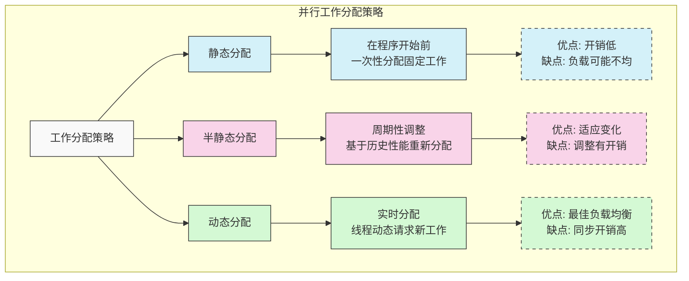

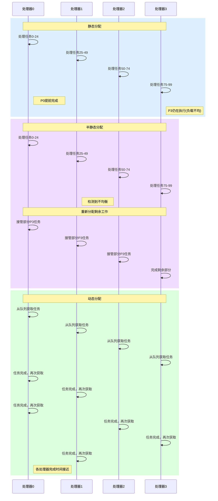

**任务粒度的权衡**：

- **细粒度**（每个任务很小）：
  - 优点：任务数量多，可实现良好的负载均衡
  - 缺点：同步开销高，临界区可能成为串行瓶颈
  
- **粗粒度**（每个任务较大）：
  - 优点：同步开销低
  - 缺点：任务数量少，可能影响负载均衡的灵活性
  
- **最佳选择**：
  - 任务数量应**远多于**处理器数量（有利于动态负载均衡）
  - 但任务不应过多（以减少管理开销）
  - 理想粒度取决于工作负载特性和机器特性，需要了解你的应用和硬件

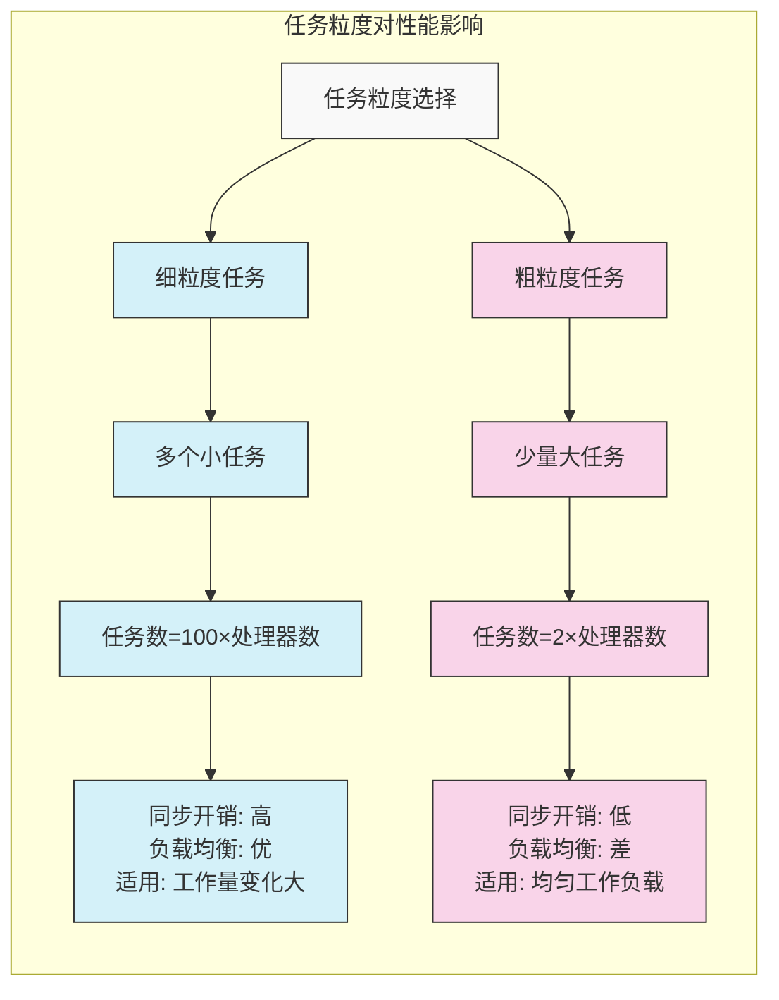

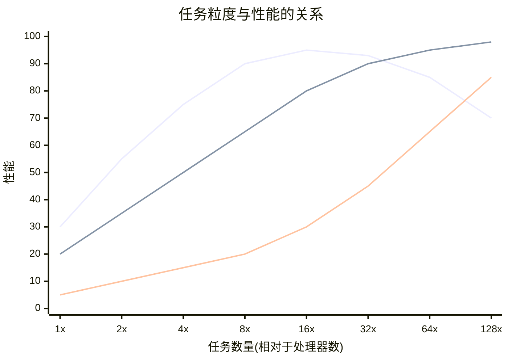

### 1.3 高级工作分配与调度技术

#### A. 智能任务调度 (Smarter Task Scheduling)

**问题**：简单的按顺序动态分配可能导致"长尾效应"—一个处理器被分配到最后一个耗时最长的任务，而其他处理器已经空闲。

**解决方案**：
1. **更细粒度**：将工作分解为更多、更小的任务（但可能增加开销）
2. **优先级调度**：优先调度长任务，确保潜在的"长尾"任务早期开始
   - 需要对任务执行时间有估计或历史数据
   - 执行长任务的线程虽然做的任务数较少，但总工作量与其他线程相近

#### B. 分布式队列与工作窃取 (Distributed Queues & Work Stealing)

**动机**：避免单一共享工作队列成为瓶颈

**原理**：
- 每个工作线程维护自己的本地工作队列
- 线程优先从本地队列获取任务
- 当本地队列为空时，尝试从其他线程的队列中"窃取"工作
- 减少竞争，提高缓存局部性

#### C. 任务依赖管理 (Task Dependencies)

**挑战**：现实世界的问题中，任务通常不是完全独立的

**解决方案**：
- 任务管理系统（调度器）明确管理任务间的依赖关系
- 任务只有在其所有依赖的任务完成后才能执行
- 系统需要维护任务依赖图并动态更新任务状态

### 1.4 负载均衡策略选择

选择合适的负载均衡策略需要权衡多种因素：
- 工作负载的可预测性和均匀性
- 动态分配的开销
- 系统资源（如缓存、内存带宽）的限制
- 并行规模（处理器数量）

**核心原则**：尽可能利用关于工作负载的先验知识来减少负载不均衡和任务管理成本。如果系统能完全了解工作负载特性，静态分配可能最优；而在不确定性高的情况下，动态策略则更有优势。

## 2. Fork-Join并行与工作窃取调度

### 2.1 Fork-Join并行模型

Fork-Join是表达分治算法（如快速排序）中固有独立性的自然方式，它允许程序以树状结构创建并组织并行工作。

**Cilk Plus语法示例**：

```c
// 普通C/C++函数调用
foo(args);  

// 分叉 - 可以异步执行，调用者继续执行后续代码
cilk_spawn foo(args);  

// 汇合点 - 等待所有spawn的调用完成
cilk_sync;  
```

**语义**：
- `cilk_spawn foo();` 创建一个可以与调用者并发执行的新逻辑线程
- `cilk_sync;` 等待当前函数内所有spawn的调用完成
- 在包含`cilk_spawn`的函数末尾有**隐式**的`cilk_sync`

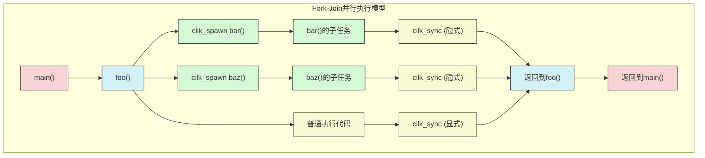

**示例：并行快速排序**

```c
void quick_sort(int* begin, int* end) {
  if (end - begin <= PARALLEL_CUTOFF) {
    // 小问题使用顺序排序
    std::sort(begin, end);
    return;
  }
  
  // 选择分区点并分区
  int* mid = partition(begin, end);
  
  // 递归排序，一个子调用被spawn
  cilk_spawn quick_sort(begin, mid);
  quick_sort(mid+1, end);
  
  // 隐式cilk_sync在函数末尾
}
```

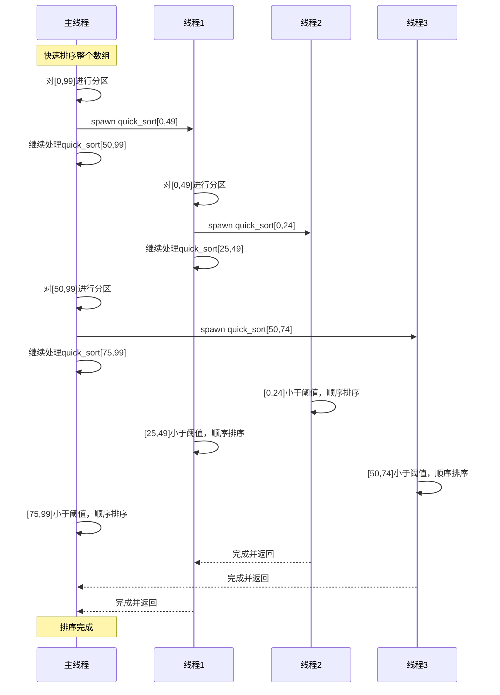

**Fork-Join模型的实际应用场景**:

1. **图像处理**：将图像划分为多个区块，并行处理每个区块
   ```c
   void process_image(Image* img) {
     // 水平切分图像为多个条带
     int strip_height = img->height / num_threads;
     
     for (int i = 0; i < num_threads; i++) {
       int y_start = i * strip_height;
       int y_end = (i == num_threads-1) ? img->height : (i+1) * strip_height;
       
       cilk_spawn process_strip(img, 0, img->width, y_start, y_end);
     }
     cilk_sync; // 等待所有条带处理完成
   }
   ```

2. **科学计算**：矩阵分解、N体模拟等
   ```c
   void cholesky_decomposition(double** A, int n) {
     for (int k = 0; k < n; k++) {
       // 更新对角线元素
       A[k][k] = sqrt(A[k][k]);
       
       // 更新当前列
       cilk_spawn update_column(A, k, n);
       
       // 更新剩余子矩阵
       update_submatrix(A, k, n);
       
       cilk_sync;
     }
   }
   ```

3. **图算法**：广度优先搜索、最短路径等
   ```c
   void parallel_bfs(Graph* g, int start_vertex) {
     Queue frontier;
     frontier.push(start_vertex);
     
     while (!frontier.empty()) {
       Queue next_frontier;
       int size = frontier.size();
       
       // 并行处理当前层的所有顶点
       for (int i = 0; i < size; i++) {
         int vertex = frontier.pop();
         cilk_spawn process_neighbors(g, vertex, &next_frontier);
       }
       cilk_sync;
       
       frontier = next_frontier;
     }
   }
   ```

**Fork-Join程序设计原则**：
- 使用`cilk_spawn`向系统暴露独立的、潜在的并行工作
- 暴露的工作至少要能填满所有处理资源
- 暴露比处理能力更多的独立工作（8倍左右），以允许系统进行良好的负载均衡
- 但避免暴露过多的细粒度工作，以免管理开销过大

### 2.2 工作窃取调度器

**朴素方法的问题**：为每个`cilk_spawn`创建一个操作系统线程代价太高，会导致大量线程创建/销毁开销和上下文切换。

**Cilk运行时实现**：
- 维护一个**工作线程池**，线程数通常等于硬件执行上下文数
- 使用**工作窃取调度器**高效管理任务执行

**关键概念**：
- **子任务(Child)与延续(Continuation)**：
  在`cilk_spawn foo(); bar(); cilk_sync;`中，`foo()`是被spawn的子任务，`bar(); cilk_sync;`是调用者函数的剩余部分，称为延续

**调度决策**：spawn时，线程应先执行子任务还是延续？

1. **执行延续优先(Child Stealing)**：
   - 将子任务放入队列供其他线程窃取，调用线程继续执行延续
   - 缺点：可能导致广度优先遍历，需要O(N)空间存储任务

2. **执行子任务优先(Continuation Stealing)**：
   - 将延续放入队列供窃取，调用线程立即执行子任务
   - 优点：
     - 如无窃取发生，执行顺序与串行相同（深度优先）
     - 空间复杂度有界（T×串行栈大小）
     - **Cilk采用此策略**

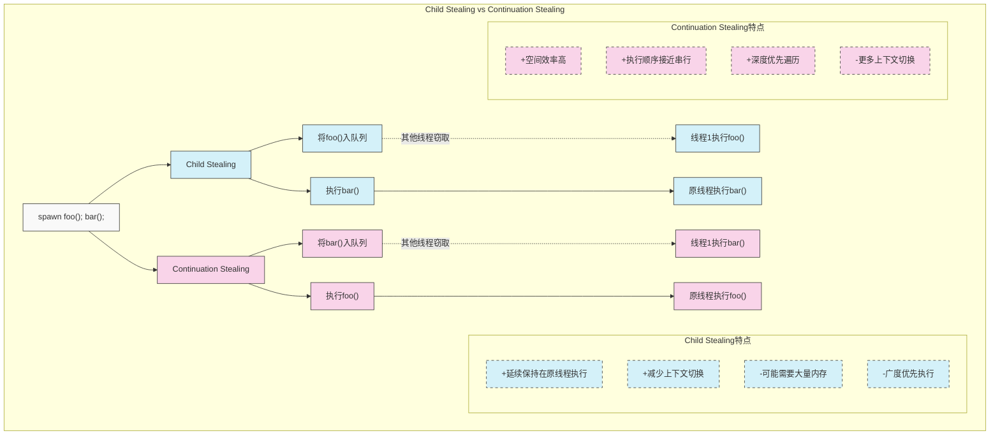

**工作队列实现**：
- 每个工作线程有一个**双端队列(deque)**
- 当线程spawn时，将**延续**压入自己队列的**底部(tail)**，然后执行子任务
- 线程完成任务后，从自己队列的底部弹出工作
- 空闲线程随机选择一个受害者线程，并从其队列的**顶部(head)**窃取工作

**窃取策略**：
- 从队列顶部窃取通常能偷到最大块的未完成工作
- 有利于最大化缓存局部性
- 本地push/pop和远程steal操作队列的不同端，可减少锁竞争

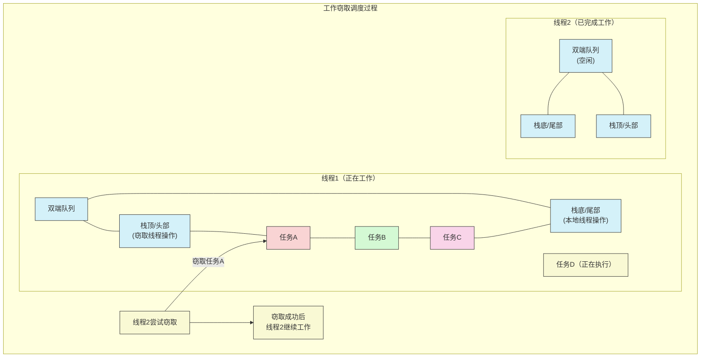

**工作窃取的C++简化实现示例**：

```cpp
// 简化的工作窃取双端队列实现
template <typename T>
class WorkStealingQueue {
private:
    std::deque<T> tasks;
    std::mutex mutex;

public:
    // 本地线程添加任务到队列底部
    void push_bottom(T task) {
        std::lock_guard<std::mutex> lock(mutex);
        tasks.push_back(std::move(task));
    }
    
    // 本地线程从底部获取任务
    bool pop_bottom(T& task) {
        std::lock_guard<std::mutex> lock(mutex);
        if (tasks.empty()) return false;
        
        task = std::move(tasks.back());
        tasks.pop_back();
        return true;
    }
    
    // 窃取线程从顶部窃取任务
    bool steal(T& task) {
        std::lock_guard<std::mutex> lock(mutex);
        if (tasks.empty()) return false;
        
        task = std::move(tasks.front());
        tasks.pop_front();
        return true;
    }
    
    size_t size() const {
        std::lock_guard<std::mutex> lock(mutex);
        return tasks.size();
    }
};

// 工作窃取线程池
class WorkStealingThreadPool {
private:
    std::vector<WorkStealingQueue<std::function<void()>>> queues;
    std::vector<std::thread> threads;
    std::atomic<bool> running{true};
    
    void worker_thread(int id) {
        std::function<void()> task;
        std::random_device rd;
        std::mt19937 rng(rd());
        
        while (running) {
            // 1. 尝试从自己的队列底部获取任务
            if (queues[id].pop_bottom(task)) {
                task();
                continue;
            }
            
            // 2. 尝试从其他线程队列顶部窃取任务
            std::uniform_int_distribution<int> dist(0, queues.size() - 1);
            bool found_task = false;
            for (int i = 0; i < queues.size() * 2; ++i) {
                int victim = dist(rng);
                if (victim == id) continue;
                
                if (queues[victim].steal(task)) {
                    task();
                    found_task = true;
                    break;
                }
            }
            
            // 3. 如果没找到任务，短暂休眠避免CPU空转
            if (!found_task) {
                std::this_thread::yield();
            }
        }
    }
    
public:
    explicit WorkStealingThreadPool(size_t num_threads = std::thread::hardware_concurrency()) 
        : queues(num_threads), threads(num_threads) {
        
        for (size_t i = 0; i < threads.size(); ++i) {
            threads[i] = std::thread(&WorkStealingThreadPool::worker_thread, this, i);
        }
    }
    
    ~WorkStealingThreadPool() {
        running = false;
        for (auto& thread : threads) {
            if (thread.joinable()) {
                thread.join();
            }
        }
    }
    
    // 提交任务，返回future
    template<class F, class... Args>
    auto submit(F&& f, Args&&... args) {
        using return_type = std::invoke_result_t<F, Args...>;
        auto task = std::make_shared<std::packaged_task<return_type()>>(
            std::bind(std::forward<F>(f), std::forward<Args>(args)...)
        );
        
        auto future = task->get_future();
        
        // 获取当前线程ID（如在线程池线程中调用）或使用随机ID
        int thread_id = 0; // 简化实现
        
        queues[thread_id].push_bottom([task]() { (*task)(); });
        
        return future;
    }
};
```

### 2.3 `cilk_sync`的实现

**目标**：确保一个代码块内spawn的所有子任务完成后才能执行sync之后的代码。

**无窃取情况**：
- 如果没有工作被偷走，当前线程会按深度优先顺序完成所有spawn的任务
- 当到达sync点时，所有工作已完成，sync是一个空操作(no-op)

**窃取情况**：
- 当工作被偷走时，运行时需要追踪未完成的spawn
- 为每个包含spawn的函数实例创建一个**描述符(descriptor)**
- 描述符记录该块spawn的任务总数以及已完成的数量
- 当线程spawn一个任务时，递增描述符的spawn计数
- 当一个任务完成时，递减其对应描述符的spawn计数
- 当线程到达sync点时，检查对应描述符的计数
- 如果计数不为零，该线程不能执行sync之后的代码，而是去窃取其他工作
- 当一个描述符的计数变为零时，其延续(sync之后的部分)变为就绪状态，可以被执行

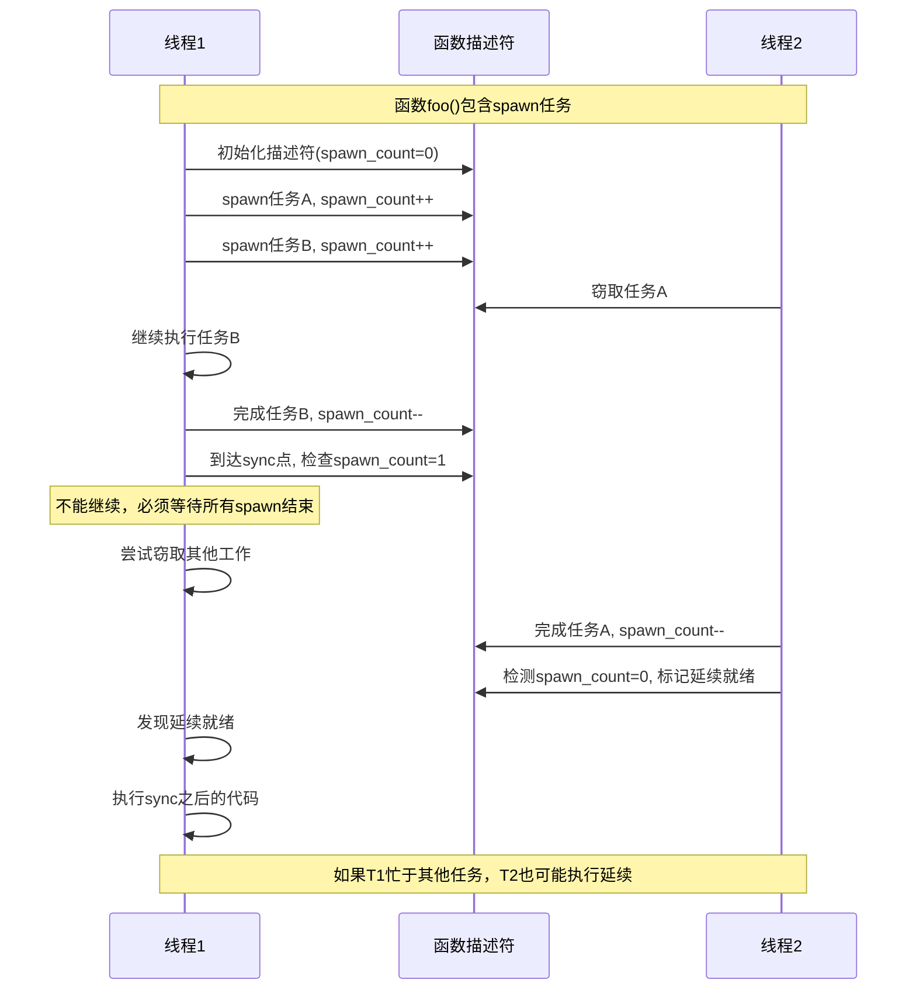

**贪心连接调度(Greedy Join Scheduling)**：
- 线程总是尝试窃取工作，如果自己队列为空且系统中有工作可偷
- 线程只有在无工作可偷时才真正空闲
- 发起spawn的线程不一定是最终执行sync之后逻辑的线程
- 记录偷窃和管理同步点的开销**仅在发生偷窃时**才产生
- 如果偷窃的是大块工作，这种开销不常发生

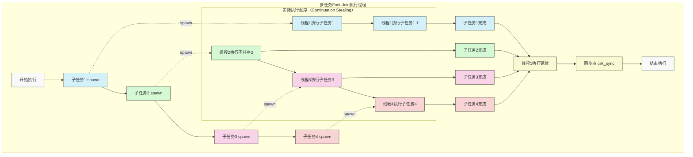

## 总结

- **工作分配与负载均衡**是并行程序性能优化的核心挑战之一
- **静态分配**简单高效，适用于工作负载可预测的场景
- **动态分配**更灵活，能适应不均匀和不可预测的工作负载，但带来额外开销
- **任务粒度选择**需要权衡负载均衡灵活性和任务管理开销
- **工作窃取**是一种高效的动态负载均衡技术，结合分布式队列降低同步成本
- **Fork-Join模型**是表达分治并行的自然方式，Cilk Plus提供了简洁的语法支持
- **执行子任务优先**的工作窃取调度策略在大多数情况下提供最佳性能和空间效率
- 高效的并行运行时系统（如Cilk）可以使开发者专注于暴露并行性，而不必担心实际的线程管理和调度

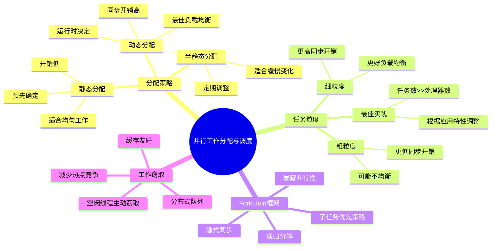

> **核心原则**：通过深入了解工作负载特性和系统特性，选择最适合的工作分配和调度策略，实现高性能并行计算。 