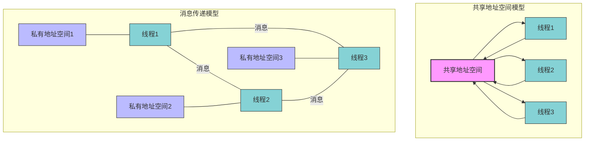
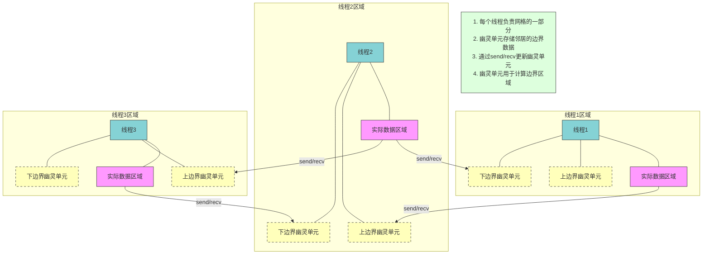
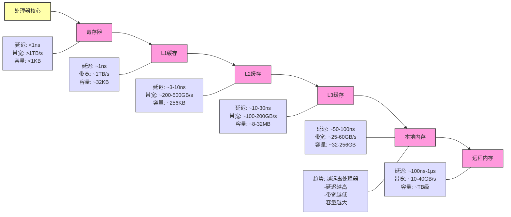
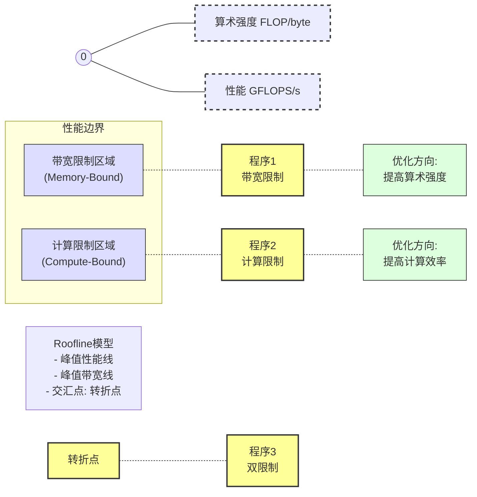
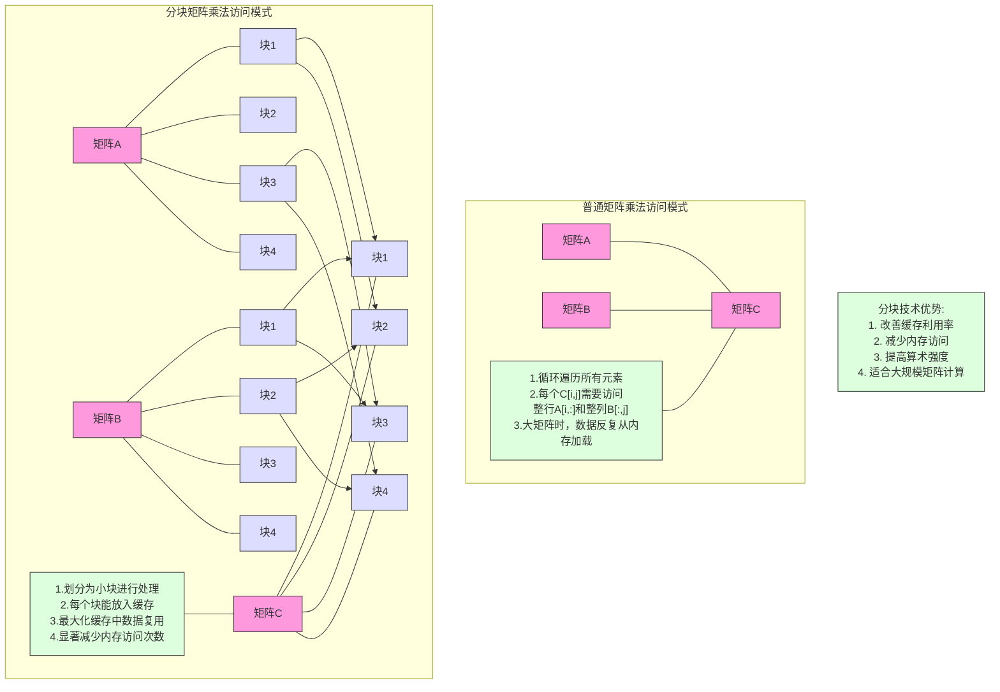

# 斯坦福CS149：并行计算 - 第六讲

## 引言：性能优化 Part II - 局部性、通信与竞争

本讲深入探讨并行程序性能优化的第二个关键方面：通信成本。高效的并行程序不仅需要良好的工作分配和调度，还需要最小化处理器之间以及处理器与内存之间的通信开销。本讲将介绍通信背后的基本概念、不同的并行编程模型、通信瓶颈的类型，以及减少通信开销的策略，帮助开发者设计高效的并行程序。

> **核心原则：** 通信成本往往是并行程序性能的主要瓶颈，理解并优化通信模式是实现高性能并行应用的关键。

## 1. 并行计算的两大编程模型

并行程序中，线程之间需要交换数据和协调执行。这种交互可以通过两种主要的编程模型实现：共享地址空间模型和消息传递模型。这两种模型提供了不同的通信抽象和实现方式。

### 1.1 共享地址空间模型 (Shared Address Space)

**基本概念**：所有线程共享同一个逻辑地址空间，通过读写共享变量进行通信。

**通信抽象**：
- 线程通过**读写共享变量**来交换数据
- 通过**同步原语**（如锁、原子操作）协调访问
- 是单处理器编程的自然扩展

**硬件实现**：
- 需要硬件支持所有处理器访问任意内存地址
- 多核处理器通过多级缓存层次结构和互连网络实现
- 可能存在**非一致性内存访问** (NUMA) 特性

**多核处理器架构示例**：

现代多核处理器（如Intel Core i7）包含：
- 多个处理器核心
- 每个核心的私有L1、L2缓存
- 所有核心共享的L3缓存
- 集成内存控制器
- 通过互连网络（如环形总线）连接各组件

**NUMA特性**：
- 不同处理器核心访问同一内存位置的延迟可能不同
- 主要出现在多插槽系统，但也可能存在于单插槽系统
- 核心越近的内存访问越快，远离核心的内存访问较慢
- 编程时需关注数据局部性以获得最佳性能

### 1.2 消息传递模型 (Message Passing)

**基本概念**：每个线程操作其私有地址空间，通过显式发送和接收消息进行通信。

**通信抽象**：
- 线程在各自**私有的地址空间**内操作
- 通过显式的**发送**和**接收**原语交换数据
- 发送/接收消息是线程间交换数据的唯一方式

**核心API**：
```c
// 发送消息
send(recipient, buffer, tag);  // 指定接收者、数据缓冲区、可选的消息标识符

// 接收消息
recv(sender, buffer, tag);     // 指定发送者、存储数据的缓冲区、可选的消息标识符
```

**同步语义**：
- **同步/阻塞模式**：
  - `send()` 直到接收方收到消息才返回
  - `recv()` 直到收到消息才返回
- **异步/非阻塞模式**：
  - `send()` 立即返回，传输在后台进行
  - `recv()` 立即返回，仅登记接收意图
  - 需要额外调用（如`checksend()`, `checkrecv()`）查询状态

**硬件实现**：
- 不需要为所有处理器提供单一共享地址空间
- 只需提供节点间消息传输的机制
- 适合构建大规模分布式系统，如集群和超级计算机

### 1.3 模型对比

| 特性 | 共享地址空间 | 消息传递 |
|------|------------|----------|
| **通信方式** | 隐式（通过共享变量） | 显式（send/recv调用） |
| **地址空间** | 单一共享 | 每个线程私有 |
| **数据共享** | 自然、直接 | 需要显式复制 |
| **同步机制** | 锁、条件变量、原子操作 | 消息的阻塞语义 |
| **编程难度** | 对熟悉单线程编程的人来说较简单 | 需要显式管理通信 |
| **错误类型** | 竞态条件、死锁 | 可能的死锁、消息格式错误 |
| **可扩展性** | 在大型系统上成本高、扩展性差 | 更容易扩展到大量节点 |
| **硬件要求** | 需要复杂硬件支持共享内存 | 硬件要求较低 |
| **典型应用** | 多核处理器上的并行应用 | 集群、超级计算机上的分布式应用 |



### 1.4 消息传递示例：2D网格求解器

在网格求解器中，数据通信模式很明确：每个线程需要与相邻区域交换边界数据。

**数据分区**：
- 每个线程负责网格的一部分（如每个线程处理若干行）
- 数据存储在线程的私有地址空间中

**幽灵单元 (Ghost Cells)**：
- 为计算边界区域，线程需要来自邻近线程的数据
- 这些数据被复制到本地私有空间中，称为"幽灵单元"
- 通过发送本地边界数据并接收邻居的边界数据来更新幽灵单元

**伪代码示例**：
```c
// 每个线程执行
void solve() {
  double my_grid[MY_ROWS + 2][N]; // 包括上下的幽灵行
  double my_new_grid[MY_ROWS + 2][N];
  
  while (!converged) {
    // 更新幽灵单元 - 与邻居交换边界数据
    if (has_top_neighbor)
      send(top_neighbor, &my_grid[1][0], N);  // 发送第一行实际数据
    if (has_bottom_neighbor)
      send(bottom_neighbor, &my_grid[MY_ROWS][0], N);  // 发送最后一行实际数据
    
    if (has_top_neighbor)
      recv(top_neighbor, &my_grid[0][0], N);  // 接收顶部幽灵行
    if (has_bottom_neighbor)
      recv(bottom_neighbor, &my_grid[MY_ROWS+1][0], N);  // 接收底部幽灵行
    
    // 计算网格点的新值
    compute_grid_values(my_grid, my_new_grid);
    
    // 检查局部收敛
    double my_diff = compute_diff(my_grid, my_new_grid);
    
    // 全局归约（通过消息传递实现）
    if (my_id != 0)
      send(0, &my_diff, 1);  // 发送局部差值给线程0
    else {
      double total_diff = my_diff;
      for (int i = 1; i < num_threads; i++) {
        double other_diff;
        recv(i, &other_diff, 1);
        total_diff += other_diff;
      }
      converged = (total_diff < THRESHOLD);
      
      // 广播收敛状态
      for (int i = 1; i < num_threads; i++)
        send(i, &converged, 1);
    }
    
    if (my_id != 0)
      recv(0, &converged, 1);  // 接收收敛状态
    
    // 交换网格
    swap(my_grid, my_new_grid);
  }
}
```



### 1.5 消息传递中的死锁问题

使用同步消息传递时，需要小心避免死锁情况。

**死锁场景示例**：
- 所有线程先调用`send()`等待对方接收
- 或所有线程先调用`recv()`等待对方发送

**避免策略**：
- 改变通信模式，如：
  - 让偶数线程先发送再接收
  - 让奇数线程先接收再发送
- 使用非阻塞通信
- 混合使用不同的通信方式

## 2. 通信与扩展内存层次

### 2.1 广义通信概念

通信不仅指机器间的消息传递，也包括系统内部各组件间的数据传输：
- 芯片上核心间的通信
- 核心与其缓存间的通信
- 核心与内存间的通信

### 2.2 扩展内存层次视角

现代计算系统可视为一个**扩展的内存层次结构**：
- 寄存器 → L1缓存 → L2缓存 → 其他核心的L2缓存 → L3缓存 → 本地内存 → 远程内存(通过网络)

**层次特性**：
- 越靠近处理器：**延迟越低、带宽越高、容量越小**
- 越远离处理器：**延迟越高、带宽越低、容量越大**
- **局部性原则**在所有层级都至关重要

**通信成本的两个关键指标**：

1. **延迟 (Latency)**：
   - 发出请求到接收数据的时间
   - 取决于物理距离、网络拥塞、中间节点数
   - 影响单次数据传输的时间成本

2. **带宽 (Bandwidth)**：
   - 单位时间内能传输的数据量
   - 受限于通信链路的物理特性
   - 影响批量数据传输的速度



### 2.3 带宽限制示例

在带宽限制的计算中：
- 处理器核心会频繁停顿等待数据到达
- 数据传输时间成为主要瓶颈
- 内存总线饱和（连续的数据传输，无空闲间隔）

**延迟与带宽对性能的影响**：
- 更高延迟：增加请求发出与数据到达之间的间隔，导致处理器空闲时间增加
- 更高带宽：缩短数据传输时间，减少处理器等待时间
- 增加计算/加载比（算术强度）：在数据传输期间有更多计算，充分利用处理器

## 3. 算术强度与性能模型

### 3.1 算术强度概念

**定义**：算术强度是单位通信数据量上执行的计算量
```
算术强度 = 计算量(如指令数或浮点运算数) / 通信量(如字节数)
```

**重要性**：
- 是衡量程序计算密集程度的关键指标
- 高算术强度意味着程序能更好地利用现代处理器的计算能力
- 现代处理器的计算能力增长远超内存带宽增长，使高算术强度更加重要

**相关概念**：
- 1/算术强度 = 通信-计算比率
- 高通信-计算比率（低算术强度）的程序容易受到通信瓶颈影响

### 3.2 Roofline性能模型

Roofline模型是一种可视化工具，帮助理解程序性能受限因素和优化方向。

**模型组成**：
- X轴：算术强度（每字节通信的计算量）
- Y轴：性能（通常以GFLOPS/s计）
- 两条限制线：
  - 斜线（带宽限制）：`性能 = 算术强度 × 内存带宽`
  - 水平线（计算限制）：处理器的峰值计算能力

**使用方法**：
1. 确定程序的算术强度
2. 在图上找到对应点
3. 根据点的位置判断程序是计算限制还是带宽限制
   - 如果点在斜线上：程序受内存带宽限制
   - 如果点在水平线上：程序受处理器计算能力限制

**优化方向**：
- 带宽限制程序：提高算术强度（减少通信或增加计算复用）
- 计算限制程序：优化计算（使用SIMD、更高效算法等）



## 4. 通信类型：固有与人为

| 特性 | 固有通信 (Inherent) | 人为通信 (Artifactual) |
|------|-------------------|----------------------|
| **定义** | 算法本质上必须执行的通信 | 由系统实现细节导致的额外通信 |
| **来源** | 算法逻辑和数据分解策略 | 系统实现细节（如缓存行大小、一致性协议） |
| **可避免性** | 很难完全避免，但可优化 | 通常可通过优化实现细节减少或避免 |
| **常见示例** | 边界数据交换、归约操作、图算法节点通信 | 缓存行填充、写分配、缓存一致性通信 |
| **优化方向** | 更好的数据分解、更高级算法 | 数据布局优化、降低假共享、批处理更新 |
| **对大规模影响** | 随处理器数量增长（如√P或P） | 受系统架构和实现影响较大 |
| **检测难度** | 相对容易通过算法分析识别 | 需要详细性能分析和底层架构知识 |

### 4.1 固有通信 (Inherent Communication)

**定义**：算法本质上必须执行的通信，是算法逻辑和数据分解策略决定的。

**示例**：
- 消息传递求解器中交换边界数据
- 归约操作（如求和、最大值）中合并结果
- 图算法中相邻节点之间的通信

**减少固有通信的策略**：
- 选择更好的数据分解和分配方案
  - 例如：2D网格问题使用2D块状分配而非1D行分配
  - 2D分配通信量与√P成比例，而1D分配与P成比例
- 使用更高级的算法减少通信需求

### 4.2 人为通信 (Artifactual Communication)

**定义**：由系统实现细节导致的额外通信，不是算法本质要求的。

**常见原因**：
1. **最小传输粒度**：
   - 系统可能以缓存行（如64字节）为单位传输数据
   - 程序只需4字节，但系统传输完整的64字节（16倍通信量）

2. **写分配问题**：
   - 写入前可能先从内存加载完整缓存行
   - 即使内容会被完全覆盖，也进行不必要的加载

3. **有限缓存容量**：
   - 数据在两次访问之间被逐出缓存
   - 导致需要重新加载相同数据（容量不命中）

4. **缓存一致性通信**：
   - 多核系统中，一个核心修改共享数据
   - 其他核心的缓存需要更新或失效，产生额外通信

### 4.3 时间局部性问题

**示例：网格迭代访问的局部性问题**

在行主序遍历大型2D网格时：
- 处理第一行后开始处理第二行
- 计算第二行需要访问第一行数据（上邻居）
- 如果第一行数据已被逐出缓存，则需重新加载
- 导致对相同数据的多次内存访问

## 5. 减少通信成本的技术

### 5.1 改进时间局部性

**分块处理 (Blocking / Tiling)**：
- 将大计算分解为能放入缓存的小块
- 在每个块内完成所有相关计算，然后再处理下一块
- 确保数据在被再次访问前仍在缓存中

**示例：分块矩阵乘法**
```c
// 标准矩阵乘法，可能存在局部性问题
for (i = 0; i < N; i++)
  for (j = 0; j < N; j++)
    for (k = 0; k < N; k++)
      C[i][j] += A[i][k] * B[k][j];

// 分块矩阵乘法，改善局部性
for (ii = 0; ii < N; ii += BLOCK)
  for (jj = 0; jj < N; jj += BLOCK)
    for (kk = 0; kk < N; kk += BLOCK)
      // 处理一个小块
      for (i = ii; i < min(ii+BLOCK, N); i++)
        for (j = jj; j < min(jj+BLOCK, N); j++)
          for (k = kk; k < min(kk+BLOCK, N); k++)
            C[i][j] += A[i][k] * B[k][j];
```



**循环融合 (Loop Fusion)**：
- 将操作相同数据的多个循环合并为一个
- 减少数据在寄存器/缓存与内存之间的往返
- 提高算术强度，减少总体通信量

**示例：向量操作融合**
```c
// 未融合的循环，每个数组元素多次加载/存储
for (i = 0; i < N; i++)
  C[i] = A[i] + B[i];
for (i = 0; i < N; i++)
  E[i] = C[i] * D[i];

// 融合后的循环，每个元素只加载/存储一次
for (i = 0; i < N; i++) {
  C[i] = A[i] + B[i];
  E[i] = C[i] * D[i];
}
```

### 5.2 减少共享数据访问竞争

**竞争 (Contention)** 定义：
- 当多个处理器/线程同时访问同一共享资源时发生
- 资源（如内存、通信链路、锁）成为"热点"(hot spot)
- 导致大量等待时间，显著降低系统性能

**减少竞争的策略**：

1. **复制热点资源**：
   - 使用本地副本减少对共享资源的直接访问
   - 使用细粒度锁而非单一全局锁
   - 分布式队列代替集中式队列

2. **分层通信**：
   - 扁平通信：所有处理器直接访问同一资源（低延迟但高竞争）
   - 树状通信：通过层级结构聚合访问（减少顶层竞争，但可能增加延迟）

3. **错开访问**：
   - 调度错开对热点资源的访问
   - 类似于预约系统，避免同时访问产生排队

**示例：分布式工作队列**
- 每个工作线程维护自己的私有队列
- 线程仅在本地队列为空时才尝试从其他队列窃取工作
- 显著减少对单一共享队列的竞争

### 5.3 增加通信与计算重叠

**基本思想**：在等待通信完成的同时执行有用的计算。

**实现方法**：
1. **使用异步通信**：
   - 发出通信请求后立即返回继续计算
   - 稍后检查通信是否完成

2. **提前启动通信**：
   - 尽早发起数据传输（如使用预取）
   - 等数据真正需要时可能已经到达

3. **双缓冲技术**：
   - 使用两个缓冲区交替进行计算和通信
   - 在一个缓冲区计算的同时，为另一个缓冲区预取数据

**示例：异步通信改进网格求解器**
```c
// 使用异步通信
void solve_async() {
  while (!converged) {
    // 启动异步边界交换
    if (has_neighbors)
      async_exchange_boundary_data(my_grid);
    
    // 先计算不依赖边界的内部点
    compute_interior_points(my_grid, my_new_grid);
    
    // 等待边界交换完成
    if (has_neighbors)
      wait_for_boundary_exchange();
    
    // 计算依赖边界的点
    compute_boundary_points(my_grid, my_new_grid);
    
    // ... 余下代码相同
  }
}
```



```mermaid
graph TD
    subgraph "传统同步通信"
        A1[发起通信] --> A2[等待完成] --> A3[执行计算] --> A4[下一步]
        A5["总时间 = 通信时间 + 计算时间"]
        style A5 fill:#faa,stroke:#333,stroke-width:1px
    end
    
    subgraph "异步通信与计算重叠"
        B1[发起异步通信] --> B2[执行不依赖通信的计算] --> B3[等待通信完成] --> B4[执行依赖通信的计算] --> B5[下一步]
        B6["总时间 ≈ max(通信时间, 非依赖计算时间) + 依赖计算时间"]
        style B6 fill:#afa,stroke:#333,stroke-width:1px
    end
    
    subgraph "双缓冲技术"
        C1[使用缓冲区1计算] --> C3[切换到缓冲区2] --> C5[使用缓冲区2计算] --> C7[切换到缓冲区1] --> C8[循环继续...]
        C2[为缓冲区2预取数据] --> C4[为缓冲区1预取数据] --> C6[为缓冲区2预取数据] --> C8
        C9["并行执行: 一个缓冲区计算的同时为另一个缓冲区预取"]
        style C9 fill:#afa,stroke:#333,stroke-width:1px
    end
    
    classDef operation fill:#ddf,stroke:#333,stroke-width:1px;
    classDef comm fill:#fdd,stroke:#333,stroke-width:1px;
    classDef compute fill:#dfd,stroke:#333,stroke-width:1px;
    
    class A1,B1,C2,C4,C6 comm;
    class A3,B2,B4,C1,C5 compute;
    class A2,A4,B3,B5,C3,C7,C8 operation;
```

## 6. 性能分析与优化技巧

### 6.1 性能分析基本方法

**基本原则**：先实现最简单的并行方案，然后**测量**性能，确定是否需要优化。

**确定性能瓶颈**：
- 程序是计算限制、内存带宽限制还是同步限制？
- 建立高水位线：理论上能达到的最佳性能
- 衡量当前实现与理想情况的差距

**实验性能分析方法**：
1. **增加计算**：如果执行时间线性增加，说明是计算限制
2. **移除计算（仅保留内存访问）**：观察执行时间减少多少，判断内存瓶颈程度
3. **简化内存访问模式**：评估改进数据局部性的上限
4. **移除同步操作**：评估同步开销

### 6.2 使用性能分析工具

现代硬件提供低级性能计数器，可统计：
- 指令完成数
- 时钟周期
- 缓存命中/未命中率
- 内存读取字节数
- 分支预测失败等

**常用工具**：
- Intel VTune, PCM
- AMD CodeAnalyst
- PAPI
- perf (Linux)
- Valgrind

### 6.3 规模问题的影响

**固定问题规模分析的陷阱**：
- **问题太小**：在大型机器上运行时，并行开销可能主导性能
- **问题太大**：小型机器可能因内存不足而性能崩溃；大型机器可能因缓存效应出现超线性加速

**最佳实践**：
- 随着机器规模增长而扩展问题规模
- 使用大机器解决更大的问题，而不仅是更快地解决相同问题
- 确保问题规模与机器规模匹配

## 7. 总结

- **通信成本是并行程序性能的关键决定因素**
  - 包括处理器间通信和处理器与内存间通信
  - 延迟和带宽是衡量通信性能的两个核心指标

- **共享地址空间和消息传递是两种主要的并行编程模型**
  - 共享地址空间模型编程简单但可扩展性有限
  - 消息传递模型通信显式但可扩展性更好

- **算术强度是衡量程序计算密集程度的重要指标**
  - 高算术强度的程序更能充分利用现代硬件
  - Roofline模型帮助理解程序性能限制因素

- **减少通信成本的关键策略**：
  - 改善时间和空间局部性（分块、循环融合）
  - 减少竞争（分布式资源、错开访问）
  - 增加通信与计算重叠（异步通信）
  - 选择合适的数据分解策略减少固有通信

- **实用优化建议**：
  - 先测量，再优化
  - 确定性能瓶颈所在
  - 建立性能高水位线
  - 确保问题规模与机器规模匹配

> **核心理念**：优化通信成本需要理解硬件架构、选择合适的编程模型、应用适当的局部性优化策略，以及不断测量和分析性能。 