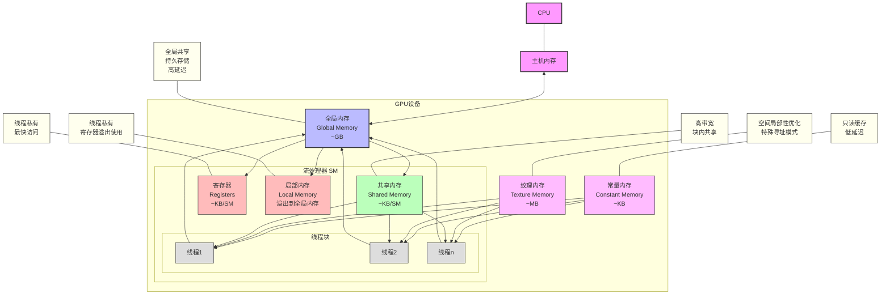
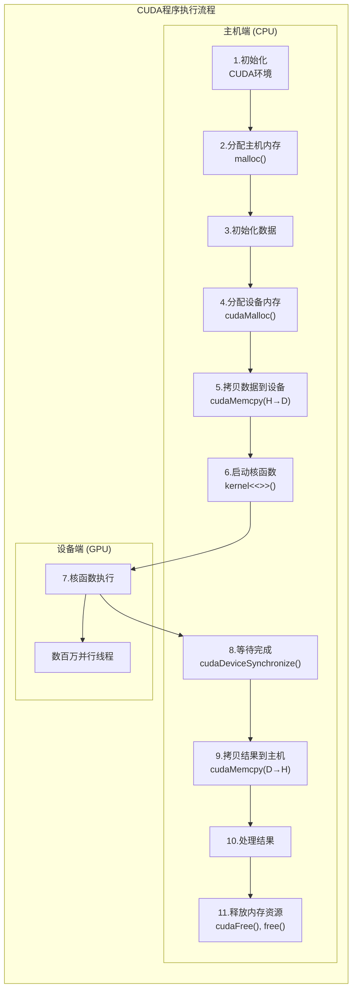
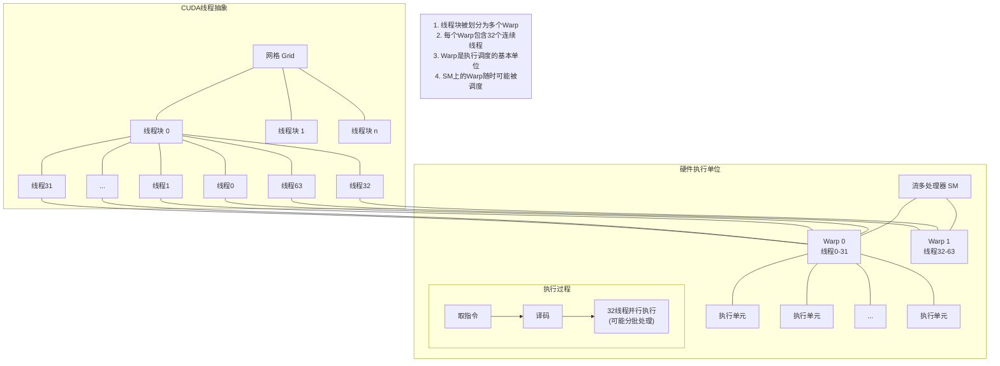
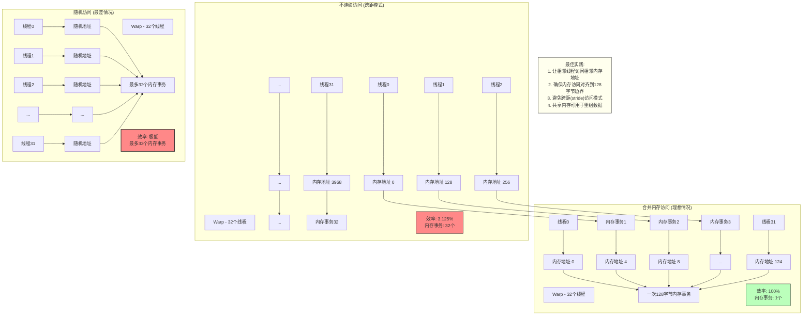

# 斯坦福CS149：并行计算 - 第七讲

## 引言: GPU架构与CUDA编程

本讲介绍图形处理器(GPU)的架构及其作为通用计算平台的应用。图形处理器最初设计用于加速3D图形渲染，后来发展成为支持各种计算密集型应用的高度并行计算引擎。我们将探讨GPU架构的基本特性、CUDA编程模型，以及如何有效利用GPU硬件特性编写高性能并行程序。

> **核心原则:** GPU通过海量线程并行和分层内存结构提供高吞吐量计算能力，但需要特定的编程模型来有效利用。

## 1. GPU架构与历史演变

### 1.1 GPU的起源与演变

GPU最初是为满足实时3D图形渲染的需求而设计的专用硬件。其演变历程可总结为：

**从专用图形处理器到通用计算平台:**
- **早期(~2000年前):** 固定功能图形管线，专注于加速特定图形操作
- **可编程着色器时代(~2001-2006):** 引入可编程着色器，允许自定义图形计算
- **早期GPGPU尝试(~2001-2006):** 研究人员开始尝试将图形API用于非图形计算
- **CUDA发布(2007):** NVIDIA推出专为通用计算设计的编程模型和接口
- **现代GPU(2007至今):** 成熟的通用计算架构，支持专业和科学计算、AI训练等

**早期GPGPU的"黑客"方法:**
- 研究人员将计算问题"伪装"成图形问题
- 例如：在512x512数组上执行函数f，可通过将输出图像尺寸设为512x512，渲染两个覆盖屏幕的三角形，将函数f写入片元着色器
- 这种方法虽然有效，但非常不直观且受限于图形API

### 1.2 GPU架构特点

现代GPU是一种**多核、多线程的吞吐量导向架构**，具有以下关键特点：

**硬件架构:**
- **多核设计:** 包含多个流多处理器(SM)，每个SM又包含多个执行单元
- **SIMD执行:** 单个处理核心内有许多执行单元同时执行相同指令
- **高度多线程:** 通过超额订阅实现延迟隐藏，单个SM可同时维护成千上万的线程上下文
- **专用内存层次:** 包括高带宽的设备内存和多级缓存系统

**与CPU架构的对比:**

| 特性 | GPU | CPU |
|------|-----|-----|
| **设计目标** | 最大化吞吐量，隐藏延迟 | 最小化单线程延迟 |
| **核心数量** | 数十到数千个简单核心 | 少量复杂核心(通常4-64) |
| **时钟频率** | 相对较低(~1-2GHz) | 较高(~3-5GHz) |
| **缓存大小** | 较小，专注于带宽 | 较大，减少延迟 |
| **控制逻辑** | 简单，功能有限 | 复杂(分支预测、乱序执行等) |
| **线程模型** | 数千到数百万轻量级线程 | 少量重量级线程 |
| **内存带宽** | 高(数百GB/s到TB/s) | 相对较低(数十到数百GB/s) |
| **编程复杂性** | 较高，需考虑硬件细节 | 相对较低，抽象程度高 |

```mermaid
graph LR
    subgraph "主机端 (CPU)"
        Init["1. 初始化<br>CUDA环境"]
        AllocH["2. 分配主机内存<br>malloc()"]
        InitData["3. 初始化数据"]
        AllocD["4. 分配设备内存<br>cudaMalloc()"]
        H2D["5. 拷贝数据到设备<br>cudaMemcpy(H→D)"]
        Launch["6. 启动核函数<br>kernel<<<grid,block>>>()"]
        Wait["8. 等待完成<br>cudaDeviceSynchronize()"]
        D2H["9. 拷贝结果到主机<br>cudaMemcpy(D→H)"]
        Process["10. 处理结果"]
        Free["11. 释放内存资源<br>cudaFree(), free()"]
    end
    
    subgraph "设备端 (GPU)"
        KernelExec["7. 核函数执行"]
        Threads["数百万并行线程"]
        
        KernelExec --> Threads
    end
    
    %% 执行流程
    Init --> AllocH --> InitData --> AllocD --> H2D --> Launch
    Launch --> KernelExec
    KernelExec --> Wait
    Wait --> D2H --> Process --> Free
    
    %% 添加注释
    style KernelExec fill:#f9f,stroke:#333,stroke-width:2px
    style Launch fill:#bbf,stroke:#333,stroke-width:1px
    style H2D fill:#fbb,stroke:#333,stroke-width:1px
    style D2H fill:#fbb,stroke:#333,stroke-width:1px

**NVIDIA GPU架构示例(V100):**
- 80个流多处理器(SM)
- 每个SM包含:
  - 64个FP32核心，32个FP64核心，8个Tensor Core
  - 多个warp调度器
  - 96KB共享内存/L1缓存
  - 65536个寄存器(每线程最多255个)
- 16-32GB HBM2内存，带宽约900GB/s
- 理论峰值性能：~15 TFLOPS (FP32)

## 2. CUDA编程模型

CUDA(Compute Unified Device Architecture)是NVIDIA开发的并行计算平台和编程模型，允许开发者利用GPU进行通用计算。CUDA提供了一套抽象，使得程序员可以不直接处理低级GPU硬件细节。

### 2.1 基本概念与线程层次结构

CUDA编程模型基于**异构计算**设计，涉及两个关键组件：**主机(CPU)**和**设备(GPU)**。

**基本执行模式:**
- 主机代码在CPU上串行执行
- 设备代码(核函数)在GPU上并行执行
- 主机负责启动核函数，管理内存，控制GPU执行

**线程层次结构:**

CUDA采用三级线程层次结构管理大量并行线程：

1. **线程(Thread):** 最基本的执行单元，每个线程运行相同的核函数代码
2. **线程块(Thread Block):** 一组可以协作的线程，共享内存资源和同步点
3. **网格(Grid):** 所有线程块的集合，构成完整的核函数执行

```mermaid
graph TD
    Grid[网格 Grid] --- B1[线程块 Block 0,0] 
    Grid --- B2[线程块 Block 1,0]
    Grid --- B3[线程块 Block 0,1]
    Grid --- B4[线程块 Block 1,1]
    Grid --- B5[....]
    
    B2 --- T1[线程 0,0]
    B2 --- T2[线程 1,0]
    B2 --- T3[线程 0,1]
    B2 --- T4[线程 1,1]
    B2 --- T5[....]
    
    subgraph "线程层次结构"
        subgraph "一个线程块内"
            T1
            T2
            T3
            T4
            T5
        end
        
        subgraph "一个网格包含多个块"
            B1
            B2
            B3
            B4
            B5
        end
        
        Grid
    end
    
    K["核函数调用: kernel<<<gridDim, blockDim>>>()"] --- Grid
    
    subgraph "索引计算"
        IDX["全局线程ID = <br/>blockIdx.x * blockDim.x + threadIdx.x"]
    end
    
    classDef grid fill:#f9d,stroke:#333,stroke-width:2px;
    classDef block fill:#bbf,stroke:#333,stroke-width:1px;
    classDef thread fill:#dfd,stroke:#333,stroke-width:1px;
    classDef code fill:#ffe,stroke:#333,stroke-width:1px;
    
    class Grid grid;
    class B1,B2,B3,B4,B5 block;
    class T1,T2,T3,T4,T5 thread;
    class K,IDX code;
```

**线程标识:**
```c
// 块内线程索引(可1D,2D,3D)
threadIdx.x, threadIdx.y, threadIdx.z

// 块在网格中的索引(可1D,2D,3D)
blockIdx.x, blockIdx.y, blockIdx.z

// 块维度
blockDim.x, blockDim.y, blockDim.z

// 网格维度
gridDim.x, gridDim.y, gridDim.z

// 计算全局线程ID(一维例子)
int globalThreadId = blockIdx.x * blockDim.x + threadIdx.x;
```

**线程块规格的限制:**
- 每个块最多1024个线程(在现代GPU上)
- 块维度可以是1D, 2D或3D，但总线程数不能超过上限
- 常见的块大小：128, 256或512线程

### 2.2 内存模型与层次结构

CUDA提供多级内存层次，以平衡访问速度、容量和共享范围的需求：

**主机-设备内存分离:**
- 主机和设备拥有独立的内存空间
- 需要显式管理数据传输

**设备内存层次:**

| 内存类型 | 范围 | 生命周期 | 速度 | 典型用途 |
|---------|------|----------|------|----------|
| **寄存器** | 线程私有 | 线程 | 最快 | 自动变量 |
| **局部内存** | 线程私有 | 线程 | 慢(全局内存) | 寄存器溢出 |
| **共享内存** | 块内共享 | 块 | 快(片上) | 线程间协作 |
| **全局内存** | 所有线程 | 应用 | 慢 | 主数据存储 |
| **常量内存** | 所有线程(只读) | 应用 | 缓存 | 不变参数 |
| **纹理内存** | 所有线程(只读) | 应用 | 缓存(空间局部性) | 特定访问模式 |



**内存管理API:**
```c
// 设备内存分配与释放
cudaMalloc((void**)&d_array, size);
cudaFree(d_array);

// 主机与设备间数据传输
cudaMemcpy(d_array, h_array, size, cudaMemcpyHostToDevice);
cudaMemcpy(h_array, d_array, size, cudaMemcpyDeviceToHost);

// 共享内存声明
__shared__ float sharedData[BLOCK_SIZE];
```

### 2.3 CUDA程序结构和语法

**基本程序结构:**

```c
// 主机代码
int main() {
    // 1. 分配主机内存
    float *h_data = (float*)malloc(size);
    
    // 2. 初始化数据
    initializeData(h_data, size);
    
    // 3. 分配设备内存
    float *d_data;
    cudaMalloc((void**)&d_data, size);
    
    // 4. 将数据拷贝到设备
    cudaMemcpy(d_data, h_data, size, cudaMemcpyHostToDevice);
    
    // 5. 启动核函数
    dim3 blockDim(256);
    dim3 gridDim((size + blockDim.x - 1) / blockDim.x);
    myKernel<<<gridDim, blockDim>>>(d_data, size);
    
    // 6. 将结果拷贝回主机
    cudaMemcpy(h_data, d_data, size, cudaMemcpyDeviceToHost);
    
    // 7. 释放资源
    cudaFree(d_data);
    free(h_data);
    
    return 0;
}
```

**核函数声明:**
```c
// 核函数(在GPU上执行)
__global__ void myKernel(float *data, int size) {
    int idx = blockIdx.x * blockDim.x + threadIdx.x;
    if (idx < size) {
        // 执行计算
        data[idx] = data[idx] * 2.0f;
    }
}
```

**函数类型限定符:**
- `__global__`: 在设备上执行，从主机调用
- `__device__`: 在设备上执行，从设备调用
- `__host__`: 在主机上执行，从主机调用(默认)
- `__host__ __device__`: 可在主机和设备上执行的函数

### 2.4 同步机制



CUDA提供多种同步机制用于协调线程执行：

**块内同步:**
- `__syncthreads()`: 块内屏障，确保块内所有线程到达同一点
- **范围**: 仅在同一线程块内有效
- **用途**: 确保所有线程完成共享内存的写入后再读取

**全局同步:**
- 核函数结束是一个隐式的全局同步点
- 不同核函数调用之间有隐式同步
- 无法在单个核函数内进行块间同步

**原子操作:**
```c
// 原子加操作
atomicAdd(address, value);

// 其他原子操作
atomicSub(), atomicExch(), atomicMin(), atomicMax() 等
```

## 3. CUDA程序示例：1D卷积

下面通过一个1D卷积的例子介绍CUDA程序的基本结构和优化思路。

### 3.1 问题定义

给定一个输入数组，计算每个元素与其相邻元素的平均值：
```
output[i] = (input[i] + input[i+1] + input[i+2]) / 3.0f
```

### 3.2 基础实现(全局内存版本)

```c
// 全局内存卷积核函数
__global__ void convolution1D_global(float *input, float *output, int width) {
    // 计算全局线程索引
    int idx = blockIdx.x * blockDim.x + threadIdx.x;
    
    // 边界检查
    if (idx < width - 2) {
        // 从全局内存读取数据并计算
        output[idx] = (input[idx] + input[idx+1] + input[idx+2]) / 3.0f;
    }
}

// 主机代码
void runConvolution1D(float *h_input, float *h_output, int width) {
    float *d_input, *d_output;
    
    // 分配设备内存
    cudaMalloc((void**)&d_input, width * sizeof(float));
    cudaMalloc((void**)&d_output, (width-2) * sizeof(float));
    
    // 传输输入数据到设备
    cudaMemcpy(d_input, h_input, width * sizeof(float), cudaMemcpyHostToDevice);
    
    // 计算启动配置
    int blockSize = 256;
    int gridSize = (width - 2 + blockSize - 1) / blockSize;
    
    // 启动核函数
    convolution1D_global<<<gridSize, blockSize>>>(d_input, d_output, width);
    
    // 等待完成并将结果传回主机
    cudaMemcpy(h_output, d_output, (width-2) * sizeof(float), cudaMemcpyDeviceToHost);
    
    // 释放设备内存
    cudaFree(d_input);
    cudaFree(d_output);
}
```

这个基础版本对数据的访问效率不高，每个线程都从全局内存读取3个输入值，导致带宽利用率低下。

### 3.3 优化实现(共享内存版本)

```c
// 使用共享内存的卷积核函数
__global__ void convolution1D_shared(float *input, float *output, int width) {
    // 声明共享内存数组
    __shared__ float sdata[BLOCK_SIZE + 2];  // BLOCK_SIZE + 卷积大小-1
    
    // 计算索引
    int tx = threadIdx.x;
    int idx = blockIdx.x * blockDim.x + tx;
    
    // 加载数据到共享内存
    if (idx < width) {
        sdata[tx] = input[idx];
    }
    
    // 加载块边界外的额外数据(用于卷积)
    if (tx < 2 && idx + BLOCK_SIZE < width) {
        sdata[tx + BLOCK_SIZE] = input[idx + BLOCK_SIZE];
    }
    
    // 同步以确保所有数据都已加载
    __syncthreads();
    
    // 执行卷积计算
    if (idx < width - 2 && tx < BLOCK_SIZE) {
        output[idx] = (sdata[tx] + sdata[tx+1] + sdata[tx+2]) / 3.0f;
    }
}
```

优化版本使用共享内存作为缓存，有以下优势：
1. **减少全局内存访问**: 多个线程共享加载的数据
2. **提高内存访问效率**: 共享内存是片上内存，访问速度快
3. **改善数据重用**: 相邻线程需要的数据可以重复利用

### 3.4 性能对比分析

全局内存版本和共享内存版本的主要区别：

| 特性 | 全局内存版本 | 共享内存版本 |
|------|------------|-------------|
| **实现复杂度** | 简单 | 较复杂 |
| **全局内存读取次数** | ~3N | ~N |
| **内存延迟** | 高 | 低(共享内存) |
| **合并访问效率** | 较高 | 非常高 |
| **适用场景** | 小数据集，原型开发 | 大数据集，性能关键应用 |

## 4. CUDA执行模型深入解析

### 4.1 GPU上的线程执行

虽然CUDA编程模型中线程、块和网格提供了清晰的抽象，但实际硬件执行方式比较复杂：

**关键概念: Warps**
- **定义**: Warp是GPU的**基本执行单位**，由32个线程组成
- **SIMT执行**: Warp内的线程以类似SIMD的方式执行，但有更灵活的控制流
- **线程块分组**: 每个线程块被划分为多个Warp（如256线程块 = 8个Warp）
- **执行调度**: SM以Warp为单位调度执行，而非单个线程
- **实现细节**: 这是硬件实现细节，非CUDA编程抽象的一部分



**SIMT (Single Instruction, Multiple Thread)**
- NVIDIA对GPU执行模型的称呼
- 类似SIMD，但允许线程独立分支和执行路径
- 当Warp内线程执行不同指令（分支发散）时，通过掩码选择性执行每个分支，导致性能下降

**线程块调度**
- GPU有专门的**线程块调度器**，负责将线程块分配到SM上
- SM资源（寄存器、共享内存）决定了一个SM能同时运行的块数量
- 一旦块开始执行，其所有线程的上下文都会被分配
- 块完成后，其资源被释放给下一个块

### 4.2 动态调度与占用率

**工作调度过程:**
1. 主机发送核函数启动命令和参数到GPU
2. GPU线程块调度器开始分配块到可用SM
3. 当一个块完成，调度器将另一个未执行的块分配到该SM
4. 过程持续直到所有块完成

**关键假设:**
- 线程块之间没有依赖关系
- 可以按任意顺序执行
- 这一假设使得GPU可以灵活调度以充分利用硬件

**SM占用率:**
- 定义：实际使用的Warp数与SM理论最大Warp数的比率
- 影响因素：
  - 每线程寄存器使用数
  - 共享内存使用量
  - 块大小
- 高占用率通常有助于隐藏延迟，但并非总是带来最高性能

### 4.3 锁步执行与线程发散

**锁步执行:**
- Warp内的32个线程执行相同的指令序列
- 如果使用16个ALU执行FP32指令，则需要2个周期完成整个Warp

**线程发散:**
- 当一个Warp中的线程遇到条件分支，各自走不同路径时，发生发散
- 硬件会序列化执行，先执行一个分支，然后执行另一个分支
- 性能降低与分支复杂度成正比（最坏情况：32个不同路径执行32倍慢）

```mermaid
graph TD
    subgraph "正常执行 (无发散)"
        W1[Warp - 32个线程] 
        W1 --> I1[指令1]
        I1 --> I2[指令2]
        I2 --> I3[指令3]
        I3 --> I4[指令4]
        
        T1["时间开销 = 4个指令周期"]
        style T1 fill:#bfb,stroke:#333,stroke-width:1px
    end
    
    subgraph "线程发散 (if-else分支)"
        W2[Warp - 32个线程]
        W2 --> C1{条件判断}
        C1 -->|16线程为true| B1[分支1-指令1]
        C1 -->|16线程为false| B2[分支2-指令A]
        
        B1 --> B1I2[分支1-指令2]
        B1I2 --> B1I3[分支1-指令3]
        
        B2 --> B2I2[分支2-指令B]
        B2I2 --> B2I3[分支2-指令C]
        
        B1I3 --> Next[继续共同路径]
        B2I3 --> Next
        
        T2["时间开销 = 1 + 3 + 3 = 7个指令周期"]
        style T2 fill:#fbb,stroke:#333,stroke-width:1px
    end
    
    subgraph "线程发散 (极端情况)"
        W3[Warp - 32个线程]
        W3 --> C2{多路条件}
        C2 -->|1线程| P1[路径1]
        C2 -->|1线程| P2[路径2]
        C2 -->|...| P3[...]
        C2 -->|1线程| P32[路径32]
        
        P1 & P2 & P3 & P32 --> Next2[继续共同路径]
        
        T3["时间开销 = 1 + 32*N个指令周期<br/>(N为每条路径平均指令数)"]
        style T3 fill:#f88,stroke:#333,stroke-width:2px
    end
    
    %% 添加注释
    Note["发散影响:<br/>1. 性能损失与分支数量成正比<br/>2. 同一Warp中相似的控制流最高效<br/>3. 尽量使条件分支与线程ID对齐<br/>4. 32个线程走不同路径是最坏情况"]
    style Note fill:#ffe,stroke:#333,stroke-width:1px
```



**避免线程发散的策略:**
- 尽量避免Warp内的条件分支
- 如必须使用条件分支，尽量使分支条件与Warp边界对齐
- 考虑重组数据，使得同一Warp中的线程执行相同路径

## 5. 高级话题与最佳实践

### 5.1 内存访问模式优化

**合并访问:**
- 当Warp访问连续的内存位置时，多个内存请求可合并成更少的事务
- 理想情况：32个线程访问32个连续4字节数据，只需一次128字节内存事务



**地址对齐:**
- 数据起始地址应对齐到适当边界（如128字节）
- 未对齐的访问可能导致额外的内存事务

**避免内存访问冲突:**
- 共享内存分为若干个内存banks
- 避免多个线程同时访问同一bank不同地址（导致bank冲突）
- 适当的内存访问模式可以避免冲突，提高共享内存吞吐量

### 5.2 同步与协作

**线程块内协作模式:**
- 协作加载（多个线程共同加载数据到共享内存）
- 数据重用（多个线程使用相同的数据）
- 分阶段计算（加载-计算-存储分离）

**块间协作限制:**
- 不能进行块间直接同步
- 需要通过多次核函数调用或原子操作实现

**持久化线程(Persistent Threads):**
- 高级CUDA编程模式
- 仅启动足够填满GPU的线程块数量
- 这些块持续运行，通过自定义工作分配机制获取任务
- 适用于负载不均衡或需要块间协作的场景

### 5.3 常见陷阱与避免策略

**依赖块间执行顺序:**
- 危险行为：块间通过标志位等待
- 可能导致死锁，因为CUDA不保证块的执行顺序
- 避免：块间必须保持独立，或使用多个核函数调用

**资源分配问题:**
- 过度使用寄存器或共享内存导致占用率低
- 使用`--ptxas-options=-v`编译选项查看资源使用情况
- 权衡共享内存用量与寄存器使用

**异步错误处理:**
- CUDA函数返回时，核函数可能尚未完成
- 使用`cudaGetLastError()`和`cudaDeviceSynchronize()`检查错误
- 开发时启用CUDA调试和分析工具

## 6. 总结

- **GPU架构特点:** 为吞吐量优化的高度并行架构，采用多核心、SIMT执行模型
- **CUDA编程模型:** 提供线程层次抽象（线程、块、网格）和分层内存系统
- **核心执行特性:**
  - 线程块可按任意顺序执行
  - 同一块中的线程并发执行，可通过共享内存和同步屏障协作
  - 硬件将线程组织为Warp（32线程），以SIMT方式执行
- **性能优化关键:**
  - 最大化内存吞吐量：合并访问，使用共享内存
  - 避免线程发散：规则的控制流，减少分支条件
  - 平衡资源使用：注意寄存器和共享内存使用量
  - 充分利用硬件：暴露足够的并行性，但避免过细粒度

> **核心理念**: GPU编程需要思考大规模数据并行模式，关注内存访问效率，并适应硬件架构的独特特性。 