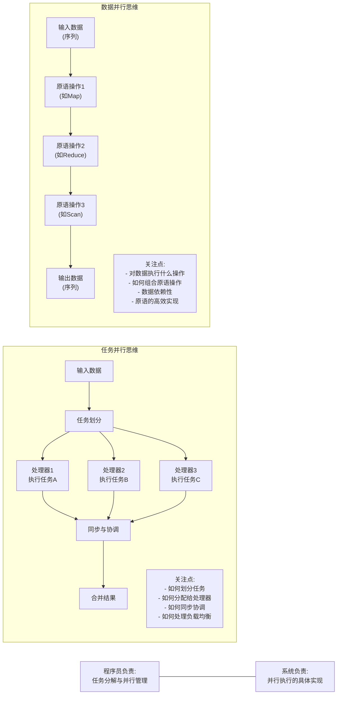
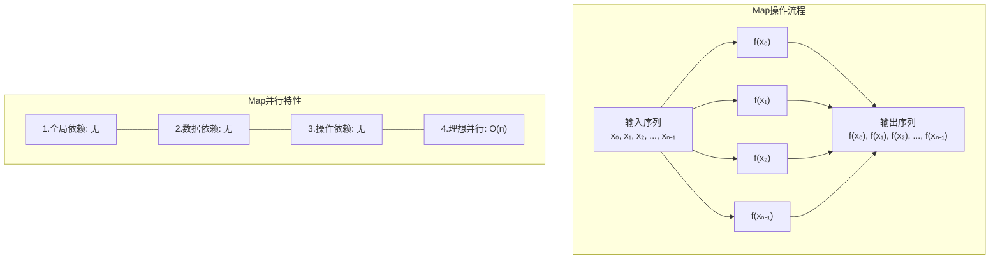
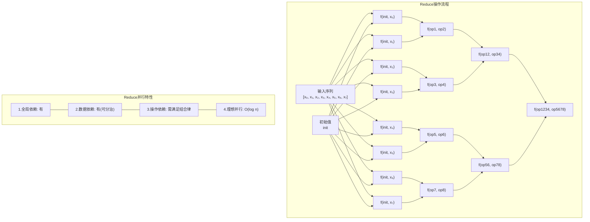
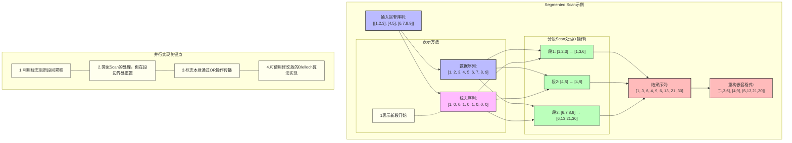

```mermaid
graph TD
    subgraph "粒子网格数据结构构建流程"
        %% 输入数据
        particles["输入: 粒子数组"]
        
        %% 第一步：计算单元格IDs
        compute["计算每个粒子<br>所属的单元格ID"]
        compute_result["粒子索引: [0,1,2,3,4,5,6,7,...]<br>单元格IDs: [2,5,2,8,5,1,2,8,...]"]
        
        %% 第二步：排序
        sort["按单元格ID排序"]
        sort_result["排序后:<br>粒子索引: [5,0,2,6,1,4,3,7,...]<br>单元格IDs: [1,2,2,2,5,5,8,8,...]"]
        
        %% 第三步：找出边界
        find["找出单元格边界"]
        boundaries["单元格1: 起始=0, 结束=0<br>单元格2: 起始=1, 结束=3<br>单元格5: 起始=4, 结束=5<br>单元格8: 起始=6, 结束=7<br>..."]
        
        %% 最终结果
        result["网格数据结构:<br>单元格1 -> [粒子5]<br>单元格2 -> [粒子0,2,6]<br>单元格5 -> [粒子1,4]<br>单元格8 -> [粒子3,7]<br>..."]
        
        %% 流程连接
        particles --> compute
        compute --> compute_result
        compute_result --> sort
        sort --> sort_result
        sort_result --> find
        find --> boundaries
        boundaries --> result
        
        %% 并行化说明
        note_compute["完全并行:<br>O(n)线程，<br>无数据依赖"]
        note_sort["高效并行排序:<br>O(n·log n)工作量,<br>O(log n)深度"]
        note_find["使用相邻元素比较<br>或Segmented Scan:<br>O(n)工作量"]
        
        note_compute -.- compute
        note_sort -.- sort
        note_find -.- find
    end
    
    subgraph "特点与优势"
        adv1["无需同步或锁:<br>避免争用和死锁"]
        adv2["保持高并行度:<br>与粒子数量成比例"]
        adv3["负载均衡:<br>均匀分配计算"]
        adv4["可扩展:<br>适用于大规模并行硬件"]
        
        adv1 --- adv2 --- adv3 --- adv4
    end
    
    %% 样式设置
    %% classDef inputNode fill:#bbf,stroke:#333,stroke-width:2px;
    %% classDef procNode fill:#bfb,stroke:#333,stroke-width:1px;
    %% classDef dataNode fill:#fbb,stroke:#333,stroke-width:1px;
    %% classDef noteNode fill:#ffe,stroke:#333,stroke-width:1px;
    %% classDef advNode fill:#fbf,stroke:#333,stroke-width:1px;
    
    class particles inputNode;
    class compute,sort,find procNode;
    class compute_result,sort_result,boundaries,result dataNode;
    class note_compute,note_sort,note_find noteNode;
    class adv1,adv2,adv3,adv4 advNode;
```

```mermaid
graph TD
    subgraph "并行直方图计算流程"
        %% 输入数据
        data["输入数据<br>[5.2, 3.7, 8.1, 2.3, 5.5, 3.2, 8.8, 5.1, ...]"]
        
        %% 第一步：计算bin索引
        mapBins["计算bin索引"]
        mapBins_result["元素: [5.2, 3.7, 8.1, 2.3, 5.5, 3.2, 8.8, 5.1, ...]<br>bin索引: [5, 3, 8, 2, 5, 3, 8, 5, ...]"]
        
        %% 第二步：排序
        sort["按bin索引排序"]
        sort_result["排序后:<br>元素: [2.3, 3.7, 3.2, 5.2, 5.5, 5.1, 8.1, 8.8, ...]<br>bin索引: [2, 3, 3, 5, 5, 5, 8, 8, ...]"]
        
        %% 第三步：找出边界
        find["找出各bin边界"]
        boundaries["bin 2: 起始位置=0<br>bin 3: 起始位置=1<br>bin 5: 起始位置=3<br>bin 8: 起始位置=6<br>..."]
        
        %% 第四步：计算每个bin的大小
        count["计算bin计数"]
        histogram["直方图结果:<br>bin 2: 1个元素<br>bin 3: 2个元素<br>bin 5: 3个元素<br>bin 8: 2个元素<br>..."]
        
        %% 流程连接
        data --> mapBins
        mapBins --> mapBins_result
        mapBins_result --> sort
        sort --> sort_result
        sort_result --> find
        find --> boundaries
        boundaries --> count
        count --> histogram
        
        %% 并行化说明
        note_map["完全并行:<br>每个元素独立计算"]
        note_sort["高效并行排序:<br>O(n·log n)工作量"]
        note_find["可使用分段扫描<br>或相邻比较"]
        note_count["并行计算bin大小"]
        
        note_map -.- mapBins
        note_sort -.- sort
        note_find -.- find
        note_count -.- count
    end
    
    subgraph "方法对比"
        comp1["传统方法:<br>原子更新直方图"]
        comp1_note["- 高争用<br>- 扩展性差<br>- 实现简单"]
        
        comp2["数据并行方法:<br>排序+分段"]
        comp2_note["- 无争用<br>- 高扩展性<br>- 额外排序开销"]
        
        comp1 --- comp2
        comp1_note -.- comp1
        comp2_note -.- comp2
    end
    
    %% 样式设置
    classDef inputNode fill:#bbf,stroke:#333,stroke-width:2px;
    classDef procNode fill:#bfb,stroke:#333,stroke-width:1px;
    classDef dataNode fill:#fbb,stroke:#333,stroke-width:1px;
    classDef noteNode fill:#ffe,stroke:#333,stroke-width:1px;
    classDef compNode fill:#fbf,stroke:#333,stroke-width:1px;
    
    class data inputNode;
    class mapBins,sort,find,count procNode;
    class mapBins_result,sort_result,boundaries,histogram dataNode;
    class note_map,note_sort,note_find,note_count noteNode;
    class comp1,comp2,comp1_note,comp2_note compNode;
```

# 斯坦福CS149：并行计算 - 第八讲

## 引言：数据并行思考模式

本讲将介绍一种不同于以往的并行编程思维方式：**数据并行思考（Data-Parallel Thinking）**。这种方法不再关注"工作单元做什么"或"如何分配工作"，而是将算法描述为对数据序列的一系列操作。我们将讨论一组强大的数据并行原语（如map、reduce、scan等），以及如何利用它们来表达和解决复杂的并行问题。这些原语通常具有高效的并行实现，使用它们构建的程序往往能在现代并行架构上获得良好性能。

> **核心理念:** 通过对数据集合的高级操作来思考问题，而不是对单个数据元素的处理过程。这种思维转变使我们能以简洁、可扩展的方式表达并行算法，并利用已有的高效并行原语实现。

## 1. 数据并行范式基础

### 1.1 数据并行的动机

随着硬件并行度的快速增长，我们需要能够表达和利用大量并行性的编程模型：

- **多核CPU和集群:** 现代服务器CPU拥有数十个核心，集群则有数百至数千个处理器
- **SIMD指令:** 单个CPU核心可同时对多个数据元素执行相同操作
- **GPU架构:** 尤其需要大量并行性才能高效运行

**GPU并行度示例（NVIDIA V100）:**
- 可并发执行高达163,840个线程
- 如果程序不能暴露足够的并行性，或算术强度不够高，在GPU上运行效率会很低

### 1.2 从任务并行到数据并行的思维转变

**传统任务并行思考:**
- 关注"如何将工作分配给处理单元"
- 思考"线程应该做什么"
- 涉及复杂的工作划分和同步机制

**数据并行思考:**
- 关注"对数据集合执行什么操作"
- 将计算表达为对元素序列的转换
- 使用高级抽象原语，不直接管理并行执行

**核心思维转变:**
从"指定每个处理器的行为"转变为"指定对数据的操作，让系统决定如何并行执行"。



### 1.3 数据并行的基本概念

**序列（Sequence）:**
- 数据并行编程的基本单位
- 元素的有序集合，可以是任何数据类型
- 与数组不同，通常通过特定操作（而非直接索引）访问

**并行原语:**
- 一组基本操作，可对序列高效并行处理
- 关注"对数据做什么"，而非"如何并行执行"
- 由系统负责高效的底层并行实现

**依赖关系:**
- 并行编程的核心挑战在于理解操作间的依赖
- 数据并行原语明确表达操作间的依赖，简化并行思考
- 缺乏依赖的操作可以并行执行

## 2. 核心数据并行原语

### 2.1 Map

**定义:** 将一个函数应用于输入序列的每个元素，生成一个等长的输出序列。

**数学表示:** `map(f, [x₀, x₁, ..., xₙ₋₁]) = [f(x₀), f(x₁), ..., f(xₙ₋₁)]`

**特点:**
- 函数`f`必须是纯函数（无副作用）
- 每个输出元素仅依赖于对应的输入元素
- 各元素的计算完全独立，可以任意顺序或并行执行

**并行实现:**
- 元素间完全独立，非常适合并行处理
- 可按处理器数量分割序列，每个处理器独立处理一部分
- 实现简单，无需同步，几乎可线性扩展



**示例:**
```python
# 串行实现
def map_serial(f, input_seq):
    return [f(x) for x in input_seq]

# 并行实现（伪代码）
def map_parallel(f, input_seq, num_threads):
    chunk_size = len(input_seq) / num_threads
    results = [None] * len(input_seq)
    
    def process_chunk(thread_id):
        start = thread_id * chunk_size
        end = min((thread_id + 1) * chunk_size, len(input_seq))
        for i in range(start, end):
            results[i] = f(input_seq[i])
    
    # 并行启动所有线程
    parallel_for(process_chunk, range(num_threads))
    return results
```

### 2.2 Reduce/Fold

**定义:** 通过二元操作将序列"折叠"成单个值，从初始值开始依次累积。

**数学表示:** `reduce(f, [x₀, x₁, ..., xₙ₋₁], init) = f(...f(f(init, x₀), x₁)..., xₙ₋₁)`

**特点:**
- 需要一个二元操作函数`f`和一个初始值`init`
- 串行计算存在明显的顺序依赖
- 如果操作`f`满足结合律，可高效并行化

**并行实现:**


**实现（结合律操作）:**
```python
# 串行实现
def reduce_serial(f, input_seq, init):
    result = init
    for x in input_seq:
        result = f(result, x)
    return result

# 并行实现（伪代码，假设f满足结合律）
def reduce_parallel(f, input_seq, init):
    # 阶段1：局部规约
    local_results = [init] * num_threads
    
    def local_reduce(thread_id):
        start = thread_id * chunk_size
        end = min((thread_id + 1) * chunk_size, len(input_seq))
        local_results[thread_id] = reduce_serial(f, input_seq[start:end], init)
    
    parallel_for(local_reduce, range(num_threads))
    
    # 阶段2：合并局部结果
    final_result = init
    for res in local_results:
        final_result = f(final_result, res)
    return final_result
```

### 2.3 Scan/Prefix Sum（前缀和）

**定义:** 计算序列的累积运算结果，生成等长的输出序列。

**类型:**
- **包含扫描(Inclusive Scan):** `out[i] = f(in[0], in[1], ..., in[i])`
- **排除扫描(Exclusive Scan):** `out[i] = f(in[0], in[1], ..., in[i-1])` (out[0] = identity)

**数学表示:**
包含扫描：`scan(f, [x₀, x₁, ..., xₙ₋₁]) = [x₀, f(x₀,x₁), ..., f(...f(x₀,x₁)...,xₙ₋₁)]`

**特点:**
- 要求操作`f`满足结合律（如加法、乘法）
- 输出元素依赖于所有前面的输入元素
- 存在固有的顺序依赖性，并行化具有挑战性

**应用:**
- 累积和/累积乘积
- 多种数据并行算法的构建块
- 动态内存分配、直方图、稀疏矩阵运算等

```mermaid
graph TD
    subgraph "Scan操作流程(包含扫描)"
        input["输入序列<br/>[x₀, x₁, x₂, x₃, x₄, x₅, x₆, x₇]"]
        
        %% 第一个元素保持不变
        out0["x₀"]
        
        %% 后续元素为累积结果
        out1["x₀ + x₁"]
        out2["x₀ + x₁ + x₂"]
        out3["x₀ + x₁ + x₂ + x₃"]
        out4["x₀ + x₁ + x₂ + x₃ + x₄"]
        out5["x₀ + x₁ + ... + x₅"]
        out6["x₀ + x₁ + ... + x₆"]
        out7["x₀ + x₁ + ... + x₇"]
        
        output["输出序列<br/>[x₀, x₀+x₁, x₀+x₁+x₂, ..., x₀+x₁+...+x₇]"]
        
        %% 依赖关系(简化以避免图表过于复杂)
        input --> out0
        out0 --> out1
        out1 --> out2
        out2 --> out3
        out3 --> out4
        out4 --> out5
        out5 --> out6
        out6 --> out7
        
        out0 & out1 & out2 & out3 & out4 & out5 & out6 & out7 --> output
        
        %% 输入元素的依赖映射(简化)
        input --> |"x₀"|out0
        input --> |"x₁"|out1
        input --> |"x₂"|out2
        input --> |"x₃"|out3
        input --> |"x₄"|out4
        input --> |"x₅"|out5
        input --> |"x₆"|out6
        input --> |"x₇"|out7
    end
    
    subgraph "Scan并行化策略"
        strategy1["1.朴素并行: O(n·log n)工作量"]
        strategy2["2.Work-Efficient: O(n)工作量"]
        strategy3["3.两阶段: Up-sweep + Down-sweep"]
        strategy4["4.多级: 块内并行+块间合并"]
        
        strategy1 --- strategy2 --- strategy3 --- strategy4
    end
    
    subgraph "Scan并行特性"
        char1["1.全局依赖: 有(每个输出依赖前面的所有输入)"]
        char2["2.数据依赖: 有(可重组)"]
        char3["3.操作依赖: 需满足结合律"]
        char4["4.理想并行: O(log n)"]
        
        char1 --- char2 --- char3 --- char4
    end
    
    %% 样式设置
    %% classDef inputNode fill:#bbf,stroke:#333,stroke-width:2px;
    %% classDef outputNode fill:#fbb,stroke:#333,stroke-width:2px;
    %% classDef scanNode fill:#bfb,stroke:#333,stroke-width:1px;
    %% classDef strategyNode fill:#fbf,stroke:#333,stroke-width:1px;
    %% classDef charNode fill:#ffe,stroke:#333,stroke-width:1px;
    
    class input inputNode;
    class output outputNode;
    class out0,out1,out2,out3,out4,out5,out6,out7 scanNode;
    class strategy1,strategy2,strategy3,strategy4 strategyNode;
    class char1,char2,char3,char4 charNode;
```



**表格总结核心数据并行原语:**

| 特性 | Map | Reduce | Scan |
|------|-----|--------|------|
| **定义** | 将函数应用于输入集合的每个元素，生成对应的输出集合 | 使用关联操作符将输入集合聚合为单个值 | 计算输入集合的所有前缀的累积结果 |
| **输入-输出** | 接收n个输入，产生n个输出 | 接收n个输入，产生1个输出 | 接收n个输入，产生n个输出 |
| **数据依赖** | 无数据依赖，完全独立 | 有全局数据依赖 | 有数据依赖，但具有特殊结构可并行化 |
| **并行复杂度** | O(n) 个处理器: O(1)时间<br>O(1) 个处理器: O(n)时间 | O(n) 个处理器: O(log n)时间<br>O(1) 个处理器: O(n)时间 | O(n) 个处理器: O(log n)时间<br>O(1) 个处理器: O(n)时间 |
| **工作效率** | 与顺序实现相同 | 通常多做O(n)工作 | 工作效率取决于实现方法：<br>- 朴素方法：O(n²)工作<br>- 工作高效方法：O(n)工作 |
| **编程简便性** | 非常简单 | 简单 | 较复杂 |
| **典型应用场景** | - 元素级转换<br>- 独立计算<br>- 数据清洗和转换<br>- 特征提取 | - 聚合计算<br>- 统计分析<br>- 查找最大/最小值<br>- 求和/乘积计算 | - 计算累积和<br>- 排序算法<br>- 动态规划问题<br>- 图算法 |
| **实际应用示例** | - 图像处理（每像素变换）<br>- 向量/矩阵元素级运算<br>- 数据格式转换 | - 词频统计<br>- 求数组总和<br>- 计算平均值<br>- MapReduce框架 | - 基数排序<br>- 快速傅里叶变换<br>- 区间查询<br>- 离散微积分 |
| **优点** | - 完全并行<br>- 无需通信<br>- 实现简单<br>- 可扩展性极佳 | - 概念简单<br>- 高度抽象<br>- 应用广泛<br>- 对多种类型数据适用 | - 解决前缀依赖问题<br>- 使某些序列问题并行化<br>- 可构建复杂算法 |
| **缺点** | - 仅适用于元素间独立计算<br>- 不适合有依赖的问题 | - 并行度受log n因素限制<br>- 通信开销较大 | - 实现复杂<br>- 部分实现方法工作效率低<br>- 通信模式复杂 |
| **内存访问模式** | 规律、可预测 | 树形归约，有较多不规则访问 | 复杂，涉及多阶段读写 |
| **变种** | flatMap、mapWithIndex | reduceByKey、treeReduce | 独占式/包含式Scan、分段Scan |

### 3. 高效并行前缀和算法 (Work-Efficient Parallel Scan)

## 4. Segmented Scan与不规则数据处理

### 4.1 Segmented Scan概念

**定义:** Segmented Scan（分段扫描）是Scan操作的泛化，在输入序列的多个连续分段上同时执行Scan操作。

**目的:** 高效处理"序列的序列"等不规则数据结构，将不规则并行性转换为规则并行处理。

**应用场景:**
- 图的邻接表处理
- 粒子模拟中的邻居列表
- 稀疏矩阵运算

### 4.2 表示方法与实现

**表示方法:**
- 使用扁平化的数据序列和对应的"标志序列"
- 标志序列中的1表示新段的起始位置
- 例如: 序列[[1,2,3], [4,5], [6,7,8,9]]可表示为:
  - 数据: [1,2,3,4,5,6,7,8,9]
  - 标志: [1,0,0,1,0,1,0,0,0]



**实现思路:**
- 在Up-sweep阶段，每个段独立执行Scan，并生成段标志
- 在Down-sweep阶段，根据段标志决定是否从左侧累积值
- 标志本身通过OR操作传播，确保段间依赖阻断

### 4.3 案例：稀疏矩阵向量乘法(SpMV)

**问题:** 计算稀疏矩阵A与向量x的乘积y=Ax

**挑战:**
- 矩阵中大部分元素为0，存储为压缩格式
- 每行非零元素数量不同，导致负载不均衡
- 直接并行化面临效率问题

**CSR格式:**
- 仅存储非零元素值(values)及其列索引(cols)
- 使用row_starts数组标记每行起始位置

**使用Segmented Scan实现SpMV:**
1. **Map操作**: 计算每个非零元素与对应向量元素的乘积
   ```
   products[i] = values[i] * x[cols[i]]
   ```

2. **生成标志序列**: 根据row_starts创建段标志
   ```
   flags[row_starts[j]] = 1, 其他位置为0
   ```

3. **执行分段扫描**: 对乘积序列执行分段加法扫描
   ```
   segmented_scan(+, products, flags)
   ```

4. **提取结果**: 每个段的最后一个元素即为结果向量的对应元素
   ```
   对每行j: y[j] = segmented_scan结果中第j段的最后一个元素
   ```

**优势:**
- 转换为规则的数据并行操作
- 避免了显式的负载均衡处理
- 能高效利用现代并行硬件

## 5. 补充原语：Gather/Scatter与排序

### 5.1 Gather与Scatter操作

**定义:**
- **Gather（间接读）**: `output[i] = input[index[i]]`
- **Scatter（间接写）**: `output[index[i]] = input[i]`

**特点:**
- 允许不规则的内存访问模式
- 比顺序访问开销更大，但支持复杂的数据重组
- 现代CPU和GPU都提供硬件支持

**硬件支持:**
- CPU: AVX2+支持Gather，AVX512支持Scatter
- GPU: 支持Gather和Scatter，但性能受内存访问模式影响

**特殊情况与优化:**
- **唯一索引(置换)**: 当index是一个置换时，可通过排序实现高效Scatter
- **重复索引**: 需要原子操作或其他策略处理写入冲突

### 5.2 排序与其他原语

**排序 (Sort):**
- 将序列元素按指定顺序重排
- 现代GPU和CPU上有高度优化的并行实现
- 可作为其他数据并行操作的构建块

**其他重要原语:**
- **Filter**: 移除不满足条件的元素
- **GroupBy**: 按键值对元素分组
- **Join**: 基于共同键合并数据集

## 6. 案例研究：数据并行解决方案

### 6.1 构建粒子网格数据结构

**问题描述:**
- 将大量粒子(百万级)分配到网格单元格中
- 需要构建每个单元格内粒子的列表
- 常用于N体问题的近邻搜索等场景

**解决方案对比:**

| 方法 | 描述 | 优点 | 缺点 |
|------|------|------|------|
| **全局锁方法** | 所有粒子并行处理，使用全局锁保护单元格列表 | 实现简单 | 严重的锁争用，性能差 |
| **单元格锁方法** | 每个单元格一个锁，减少争用 | 争用减少 | 仍有锁开销，热点单元格性能问题 |
| **按单元格并行** | 为每个单元格分配一个线程 | 无争用 | 并行度受限(只有网格单元数),工作量不均衡 |
| **部分结果合并** | 每个线程维护私有结果，最后合并 | 无争用，同步少 | 额外合并工作和内存开销 |
| **数据并行方法** | 使用Sort和其他数据并行原语 | 高效，可扩展 | 需要多次数据传递，带宽需求高 |

**数据并行解决方案:**
1. **Map**: 计算每个粒子所属的单元格ID
   ```c
   parallel_for(i = 0; i < num_particles; i++) {
       cell_ids[i] = compute_cell_id(particles[i].position);
   }
   ```

2. **Sort**: 按单元格ID对粒子索引排序
   ```c
   // 使用高效的并行排序算法
   sort_by_key(cell_ids, particle_indices);
   ```

3. **Find Boundaries**: 确定每个单元格的起始/结束位置
   ```c
   // 可以用类似Scan的操作实现
   find_segment_boundaries(sorted_cell_ids, cell_starts, cell_ends);
   ```

**分析:**
- 保持了粒子数量级的并行性
- 消除了细粒度同步和锁争用
- 代价是多次数据传递和排序操作



**分析:**
- 保持了粒子数量级的并行性
- 消除了细粒度同步和锁争用
- 代价是多次数据传递和排序操作

### 6.2 并行直方图计算

**问题描述:**
- 计算大量数据的直方图(频率分布)
- 直接并行更新会导致bin之间的争用
- 需要高效地计算大规模数据集的直方图

**解决方案:**

**数据并行方法:**
1. **Map**: 计算每个元素对应的bin索引
   ```c
   parallel_for(i = 0; i < n; i++) {
       bin_ids[i] = compute_bin(data[i]);
   }
   ```

2. **Sort**: 按bin索引排序
   ```c
   sort_by_key(bin_ids, data_indices);
   ```

3. **Find Boundaries**: 找出每个bin的起始位置
   ```c
   // 可使用Run-Length Encoding或类似技术
   find_segment_boundaries(sorted_bin_ids, bin_starts);
   ```

4. **计算每个bin的大小**: 相邻bin起始位置之差即为bin大小
   ```c
   parallel_for(i = 0; i < num_bins-1; i++) {
       bin_counts[i] = bin_starts[i+1] - bin_starts[i];
   }
   bin_counts[num_bins-1] = n - bin_starts[num_bins-1];
   ```



**分析:**
- 避免了原子操作和锁争用
- 可扩展到大量处理器
- 需要额外的排序和数据移动开销

## 7. 数据并行思考方式的应用与影响

### 7.1 数据并行模式的优缺点

**优点:**
- **高表达能力**: 以简洁方式表达复杂算法
- **可组合性**: 原语可灵活组合解决复杂问题
- **可移植性**: 抽象层次高，易于跨平台实现
- **可扩展性**: 能有效利用大规模并行硬件
- **隐藏同步**: 将细粒度同步转化为粗粒度或消除同步

**缺点:**
- **带宽要求高**: 通常需要多次数据传递
- **临时存储开销**: 中间结果可能占用大量内存
- **不适合小数据集**: 启动开销可能超过计算开销
- **不适合不规则访问**: 某些算法难以用数据并行表达

### 7.2 现代系统中的数据并行

**硬件加速:**
- **GPU库**: CUDA Thrust、CUB等提供高效数据并行原语
- **CPU SIMD优化**: 现代CPU库专门优化数据并行操作

**大数据处理框架:**
- **MapReduce、Spark、Hadoop**: 基于数据并行思想的分布式计算
- **Pandas、Dask**: 数据科学中的数据并行抽象

**领域特定系统:**
- **TensorFlow、PyTorch**: 深度学习框架采用数据并行模型
- **科学计算库**: 如NumPy、CuPy等

### 7.3 最佳实践

**选择合适的问题:**
- 规则的数据结构和访问模式
- 大规模数据集
- 计算密集型任务

**使用适当的原语组合:**
- 选择能表达算法核心的最小原语集
- 避免不必要的数据转换和复制
- 考虑算法的带宽和计算比例

**性能调优:**
- 尽量减少数据传递次数
- 关注顺序访问和局部性
- 根据目标硬件特性选择实现策略

## 8. 总结

- **数据并行思考**是一种强大的并行编程范式，通过对数据集合的操作表达算法，而非关注单个处理器的行为
- **核心原语**（Map、Reduce、Scan等）提供了表达各种并行算法的构建块，并在现代硬件上有高效实现
- **并行Scan算法**展现了将串行依赖转化为并行计算的策略，以及如何在不同硬件层次采用不同实现方法
- **Segmented Scan**提供了处理不规则数据结构的统一方法，将不规则并行性转换为规则数据并行
- **数据并行解决方案**通常能消除细粒度同步，以带宽开销换取更高的并行度和可扩展性
- **现代计算系统**（从单机GPU到分布式集群）的设计和编程模型都受到数据并行思想的深刻影响

**数据并行原语综合对比:**

| 原语 | 描述 | 时间复杂度(串行) | 时间复杂度(并行) | 空间复杂度 | 关键特性与限制 | 典型应用场景 |
|------|------|-----------------|-----------------|------------|----------------|--------------|
| **Map** | 将函数应用于每个元素 | O(n) | O(1) | O(n) | 完全独立、无依赖、最易并行 | 元素变换、筛选、图像处理 |
| **Reduce** | 将序列折叠为单值 | O(n) | O(log n) | O(n) | 需满足结合律、可分治 | 求和、最值、统计计算 |
| **Scan** | 计算前缀累积结果 | O(n) | O(log n) | O(n) | 需满足结合律、有序依赖 | 动态分配、直方图、排序 |
| **Segmented Scan** | 分段执行Scan | O(n) | O(log n) | O(n) | 需满足结合律、分段独立 | 不规则数据、图处理、稀疏矩阵运算 |
| **Filter** | 保留满足条件的元素 | O(n) | O(log n) | O(n) | 涉及元素移动、排除 | 数据筛选、压缩、清洗 |
| **Sort** | 元素排序 | O(n log n) | O(log² n) | O(n) | 比较或基数、全局重排 | 排序搜索、分段边界 |
| **Gather** | 按索引读取(间接访问) | O(n) | O(1) | O(n) | 随机读取、局部性差 | 数据重组、索引查找 |
| **Scatter** | 按索引写入(间接写入) | O(n) | O(1)* | O(n) | 写冲突、需原子操作 | 直方图、稀疏更新 |

*在存在写冲突的情况下，Scatter可能需要序列化，复杂度会增加

**原语组合使用场景:**

| 组合 | 典型用途 | 优势 | 示例应用 |
|------|----------|------|----------|
| **Map + Reduce** | 转换后聚合 | 高并行、两阶段 | 向量点积、MapReduce框架 |
| **Map + Scan** | 转换后累积 | 数据重用、历史聚合 | 跑动总和、积分计算 |
| **Sort + Segmented Scan** | 分组聚合 | 数据重组、分组计算 | GroupBy操作、直方图 |
| **Scan + Scatter** | 动态内存分配 | 并行分配、无争用 | 压缩、粒子模拟 |

> **核心理念**: 通过高级数据操作而非低级线程管理来思考并行算法，利用已有的高效原语实现简化了并行程序开发，同时获得性能和可扩展性。 