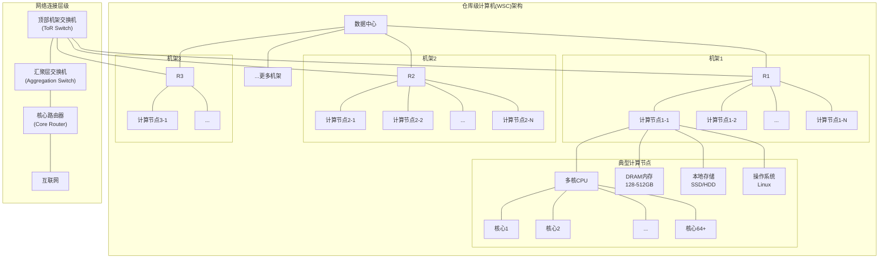
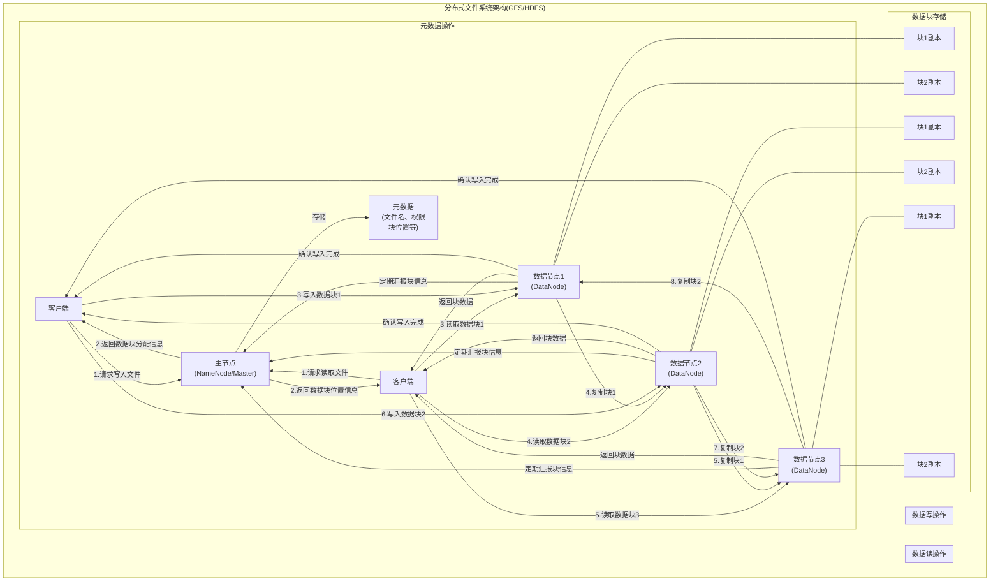
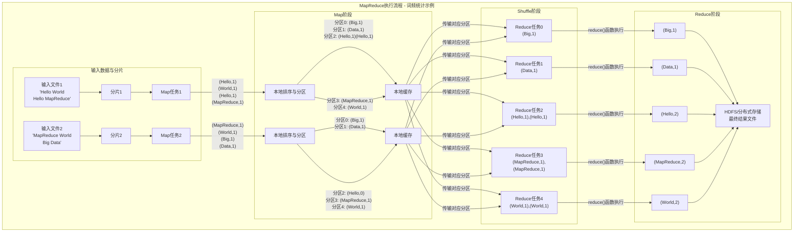
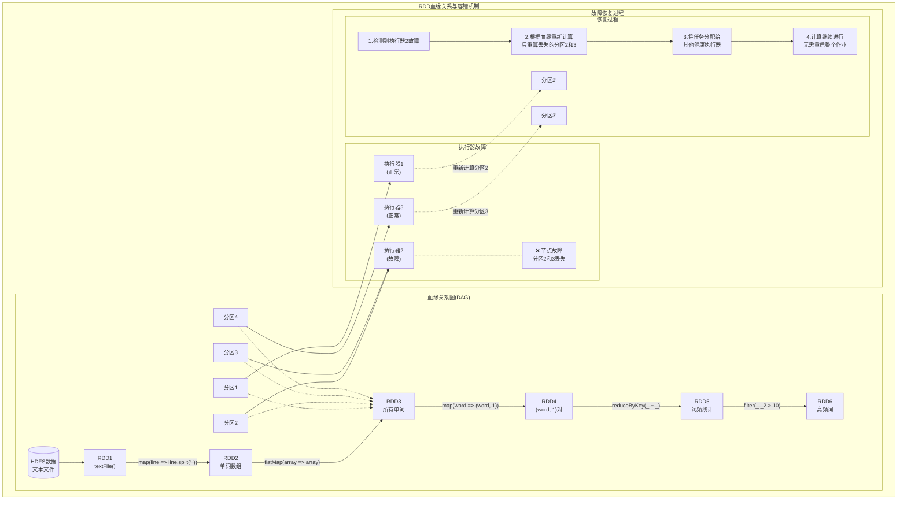
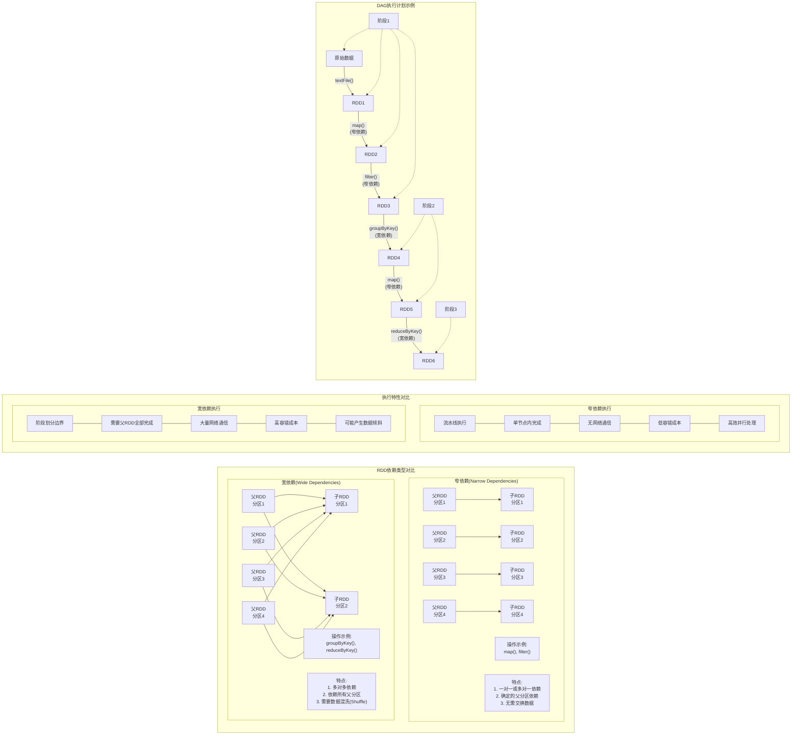
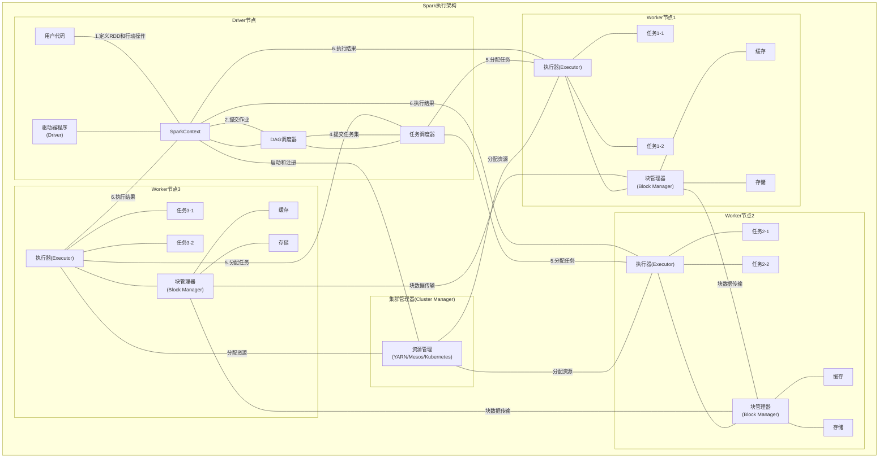
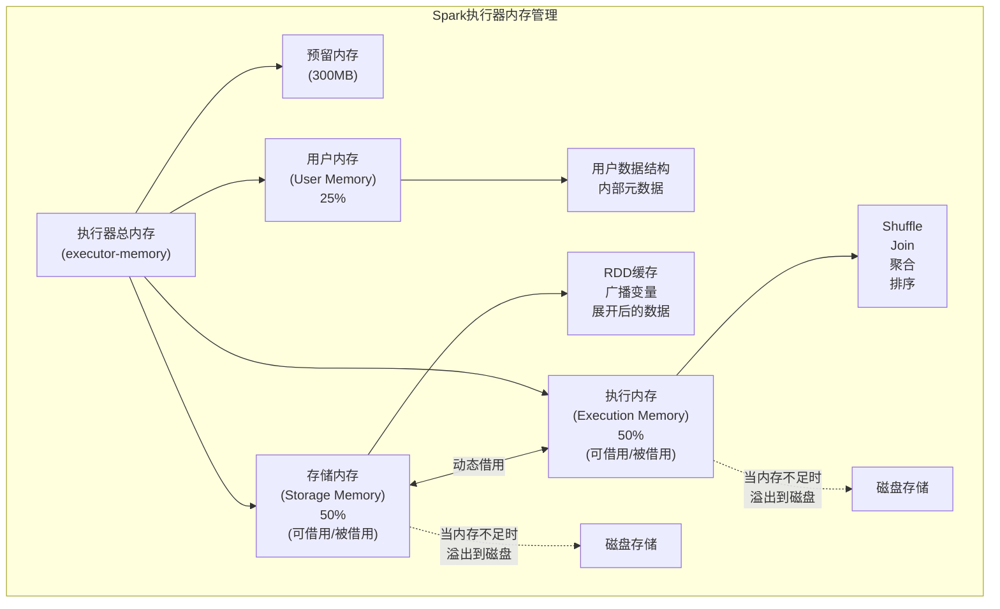

# CS149: 并行计算 - 第9讲：集群上的数据并行计算(Spark)

## 1. 引言：集群计算的挑战

### 1.1 大规模数据处理需求

现代数据处理需求（如处理100TB级别的日志文件）已远超单台机器的能力范围。使用拥有数千节点的集群可以将处理时间从数周缩短至数十分钟，但这带来了全新的编程挑战：

- **规模问题**：如何为拥有成千上万核心的系统高效编程？
- **可靠性问题**：如何确保在系统组件不可避免发生故障时数据不会丢失？
- **编程复杂性**：如何简化集群编程模型，使开发者能够专注于应用逻辑？

### 1.2 数据并行思考回顾

上节课我们讨论了数据并行思考模式：
- 将算法描述为对**数据序列**的操作（`map`, `filter`, `reduce`, `scan`, `sort`等）
- 这些原语通常有高性能并行实现，使得基于它们构建的程序能在并行系统上高效运行
- 主要挑战是带宽瓶颈和负载均衡

今天我们讨论如何将这种思想扩展到拥有数千甚至数万节点的分布式系统，同时确保：
- **可扩展性**：能扩展到10万级别的核心数量
- **容错性**：在组件故障时保持数据完整性
- **高效性**：在内存和带宽受限的条件下高效运行

## 2. 仓库级计算机架构(WSC)

### 2.1 基本架构

**仓库级计算机**(Warehouse-Scale Computers, WSC)是现代大规模数据处理的基础设施：

- 由成千上万台**商用计算机节点**组成
- 每个节点包含多核x86处理器、私有内存(DRAM)和存储(SSD/HDD)
- 每个节点运行独立的操作系统(Linux)，拥有独立的地址空间
- 节点间通过高速以太网连接(10-40Gb/s)
- 采用**消息传递**模型进行节点间通信（无共享内存）



WSC的关键特征是其**规模庞大且高度分层**的架构：

- 数据中心内有多个机架(Rack)，每个机架包含数十台服务器节点
- 同一机架内节点通过顶部机架交换机(ToR Switch)互联，带宽较高
- 不同机架间通过汇聚层和核心层网络互联，带宽逐级降低
- 这种分层网络结构导致不同位置节点间的通信成本差异巨大

### 2.2 性能特点与带宽层级

WSC的性能特点主要受带宽层级限制：

| 连接类型 | 典型带宽 | 相对性能 |
|---------|----------|----------|
| 节点内DRAM访问 | 100 GB/s | 最高 |
| 节点内总线 | 1-4 GB/s | 高 |
| 机架内网络 | 1-2 GB/s | 中 |
| 机架间网络 | 0.1-2 GB/s | 低 |

这种带宽层级对算法设计和性能有重大影响：
- **局部性**变得极其重要（尽量将计算移动到数据所在位置）
- **网络通信**通常是主要瓶颈
- **数据移动**成本远高于计算成本

### 2.3 组件可靠性与系统故障

在WSC环境中，硬件故障是常态而非例外：

- 单个组件的平均无故障时间(MTTF)可能长达数年
- 但在包含数千组件的系统中，**整体系统的MTTF会急剧下降**
- 具有10,000个节点的集群中，每天可能有2-4个节点发生故障
- 大规模集群中，硬件故障的频率可能是每小时级别

这种必然的故障率要求系统在设计上必须考虑容错机制。

## 3. 分布式文件系统(DFS)

### 3.1 DFS的设计目标

为解决节点故障与持久化存储问题，大规模集群通常采用**分布式文件系统**(如Google GFS或Hadoop HDFS)：

- 提供全局统一的文件命名空间
- 专为**大文件**(GB到TB级)优化
- 支持数据复制以实现容错性
- 优化以支持特定读写模式（大多数操作是**读取**和**追加**，很少原地更新）

### 3.2 DFS架构与实现

典型DFS(如GFS/HDFS)由三个主要组件组成：

1. **主节点**(Master/NameNode)：
   - 存储文件元数据（文件名、权限、块位置）
   - 协调文件操作，但不参与数据传输
   - 自身通过复制提供高可用性

2. **数据节点**(Chunk Server/DataNode)：
   - 存储实际文件数据块(通常64-256MB)
   - 提供数据块读写服务
   - 定期向主节点报告状态

3. **客户端**：
   - 与主节点交互获取元数据
   - 直接与数据节点交互进行数据读写



**DFS读写流程说明**：

**读取文件流程**：
1. 客户端向主节点请求读取特定文件
2. 主节点查询元数据，返回包含文件数据块位置的信息
3. 客户端直接与相应的数据节点通信，并行读取各个块
4. 数据节点返回请求的块数据
5. 客户端组装所有数据块，重建完整文件

**写入文件流程**：
1. 客户端向主节点请求写入文件
2. 主节点分配数据块ID和位置，返回给客户端
3. 客户端将数据拆分成块，发送到指定的数据节点
4. 接收数据的数据节点按照复制链(Pipeline)将数据复制到其他节点
5. 当所有复制完成后，数据节点向客户端确认写入成功
6. 重复步骤3-5直到所有数据写入完成
7. 客户端通知主节点文件写入完成

这种设计实现了**数据与元数据分离**，并通过**数据块复制**确保了系统的可靠性和可用性。

### 3.3 数据复制与容错

DFS通过**数据复制**实现容错性：

- 每个数据块被复制多份(通常2-3份)
- 副本存储在**不同**物理节点上（优先分布在不同机架）
- 主节点追踪所有副本的位置
- 当检测到节点故障时，自动创建新的副本以维持复制因子
- 写入操作只有在所有副本更新后才完成

这种设计确保了即使在节点故障情况下，数据仍然可用。

## 4. MapReduce编程模型

### 4.1 MapReduce概述

MapReduce是针对大规模数据处理的简化编程模型：

- 由Google在2004年提出，旨在简化分布式数据处理
- 基于函数式编程的Map和Reduce原语
- 自动处理数据分布、并行化、容错和负载均衡
- 极大简化了大规模数据处理的复杂性

### 4.2 核心原语和编程接口

MapReduce基于两个简单函数：

1. **Map函数**：`map(k1, v1) → list(k2, v2)`
   - 处理输入数据的每一条记录
   - 生成中间键值对

2. **Reduce函数**：`reduce(k2, list(v2)) → list(v3)`
   - 处理具有相同键的所有值
   - 生成最终结果

用户只需实现这两个函数，框架负责处理所有分布式计算细节。

#### MapReduce代码示例：词频统计

下面是两种常用语言中MapReduce词频统计的实现：

**Java实现**：
```java
// 词频统计 - Java MapReduce实现
public class WordCount {
    
    // Map函数实现
    public static class TokenizerMapper extends Mapper<Object, Text, Text, IntWritable> {
        
        private final static IntWritable one = new IntWritable(1);
        private Text word = new Text();
        
        public void map(Object key, Text value, Context context) throws IOException, InterruptedException {
            // 将输入文本分割成单词
            StringTokenizer itr = new StringTokenizer(value.toString());
            while (itr.hasMoreTokens()) {
                word.set(itr.nextToken());
                // 发出(单词,1)键值对
                context.write(word, one);
            }
        }
    }
    
    // Reduce函数实现
    public static class IntSumReducer extends Reducer<Text, IntWritable, Text, IntWritable> {
        
        private IntWritable result = new IntWritable();
        
        public void reduce(Text key, Iterable<IntWritable> values, Context context) 
                throws IOException, InterruptedException {
            int sum = 0;
            // 对同一单词的所有计数求和
            for (IntWritable val : values) {
                sum += val.get();
            }
            result.set(sum);
            // 输出(单词,总数)键值对
            context.write(key, result);
        }
    }
    
    // 主函数 - 设置和提交作业
    public static void main(String[] args) throws Exception {
        Configuration conf = new Configuration();
        Job job = Job.getInstance(conf, "word count");
        
        job.setJarByClass(WordCount.class);
        job.setMapperClass(TokenizerMapper.class);
        
        // 组合器优化：在Map端进行本地合并
        job.setCombinerClass(IntSumReducer.class);
        job.setReducerClass(IntSumReducer.class);
        
        // 设置输出类型
        job.setOutputKeyClass(Text.class);
        job.setOutputValueClass(IntWritable.class);
        
        // 设置输入输出路径
        FileInputFormat.addInputPath(job, new Path(args[0]));
        FileOutputFormat.setOutputPath(job, new Path(args[1]));
        
        // 提交作业并等待完成
        System.exit(job.waitForCompletion(true) ? 0 : 1);
    }
}
```

**Python实现** (使用Hadoop Streaming):
```python
#!/usr/bin/env python
# 词频统计 - Python MapReduce实现

import sys

# Map函数
def mapper():
    # 读取标准输入的每一行
    for line in sys.stdin:
        # 去除首尾空白并分割为单词
        words = line.strip().split()
        
        # 对每个单词发出(word,1)键值对
        for word in words:
            print(f"{word}\t1")

# Reduce函数
def reducer():
    current_word = None
    current_count = 0
    
    # 输入是已按键排序的(word,count)对
    for line in sys.stdin:
        # 解析输入
        word, count = line.strip().split('\t')
        count = int(count)
        
        # 如果是同一个单词，累加计数
        if current_word == word:
            current_count += count
        else:
            # 输出上一个单词的最终计数(如果存在)
            if current_word:
                print(f"{current_word}\t{current_count}")
            # 开始处理新单词
            current_word = word
            current_count = count
    
    # 输出最后一个单词的计数
    if current_word:
        print(f"{current_word}\t{current_count}")

# 根据环境变量选择运行mapper或reducer
if __name__ == "__main__":
    if sys.argv[1] == "map":
        mapper()
    else:
        reducer()
```

**执行Python版本的命令**：
```bash
# 在Hadoop上使用Streaming API执行Python MapReduce作业
hadoop jar $HADOOP_HOME/share/hadoop/tools/lib/hadoop-streaming-*.jar \
    -files mapper.py,reducer.py \
    -mapper "python mapper.py map" \
    -reducer "python reducer.py reduce" \
    -input /input/text_files/ \
    -output /output/word_count
```

这两个示例展示了MapReduce编程模型的简洁性：
- 用户只需关注Map和Reduce函数的实现
- 框架负责任务分配、数据移动和容错
- 相同的逻辑可以用不同语言实现，通过Hadoop API或Streaming接口

### 4.3 MapReduce执行流程

以词频统计(Word Count)为例，MapReduce的执行流程如下：

1. **输入分片**：
   - 输入数据被分割成固定大小的块
   - 每个Map任务处理一个或多个数据块

2. **Map阶段**：
   - 在数据所在节点上启动Map任务（**数据局部性**）
   - Map函数处理每个记录，生成中间键值对
   - 中间结果按键分区并写入本地磁盘

3. **Shuffle阶段**：
   - 将中间结果按键重新分配给Reduce任务
   - 相同键的所有值被发送到同一个Reduce任务
   - 这是主要的网络通信环节

4. **Reduce阶段**：
   - Reduce函数处理每个键及其所有值
   - 生成最终结果并写入分布式文件系统



**MapReduce词频统计流程详解**：

1. **输入分片**：
   - 输入文本被拆分成块(如分片1: "Hello World Hello MapReduce", 分片2: "MapReduce World Big Data")
   - 每个分片分配给一个Map任务

2. **Map阶段**：
   - Map函数处理每个分片，将文本分割成单词并发出(word,1)键值对
   - 例如，分片1生成：(Hello,1), (World,1), (Hello,1), (MapReduce,1)
   - 分片2生成：(MapReduce,1), (World,1), (Big,1), (Data,1)
   - 中间结果按键进行哈希分区

3. **Shuffle阶段**：
   - 系统将具有相同键的所有中间值收集到一起
   - 例如，所有"Hello"分配给Reduce任务2，结果为[(Hello,1), (Hello,1)]
   - 所有"World"分配给Reduce任务4，结果为[(World,1), (World,1)]

4. **Reduce阶段**：
   - 每个Reduce任务处理一组键及其值列表
   - 对于词频统计，Reduce函数简单地对所有值求和
   - 例如，Reduce任务2输出(Hello,2)，Reduce任务4输出(World,2)
   - 最终结果写入HDFS作为输出文件

MapReduce框架负责处理所有的任务调度、容错和通信细节，使开发者能专注于Map和Reduce函数的实现。

### 4.4 容错与性能优化

MapReduce框架自动处理故障恢复：

- **Map任务失败**：重新在另一节点上执行该任务（输入数据在DFS上有副本）
- **Reduce任务失败**：重新执行该任务（中间结果可能需要重新计算）
- **处理慢节点(Stragglers)**：通过推测执行(speculative execution)启动相同任务的备份，使用先完成的结果

性能优化主要通过：
- 利用数据局部性（在数据所在节点运行计算）
- 减少网络通信（Map端合并）
- 适当任务粒度（避免过多小任务带来的调度开销）

### 4.5 MapReduce的局限性

尽管MapReduce简化了集群编程，但它存在一些固有限制：

- **编程模型限制**：只支持Map→Reduce简单结构，复杂计算需要多个作业串联
- **迭代算法效率低**：每次迭代都需要从DFS读取并写回结果，I/O开销巨大
- **不适合交互式查询**：启动延迟高，不适合低延迟分析
- **中间结果必须物化**：增加了存储和I/O开销

这些限制促使了更高级框架（如Spark）的发展。

## 5. Apache Spark

### 5.1 Spark设计动机

Spark旨在解决MapReduce的关键限制：

- 许多大数据应用的工作集能够放入集群的**内存**中
- 迭代式算法（如机器学习、图计算）需要高效地重复访问同一数据集
- 交互式数据分析需要低延迟查询
- **核心挑战**：为内存中的分布式计算提供高效的容错机制

### 5.2 弹性分布式数据集(RDD)

Spark的核心抽象是**弹性分布式数据集**(Resilient Distributed Dataset, RDD)：

- **不可变的**、分区记录集合
- 只能通过对现有RDD或外部数据源进行**确定性变换**来创建
- 支持两类操作：
  - **转换**(Transformations)：从现有RDD创建新RDD（如`map`, `filter`, `join`）
  - **行动**(Actions)：计算结果并返回值或将结果写入存储（如`count`, `collect`, `save`）
- 转换操作采用**惰性求值**(lazy evaluation)：仅在行动操作需要结果时才执行

RDD特性：
- **弹性**：能从节点故障中恢复
- **分布式**：数据分布在集群多个节点上
- **数据集**：包含确定性、可重现的操作序列

### 5.3 血缘与容错机制

Spark的关键创新是基于**血缘**(Lineage)的容错机制：

- 每个RDD**记录**了创建它的所有转换操作序列（而非数据本身）
- 当节点故障导致某分区数据丢失时，Spark可以：
  - 根据血缘信息重新计算丢失的分区
  - 只重新计算必要的部分（不需要回滚整个计算）
  - 无需像传统方法那样维护昂贵的检查点或复制

这种设计的优势：
- 血缘信息存储开销小（比数据本身小得多）
- 重计算粒度在分区级别（比细粒度日志效率高）
- 支持粗粒度转换（作用于整个数据集），简化编程模型



**RDD故障恢复机制详解**:

1. **血缘记录**：每个RDD维护了从输入数据创建它的完整转换记录
   - 例如，词频统计任务中，最终RDD的血缘可能是：HDFS文件 → 文本行 → 单词 → (单词,1)对 → 聚合计数 → 过滤

2. **分区级故障恢复**：
   - 当执行器(Executor)故障时，其上的RDD分区数据丢失
   - Spark驱动器(Driver)检测到故障并标记丢失的分区
   - 系统仅重计算丢失的分区（图中的分区2和3）
   - 重计算任务分配给健康的执行器

3. **窄依赖优势**：
   - 如果所有转换都是窄依赖，只需重计算故障节点负责的数据
   - 不影响其他节点和分区的计算，降低恢复成本

4. **宽依赖处理**：
   - 对于宽依赖操作（如`reduceByKey`），可能需要从多个父分区重新计算数据
   - 可以通过检查点(checkpoint)机制降低长依赖链的恢复成本

Spark的这种轻量级容错机制无需将中间数据复制到稳定存储，大大降低了正常执行的开销，同时保证了故障恢复能力。

### 5.4 RDD操作与优化

Spark支持丰富的RDD操作：

**转换操作**(Transformations)示例：
- `map(func)`: 对每个元素应用函数
- `filter(func)`: 选择满足条件的元素
- `flatMap(func)`: 将每个元素转换为0或多个输出元素
- `groupByKey()`: 按键分组值
- `reduceByKey(func)`: 合并具有相同键的值
- `join(otherRDD)`: 连接两个RDD

**行动操作**(Actions)示例：
- `count()`: 返回元素数量
- `collect()`: 将所有元素作为数组返回给驱动程序
- `reduce(func)`: 使用指定函数聚合元素
- `saveAsTextFile(path)`: 将结果写入文本文件

Spark对RDD执行进行多种优化：

1. **避免物化中间结果**：
   - 尽可能将转换操作**流水线化**执行
   - 类似于编译器的循环融合优化

2. **区分依赖类型**：
   - **窄依赖**(Narrow Dependencies)：子RDD的每个分区仅依赖父RDD的少量确定分区
     - 例如：`map`, `filter`, `union`
     - 允许在单节点上流水线执行，无需通信
     - 容错成本低（只需重计算丢失分区）
   
   - **宽依赖**(Wide Dependencies)：子RDD的分区依赖父RDD的多个分区
     - 例如：`groupByKey`, `reduceByKey`, `join`(键不同时)
     - 需要数据混洗(shuffle)，类似MapReduce的重新分区
     - 通常是性能瓶颈



**RDD依赖类型的性能影响**：

1. **Spark执行模型**：
   - Spark将RDD操作序列转换为有向无环图(DAG)
   - DAG按宽依赖划分为多个阶段(Stage)
   - 每个阶段内的窄依赖操作可以流水线化执行

2. **窄依赖优势**：
   - **流水线执行**：连续的窄依赖操作可合并为单一任务
   - **内存局部性**：数据可留在同一节点处理，无需网络传输
   - **细粒度恢复**：节点故障时只需重计算特定分区

3. **宽依赖开销**：
   - **数据混洗**：需要在网络上传输大量数据
   - **同步屏障**：所有父RDD分区必须计算完成才能进行
   - **中间物化**：需要将中间结果写入内存/磁盘
   - **数据倾斜**：可能导致某些分区工作量不均衡

4. **优化策略**：
   - 减少宽依赖操作次数
   - 在宽依赖前使用`filter`减少数据量
   - 使用`reduceByKey`代替`groupByKey`进行本地聚合
   - 自定义分区策略避免数据倾斜

理解RDD依赖类型有助于编写高性能的Spark应用程序，尽量减少宽依赖操作和数据混洗阶段。

3. **分区优化**：
   - `partitionBy()`：用户可指定RDD的分区方式
   - 结合`persist()`持久化优化后的分区
   - 可将宽依赖转换为窄依赖（如预先按连接键分区的两个RDD的`join`操作）

#### RDD操作代码示例集

以下展示了Spark RDD最常用的转换和行动操作示例：

```scala
// Scala示例：常见RDD操作
import org.apache.spark.{SparkConf, SparkContext}

object RDDOperationsExample {
  def main(args: Array[String]): Unit = {
    // 初始化Spark上下文
    val conf = new SparkConf().setAppName("RDD操作示例").setMaster("local[*]")
    val sc = new SparkContext(conf)
    
    // 创建RDD
    val data = sc.parallelize(1 to 10)  // 从集合创建
    val textRDD = sc.textFile("hdfs://path/to/file.txt")  // 从文件创建
    
    // ========== 转换操作(Transformations) ==========
    
    // map: 对每个元素应用函数
    val doubled = data.map(x => x * 2)  // 结果: [2, 4, 6, ..., 20]
    
    // filter: 返回满足条件的元素
    val evenNumbers = data.filter(x => x % 2 == 0)  // 结果: [2, 4, 6, 8, 10]
    
    // flatMap: 每个输入元素生成0到多个输出元素
    val words = textRDD.flatMap(line => line.split(" "))  // 分割每行为单词
    
    // 键值对RDD操作
    val pairs = data.map(x => (x % 3, x))  // 创建键值对
    
    // groupByKey: 按键分组
    val grouped = pairs.groupByKey()  // 例如: [(0, [3, 6, 9]), (1, [1, 4, 7, 10]), (2, [2, 5, 8])]
    
    // reduceByKey: 按键归约
    val sumByKey = pairs.reduceByKey((a, b) => a + b)  // 按键求和
    
    // join: 连接两个RDD
    val otherPairs = data.map(x => (x % 3, "value_" + x))
    val joined = pairs.join(otherPairs)  // 结果包含键及其对应的值对
    
    // sortByKey: 按键排序
    val sorted = pairs.sortByKey()  // 按键升序排序
    
    // 自定义分区
    val customPartitioned = pairs.partitionBy(new org.apache.spark.HashPartitioner(4))
    customPartitioned.persist()  // 持久化优化后的分区
    
    // ========== 行动操作(Actions) ==========
    
    // collect: 返回所有元素
    val allElements = doubled.collect()  // 返回数组到驱动程序
    println("所有元素: " + allElements.mkString(", "))
    
    // count: 计算元素数量
    val elementCount = data.count()
    println("元素数量: " + elementCount)
    
    // first: 获取第一个元素
    val firstElement = data.first()
    println("第一个元素: " + firstElement)
    
    // take: 获取前n个元素
    val firstFive = data.take(5)
    println("前五个元素: " + firstFive.mkString(", "))
    
    // reduce: 使用函数聚合元素
    val sum = data.reduce((a, b) => a + b)
    println("总和: " + sum)
    
    // foreach: 对每个元素执行操作
    data.foreach(x => println("元素: " + x))
    
    // 保存结果
    doubled.saveAsTextFile("hdfs://path/to/output")
    
    // 停止SparkContext
    sc.stop()
  }
}
```

**Python示例**:

```python
# Python示例：常见RDD操作
from pyspark import SparkContext, SparkConf

# 初始化Spark
conf = SparkConf().setAppName("RDD操作示例").setMaster("local[*]")
sc = SparkContext(conf=conf)

# 创建RDD
data = sc.parallelize(range(1, 11))  # 从集合创建
text_rdd = sc.textFile("hdfs://path/to/file.txt")  # 从文件创建

# ========== 转换操作(Transformations) ==========

# map: 对每个元素应用函数
doubled = data.map(lambda x: x * 2)  # 结果: [2, 4, 6, ..., 20]

# filter: 返回满足条件的元素
even_numbers = data.filter(lambda x: x % 2 == 0)  # 结果: [2, 4, 6, 8, 10]

# flatMap: 每个输入元素生成0到多个输出元素
words = text_rdd.flatMap(lambda line: line.split(" "))  # 分割每行为单词

# 键值对RDD操作
pairs = data.map(lambda x: (x % 3, x))  # 创建键值对

# groupByKey: 按键分组
grouped = pairs.groupByKey()  # 例如: [(0, [3, 6, 9]), (1, [1, 4, 7, 10]), (2, [2, 5, 8])]
# 注意: groupByKey在实际应用中通常应避免使用，建议用reduceByKey或aggregateByKey代替

# reduceByKey: 按键归约
sum_by_key = pairs.reduceByKey(lambda a, b: a + b)  # 按键求和

# join: 连接两个RDD
other_pairs = data.map(lambda x: (x % 3, "value_" + str(x)))
joined = pairs.join(other_pairs)  # 结果包含键及其对应的值对

# sortByKey: 按键排序
sorted_rdd = pairs.sortByKey()  # 按键升序排序

# ========== 行动操作(Actions) ==========

# collect: 返回所有元素
all_elements = doubled.collect()  # 返回列表到驱动程序
print("所有元素:", all_elements)

# count: 计算元素数量
element_count = data.count()
print("元素数量:", element_count)

# first: 获取第一个元素
first_element = data.first()
print("第一个元素:", first_element)

# take: 获取前n个元素
first_five = data.take(5)
print("前五个元素:", first_five)

# reduce: 使用函数聚合元素
sum_result = data.reduce(lambda a, b: a + b)
print("总和:", sum_result)

# foreach: 对每个元素执行操作
# 注意: Python中的foreach在driver执行，不同于Scala版本
data.foreach(lambda x: print("元素:", x))

# 保存结果
doubled.saveAsTextFile("hdfs://path/to/output")

# 高级RDD操作：WordCount示例
word_counts = text_rdd \
    .flatMap(lambda line: line.split(" ")) \
    .map(lambda word: (word, 1)) \
    .reduceByKey(lambda a, b: a + b)

# 显示结果
for word, count in word_counts.collect():
    print(f"{word}: {count}")

# 停止SparkContext
sc.stop()
```

**性能优化技巧**:

1. **使用正确的操作**:
   - 优先使用`reduceByKey`代替`groupByKey`（前者在数据混洗前进行本地合并）
   - 使用`mapPartitions`替代`map`处理大型对象创建
   - 使用`filter`在混洗前减少数据量

2. **优化分区**:
   ```scala
   // 预先分区优化连接操作
   val userData = userRDD.partitionBy(new HashPartitioner(100)).persist()
   val eventData = eventRDD.partitionBy(new HashPartitioner(100)).persist()
   // 分区方式相同，join不需要混洗
   val joined = userData.join(eventData)
   ```

3. **广播小数据集**:
   ```scala
   // 广播小数据集以避免在任务间复制
   val broadcastMap = sc.broadcast(Map("a" -> 1, "b" -> 2))
   val result = data.map(x => x * broadcastMap.value.getOrElse(x.toString, 0))
   ```

4. **避免创建不必要的对象**:
   ```scala
   // 不推荐: 每个元素创建新对象
   val result = data.map(x => (new SomeObject(x)).compute())
   
   // 推荐: 重用对象
   val result = data.mapPartitions(iter => {
     val obj = new SomeObject()
     iter.map(x => {
       obj.update(x)
       obj.compute()
     })
   })
   ```

以上示例展示了Spark RDD的基本操作和性能优化技巧，可根据实际需求选择合适的操作组合。

### 5.5 RDD持久化

Spark支持将RDD持久化在内存中以加速迭代计算：

- `persist()`/`cache()`：在第一次计算后将RDD保存在内存中
- 支持多种存储级别：
  - `MEMORY_ONLY`：只存储在内存中
  - `MEMORY_AND_DISK`：溢出到磁盘
  - `DISK_ONLY`：只存储在磁盘上
  - 带`_SER`后缀的选项：使用Java序列化存储（更节省空间）
  - 带`_2`后缀的选项：在两个节点上复制数据（容错）

```scala
// Scala 持久化示例
val result = input.map(x => expensive(x)).persist(StorageLevel.MEMORY_AND_DISK_SER)
// 第一次触发计算并缓存
result.count()
// 后续操作使用缓存加速
result.reduce(_ + _)
```

```python
# Python 持久化示例
result = input.map(lambda x: expensive(x)).persist(StorageLevel.MEMORY_AND_DISK_SER)
# 第一次触发计算并缓存
result.count()
# 后续操作使用缓存加速
result.reduce(lambda a, b: a + b)
```

**持久化级别选择指南：**

| 存储级别 | 空间使用 | CPU时间 | 内存中 | 磁盘中 | 推荐场景 |
|---------|---------|---------|-------|--------|---------|
| MEMORY_ONLY | 高 | 低 | 是 | 否 | 默认选项，适用于数据集较小或重计算昂贵 |
| MEMORY_ONLY_SER | 低 | 高 | 是 | 否 | 当内存有限但可承受反序列化开销 |
| MEMORY_AND_DISK | 高 | 中 | 部分 | 部分 | 当数据集不完全适合内存 |
| MEMORY_AND_DISK_SER | 低 | 高 | 部分 | 部分 | 内存有限且需要磁盘备份 |
| DISK_ONLY | 低 | 高 | 否 | 是 | 极大数据集但仍需缓存加速 |

**最佳实践：**

1. **选择性持久化**：只缓存重复使用的RDD，尤其是计算开销大的RDD
2. **监控缓存使用**：通过Web UI监控内存使用情况，避免过度缓存
3. **清除不需要的缓存**：使用`unpersist()`手动删除不再需要的缓存
4. **考虑数据大小**：对于大数据集，考虑使用序列化存储选项
5. **在迭代算法中**：优先缓存每次迭代都会访问的RDD

**实例：迭代算法中的持久化**

```scala
// PageRank算法示例
var ranks = // 初始化PageRank值
var oldRanks = ranks
for (i <- 1 to ITERATIONS) {
  oldRanks = ranks.persist(StorageLevel.MEMORY_AND_DISK)
  ranks = // 基于oldRanks计算新的ranks
  oldRanks.unpersist()
}
```

### 6. Spark执行模型与调优

### 6.1 Spark执行架构

Spark采用主从(Master-Worker)架构，包含以下关键组件：

1. **驱动器程序(Driver)**：
   - 运行用户的main()函数
   - 创建SparkContext
   - 定义RDD和执行操作
   - 将作业转换为任务并协调执行

2. **执行器(Executor)**：
   - 运行在工作节点上的JVM进程
   - 执行由驱动器分配的任务
   - 存储RDD数据（缓存）
   - 通过块管理器(Block Manager)管理内存和磁盘存储

3. **集群管理器(Cluster Manager)**：
   - 负责资源分配和管理
   - 支持多种模式：Standalone、YARN、Mesos、Kubernetes



### 6.2 作业调度与执行流程

Spark作业执行流程遵循以下步骤：

1. **作业(Job)创建**：
   - 每个行动操作(action)创建一个作业
   - 作业由一组任务组成，计算RDD的所有分区

2. **阶段(Stage)划分**：
   - DAG调度器根据RDD依赖关系将作业分解为阶段
   - 阶段边界由宽依赖(shuffle)决定
   - 每个阶段包含一组可以流水线执行的窄依赖操作

3. **任务集(TaskSet)创建**：
   - 每个阶段创建一个任务集
   - 每个任务对应一个RDD分区
   - 任务包含执行阶段中所有操作所需的代码

4. **任务调度**：
   - 任务调度器将任务分配给执行器
   - 考虑数据局部性(data locality)优化：
     - **PROCESS_LOCAL**：数据在同一JVM中(最佳)
     - **NODE_LOCAL**：数据在同一节点但不同JVM
     - **RACK_LOCAL**：数据在同一机架
     - **ANY**：数据在集群的其他地方(最差)

5. **任务执行**：
   - 执行器运行任务并向驱动器报告状态和结果
   - 对于中间结果，写入内存或磁盘等待下一阶段
   - 对于最终结果，根据行动操作的需要处理（如返回给驱动器或写入存储）

Spark采用延迟调度(delay scheduling)策略，在一定时间内等待最佳数据局部性：如果找不到本地数据，会逐渐放宽局部性约束。

**执行流程示例**：

以下是一个WordCount作业的执行流程：
1. 用户调用`reduceByKey().saveAsTextFile()`（包含一个action）
2. SparkContext创建一个Job
3. DAG调度器分析RDD依赖，确定需要两个Stage：
   - Stage 1: `textFile() -> flatMap() -> map()`（生成(word,1)对）
   - Stage 2: `reduceByKey() -> saveAsTextFile()`（聚合并保存）
4. 先执行Stage 1，完成后执行Stage 2
5. 每个Stage创建任务集，分配给执行器执行

### 6.3 内存管理

Spark 1.6及之后版本采用统一内存管理，将执行器内存分为三部分：

1. **执行内存(Execution Memory)**：
   - 用于shuffle、join、sort等操作
   - 动态占用，可以在需要时借用存储内存

2. **存储内存(Storage Memory)**：
   - 用于缓存RDD、广播变量等
   - 动态占用，当不足时可以溢出到磁盘

3. **用户内存(User Memory)**：
   - 用户数据结构和Spark内部元数据
   - 固定大小，不参与动态调整



**内存管理策略**：

1. **动态内存借用**：
   - 存储内存和执行内存可以相互借用
   - 执行内存借用的存储内存在需要时可以强制收回
   - 存储内存借用的执行内存不可强制收回，需等待执行完成
   
2. **存储内存淘汰**：
   - 当存储内存不足时，根据LRU(最近最少使用)策略淘汰缓存的RDD分区
   - 用户可以通过设置持久化级别来控制淘汰行为

3. **执行内存溢出**：
   - 当执行内存不足时，溢出到磁盘
   - 一般发生在大型shuffle操作中

**内存配置参数**：

| 参数 | 默认值 | 说明 |
|------|------|------|
| `spark.executor.memory` | 1GB | 执行器的总内存 |
| `spark.memory.fraction` | 0.6 | 执行和存储内存占总内存的比例 |
| `spark.memory.storageFraction` | 0.5 | 存储内存的初始比例 |
| `spark.memory.offHeap.enabled` | false | 是否启用堆外内存 |
| `spark.memory.offHeap.size` | 0 | 堆外内存大小 |

### 6.4 数据序列化

序列化对Spark性能有重大影响，主要用于：
- 通过网络传输数据
- 将RDD缓存到内存
- 溢出数据到磁盘

Spark支持两种序列化框架：

1. **Java序列化**：
   - 默认使用，基于Java的ObjectOutputStream
   - 灵活但较慢，序列化后对象较大
   - 支持任何实现了`java.io.Serializable`的类

2. **Kryo序列化**：
   - 比Java序列化更快，生成更小的序列化对象
   - 需要预先注册类以获得最佳性能
   - 不支持所有可序列化类型
   - 启用方法：设置`spark.serializer`为`org.apache.spark.serializer.KryoSerializer`

**Kryo序列化配置示例**：

```scala
// Scala: 配置Kryo序列化
val conf = new SparkConf().setAppName("KryoExample")
  .set("spark.serializer", "org.apache.spark.serializer.KryoSerializer")
  .set("spark.kryo.registrationRequired", "false") // 不强制注册
  .registerKryoClasses(Array(
    classOf[MyCustomClass1],
    classOf[MyCustomClass2]
    // 注册自定义类以获得最佳性能
  ))
```

```python
# Python: 配置Kryo序列化
from pyspark import SparkConf, SparkContext

conf = SparkConf().setAppName("KryoExample") \
    .set("spark.serializer", "org.apache.spark.serializer.KryoSerializer") \
    .set("spark.kryo.registrationRequired", "false")
    
sc = SparkContext(conf=conf)
```

### 6.5 性能调优最佳实践

#### 1. 并行度调优

**并行度**指的是RDD的分区数量，影响任务数量和资源利用效率：

- **过低并行度**：无法充分利用集群资源，任务执行时间长
- **过高并行度**：任务启动开销大，小任务多，调度开销增加

**并行度调优策略**：
- 一般建议为集群总核心数的2-3倍
- 每个分区数据量控制在100MB-1GB之间
- 可通过`repartition()`或`coalesce()`调整分区数
- 在`SparkContext`中设置`spark.default.parallelism`

```scala
// 调整并行度示例
val data = sc.textFile("hdfs://path", 100) // 设置100个分区
val rdd1 = data.repartition(200) // 增加分区数
val rdd2 = rdd1.coalesce(50, shuffle=false) // 减少分区数(不触发shuffle)
```

#### 2. 数据倾斜处理

**数据倾斜**是指特定分区的数据量远大于其他分区，导致任务执行时间不平衡：

- 主要发生在聚合、连接等操作中
- 表现为大多数任务快速完成，少数任务执行时间极长

**数据倾斜诊断**：
- Spark UI任务执行时间分布极不均匀
- Shuffle阶段某些分区数据量异常大
- 特定分区的GC活动频繁

**数据倾斜解决方案**：

1. **调整并行度**：
   ```scala
   // 增加并行度稀释倾斜数据
   val result = skewedRDD.repartition(1000).reduceByKey(_ + _)
   ```

2. **自定义分区器**：
   ```scala
   // 自定义分区器避免热点键分配到同一分区
   val customPartitioner = new Partitioner() {
     override def numPartitions: Int = 100
     override def getPartition(key: Any): Int = {
       val k = key.asInstanceOf[String]
       if (isSkewedKey(k)) {
         // 对倾斜键做特殊处理
         (k + Random.nextInt(20)).hashCode % numPartitions
       } else {
         k.hashCode % numPartitions
       }
     }
   }
   
   skewedRDD.partitionBy(customPartitioner).reduceByKey(_ + _)
   ```

3. **键预处理**：
   ```scala
   // 对倾斜键添加随机前缀，进行两阶段聚合
   val rdd1 = skewedRDD.map { case (k, v) =>
     val prefix = if (isSkewedKey(k)) Random.nextInt(10) else 0
     ((prefix, k), v)
   }
   
   // 第一阶段聚合
   val rdd2 = rdd1.reduceByKey(_ + _)
   
   // 第二阶段聚合(去除前缀)
   val result = rdd2.map { case ((prefix, k), v) => (k, v) }
     .reduceByKey(_ + _)
   ```

4. **广播连接**：
   ```scala
   // 当一个表较小时，使用广播连接避免shuffle
   val smallRDD = sc.parallelize(/* 小量数据 */)
   val smallMap = smallRDD.collectAsMap()
   val broadcastMap = sc.broadcast(smallMap)
   
   // 在大表中查找对应的键
   val result = largeRDD.mapPartitions { iter =>
     val localMap = broadcastMap.value
     iter.flatMap { case (k, v) =>
       localMap.get(k) match {
         case Some(smallV) => Iterator((k, (v, smallV)))
         case None => Iterator.empty
       }
     }
   }
   ```

#### 3. Shuffle优化

**Shuffle**是Spark中最昂贵的操作，涉及大量磁盘I/O、序列化和网络传输：

- 减少shuffle数据量至关重要
- 合理配置shuffle参数可提高性能

**Shuffle优化策略**：

1. **减少shuffle操作**：
   - 使用`reduceByKey`代替`groupByKey`（前者在map端进行合并）
   - 使用`treeReduce`代替`reduce`（减少数据传输量）
   - 使用广播变量代替`join`（当一侧数据集较小时）

2. **调整shuffle配置**：
   - `spark.shuffle.compress`：启用shuffle数据压缩
   - `spark.shuffle.file.buffer`：增加shuffle写缓冲区大小
   - `spark.reducer.maxSizeInFlight`：控制reduce任务的并发拉取量
   - `spark.shuffle.io.maxRetries`：增加shuffle失败重试次数

#### 4. 缓存策略优化

合理的RDD缓存策略可以显著提高迭代算法性能：

1. **选择合适的存储级别**：
   - 内存足够时使用`MEMORY_ONLY`
   - 内存受限时使用`MEMORY_ONLY_SER`
   - 数据集大于内存时使用`MEMORY_AND_DISK`
   - 需要容错时使用带`_2`后缀的级别

2. **缓存对象优化**：
   - 使用更紧凑的数据结构
   - 避免缓存包含大量对象引用的RDD
   - 考虑使用Kryo序列化优化缓存

3. **选择性缓存**：
   ```scala
   // 只缓存重复使用的RDD
   val preprocessed = rawData.filter(...).map(...).persist()
   
   // 多次使用
   val result1 = preprocessed.count()
   val result2 = preprocessed.max()
   val result3 = preprocessed.groupBy(...)
   
   // 使用完毕后释放
   preprocessed.unpersist()
   ```

#### 5. 资源配置优化

合理的资源配置能够最大化集群利用率：

| 参数 | 说明 | 建议值 |
|------|------|-------|
| `spark.executor.instances` | 执行器实例数量 | 根据集群节点数和每节点能运行的执行器数量设置 |
| `spark.executor.cores` | 每个执行器的CPU核心数 | 4-8核，避免过大导致GC暂停影响所有任务 |
| `spark.executor.memory` | 每个执行器的内存大小 | 每核心4-8GB，考虑操作系统和YARN开销 |
| `spark.driver.memory` | 驱动器程序内存大小 | 根据需要收集的数据量设置，通常4-8GB |
| `spark.memory.fraction` | 可用于执行和存储的内存比例 | 默认0.6，根据应用特点调整 |
| `spark.default.parallelism` | 默认并行度 | 集群总核心数的2-3倍 |

**常见配置错误**：
- 单个执行器分配过多内存和核心
- 驱动器内存不足导致OOM
- 并行度设置过低导致资源利用率低

**资源配置示例**：

```bash
# 集群有10个节点，每个节点16核、64GB内存
spark-submit \
  --master yarn \
  --deploy-mode cluster \
  --num-executors 20 \
  --executor-cores 5 \
  --executor-memory 18g \
  --driver-memory 10g \
  --conf spark.default.parallelism=200 \
  --conf spark.memory.fraction=0.7 \
  --conf spark.serializer=org.apache.spark.serializer.KryoSerializer \
  --class com.example.SparkApp \
  myapp.jar
```

### 6.6 应用程序调优与监控

#### 1. 实时监控

Spark提供多种监控工具帮助诊断性能问题：

- **Spark Web UI**：监控作业、阶段、任务执行
  - 识别慢任务和故障
  - 检查数据倾斜
  - 分析内存使用情况

- **Spark History Server**：查看历史作业信息
  - 配置`spark.eventLog.enabled=true`启用事件日志
  - 对比不同作业和配置的性能差异

- **JVM监控**：追踪GC和内存使用
  - 配置`spark.executor.extraJavaOptions="-verbose:gc -XX:+PrintGCDetails"`
  - 检测内存泄漏和GC问题

#### 2. 应用程序设计最佳实践

- **避免重复计算**：合理使用缓存避免RDD的重复计算
- **增量计算**：设计算法支持增量更新而非全量重算
- **优化数据分区**：合理分区策略能减少跨分区操作
- **减少驱动器负载**：避免将大量数据收集到驱动器
- **适当广播变量**：减少任务间重复数据序列化

#### 3. 性能问题诊断流程

1. **识别瓶颈**：
   - 检查Spark UI中的作业和阶段执行时间
   - 分析任务执行时间分布，寻找异常慢的任务
   - 查看每个阶段的输入/输出数据大小

2. **分析资源使用**：
   - 检查内存使用和GC活动
   - 监控CPU、网络和磁盘I/O使用情况
   - 评估当前资源配置是否合理

3. **针对性优化**：
   - 数据倾斜：重新设计分区或分阶段处理
   - 内存不足：调整存储级别或增加执行器内存
   - 网络瓶颈：减少shuffle数据量或优化数据局部性
   - 调度开销：合理设置并行度，避免过多小任务

## 7. 总结与展望

### 7.1 Spark与MapReduce对比

Spark相比MapReduce的主要优势：

- **性能**：迭代计算速度提升10-100倍
- **易用性**：丰富的API和更简洁的编程模型
- **通用性**：支持多种计算模式而非仅Map和Reduce
- **内存计算**：能够缓存中间结果加速迭代和交互式分析
- **生态系统**：支持批处理、流处理、机器学习和图计算

### 7.2 大数据计算的未来趋势

1. **硬件演进**：
   - 异构计算架构(GPU/FPGA/TPU)的广泛应用
   - 网络速度继续提升(RDMA, 100Gb+网络)
   - 新型存储技术(NVMe, 持久内存)改变系统架构

2. **软件发展**：
   - 更高级的抽象和领域特定语言
   - 自动优化和调度系统
   - 深度学习与分布式计算的融合

3. **应用拓展**：
   - 实时大规模计算需求增长
   - 端到端融合分析平台
   - AI/ML与大数据分析的深度结合

### 7.3 核心思想总结

分布式数据并行计算的核心思想：

- **数据驱动的编程模型**：表达计算为对数据序列的操作
- **容错设计至关重要**：在大规模系统中故障是常态
- **减少数据移动**：数据局部性对性能影响巨大
- **理解系统瓶颈**：针对系统特性优化应用程序
- **抽象与实现分离**：高级抽象使开发者专注于应用逻辑，而系统负责执行细节

通过理解这些核心思想，我们能够设计和实现在现代集群环境中高效运行的大规模数据处理应用。
