# CS149: 并行计算 - 第10讲：高效评估深度神经网络(DNN)

## 1. 深度神经网络评估的效率挑战

深度神经网络(DNN)在计算机视觉、自然语言处理等领域取得了巨大成功，但其高效评估面临多重挑战：

### 1.1 挑战来源

- **模型多样性**：存在多种网络架构(CNN, RNN, Transformer等)，每种架构又有众多变体(ResNet, Inception, BERT等)
- **硬件多样性**：目标设备从高性能服务器(GPU/CPU集群)到资源受限的边缘设备(手机、智能摄像头、嵌入式系统)
- **性能需求**：许多应用需要实时处理(如自动驾驶、AR)或高吞吐量(如云服务)
- **资源限制**：能耗、内存、带宽等资源约束，尤其在移动和嵌入式设备上

### 1.2 优化目标

- **计算效率**：最大化计算资源利用，提高每秒处理样本数
- **内存效率**：减少模型大小和运行时内存占用
- **能源效率**：降低每次推理的能耗，尤其对电池供电设备重要
- **延迟最小化**：减少单次推理的端到端时间

### 1.3 DNN评估的挑战与优化目标可视化

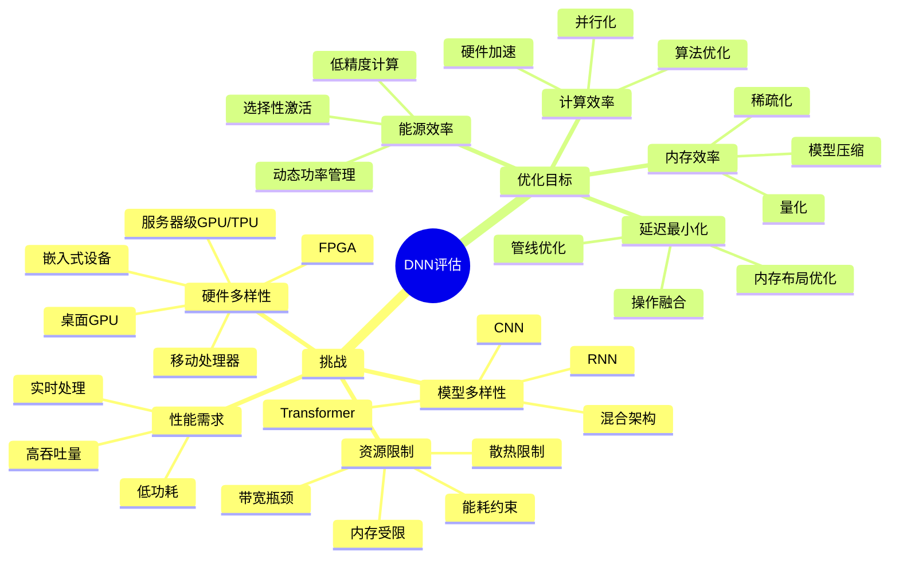

## 2. 卷积神经网络基础

在深入探讨优化技术前，先回顾CNN的基本构建块：

### 2.1 神经元与激活函数

- **人工神经元**：计算单元，接收n个输入(x₁, x₂, ..., xₙ)，有n+1个参数(n个权重w₁...wₙ和1个偏置b)
- **计算流程**：
  1. 计算加权和：sum = Σ(xᵢ × wᵢ) + b
  2. 应用激活函数：output = f(sum)
- **常用激活函数**：
  - ReLU(x) = max(0, x)：计算高效，解决梯度消失问题
  - Sigmoid(x) = 1/(1+e^(-x))：将输出压缩至(0,1)
  - Tanh(x)：将输出压缩至(-1,1)

### 2.2 全连接层

- **结构**：每个输出单元连接到所有输入单元
- **计算**：本质是矩阵-向量乘法，y = Wx + b，其中：
  - W是权重矩阵(m×n)，m是输出神经元数，n是输入神经元数
  - x是输入向量(n)，b是偏置向量(m)
  - y是输出向量(m)

### 2.3 卷积层

- **核心操作**：使用滑动窗口(称为卷积核或滤波器)对输入进行局部加权求和
- **关键特性**：
  - **局部连接**：每个输出单元仅连接到输入的局部区域，大幅减少参数量
  - **权重共享**：同一滤波器在整个输入上滑动，共享相同权重参数
  - **平移不变性**：无论特征出现在输入的何处，都能被相同滤波器检测到
  
- **多通道卷积**：
  - 输入有C个通道(如RGB图像有3通道)
  - 每个滤波器对应C个通道，生成1个输出通道
  - 一个卷积层通常有K个不同滤波器，产生K个输出通道
  - 计算公式：对于输出通道k的位置(i,j)：
    ```
    Output[k,i,j] = bias[k] + Σₖ Σᵣ Σₛ Input[c,i+r,j+s] × Filter[k,c,r,s]
    ```
    
### 2.4 其他常见层

- **池化层(Pooling)**：下采样操作，减少空间维度，提高计算效率和鲁棒性
  - **最大池化(Max Pooling)**：取区域最大值
  - **平均池化(Average Pooling)**：取区域平均值
  
- **归一化层(Normalization)**：如批量归一化(Batch Normalization)，稳定训练过程

- **残差连接(Residual Connections)**：允许信息绕过某些层直接传递，解决深层网络训练问题

### 2.5 CNN架构可视化

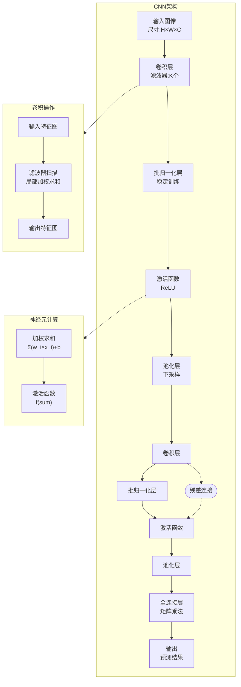

## 3. 卷积操作的高效实现

卷积操作是CNN的计算瓶颈，其高效实现对整体性能至关重要：

### 3.1 直接实现

- **朴素实现**：使用7重嵌套循环（批次、输出高/宽、输出通道/滤波器、输入通道、卷积窗口高/宽）
- **复杂度**：O(N×H_out×W_out×K×C×R×S)，其中：
  - N：批次大小
  - H_out, W_out：输出特征图高度和宽度
  - K：输出通道数(滤波器数)
  - C：输入通道数
  - R, S：滤波器高度和宽度
- **计算特点**：
  - 大量**数据重用**：每个输入值被多个输出位置和多个滤波器使用
  - 每个滤波器权重在空间维度上重用于每个输入位置
  - 适合利用**缓存局部性**和**并行计算**

### 3.2 GEMM转换:Im2Col方法(显式GEMM)

GEMM(通用矩阵乘法)是高度优化的计算原语，可将卷积转换为GEMM以利用现有高性能库：

- **Im2Col转换步骤**：
  1. 将输入特征图的每个卷积窗口重排成一列，形成"卷积矩阵"
  2. 将所有滤波器权重重排成"滤波器矩阵"
  3. 计算这两个矩阵的乘积，得到输出特征图
  
- **数学表达**：
  ```
  Input: (N, C, H, W)
  Filters: (K, C, R, S)
  
  1. Im2Col: Input → Conv Matrix (N×H_out×W_out, C×R×S)
  2. Filter Matrix: (K, C×R×S)
  3. 矩阵乘法: (K, C×R×S) × (C×R×S, N×H_out×W_out) = (K, N×H_out×W_out)
  4. 重排输出为: (N, K, H_out, W_out)
  ```

- **Im2Col方法可视化**：

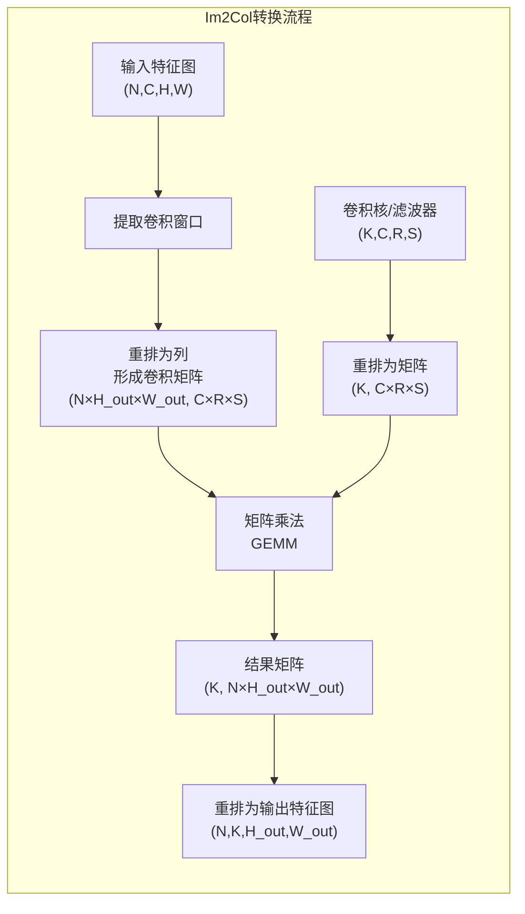

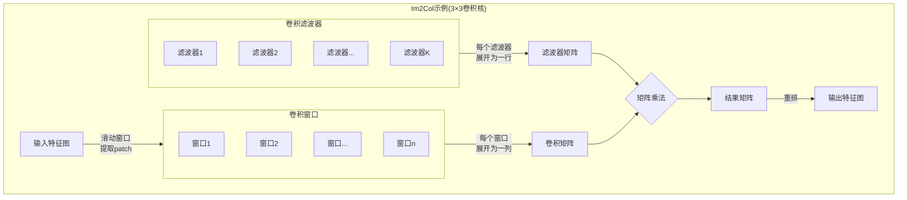
  
- **优势**：
  - 利用高度优化的GEMM库(cuBLAS, MKL等)，无需专门为卷积开发优化代码
  - 简化实现，减少开发复杂度
  
- **缺点**：
  - **内存开销大**：显式构建卷积矩阵需要额外O(N×H_out×W_out×C×R×S)空间
  - **内存访问增加**：从全局内存重复读取和复制输入数据到卷积矩阵
  - **带宽压力**：增加内存流量，可能成为瓶颈

### 3.3 GEMM优化技术

一旦卷积转换为GEMM，可应用多种矩阵乘法优化技术：

- **分块(Blocking)**：
  - **基本思想**：将矩阵划分为小块，使工作集能放入缓存
  - **实现**：三重循环中引入额外嵌套循环，限制每次计算的矩阵范围
  - **优势**：提高缓存命中率，减少内存访问
  
- **层次化分块**：
  - 考虑多级缓存(L1/L2/L3)和寄存器，进行相应分块
  - 不同级别块大小设计针对不同缓存大小
  
- **SIMD向量化**：
  - 利用CPU(AVX/SSE)或GPU的向量处理单元并行处理多个数据元素
  - 考虑数据布局对向量加载效率的影响(如矩阵转置可能有利于向量加载)
  
- **多线程并行**：
  - OpenMP/TBB(CPU)或CUDA线程(GPU)并行化外层循环
  - 负载均衡至关重要

### 3.4 隐式GEMM方法

为解决显式GEMM的内存开销问题，现代实现采用"隐式GEMM"方法：

- **核心思想**：避免物化整个卷积矩阵，动态计算需要的数据
- **实现策略**：
  1. 将矩阵分成小块，每次只计算输出矩阵的一个块
  2. 只加载当前计算所需的输入数据块到快速的片上内存(如GPU共享内存)
  3. 在片上内存中进行高效的小型GEMM计算
  4. 结果写回全局内存
- **优势**：
  - 大幅减少内存占用(无需额外O(N)存储)
  - 减少DRAM访问(每个输入数据只从全局内存加载一次)
  - 提高计算密度和并行度
- **代表实现**：NVIDIA CUTLASS库提供了高效的模板实现

### 3.5 其他卷积算法

除了GEMM转换，还有其他高效算法：

- **FFT卷积**：
  - 利用卷积定理：空间域卷积等价于频域乘积
  - 将输入和滤波器变换到频域，逐元素相乘，再变换回空间域
  - 适用于**大尺寸滤波器**，滤波器大于5×5时可能有优势
  - 缺点：需要额外FFT/IFFT计算，精度问题，零填充开销
  
- **Winograd算法**：
  - 减少乘法运算次数(以增加加法为代价)
  - 特别适合小尺寸滤波器(如3×3)
  - 公式：F(2×2, 3×3)需要4次乘法而非9次
  - 在理论上，对于m×m输出和r×r滤波器，复杂度从O(m²r²)降至O(m²+r²)
  - 适用于现代网络中大量使用的小滤波器

### 3.6 卷积实现方法比较

下表对比了主要卷积实现方法的特点和适用场景：

| 实现方法 | 计算复杂度 | 内存开销 | 适用场景 | 优势 | 劣势 |
|---------|-----------|----------|----------|------|------|
| 直接实现 | O(N×H_out×W_out×K×C×R×S) | 低 | 小型网络，内存受限设备 | 无额外内存需求，容易实现 | 性能较低，难以优化 |
| 显式GEMM (Im2Col) | O(N×H_out×W_out×K×C×R×S) | 高 | 通用场景，原型开发 | 利用优化GEMM库，通用性 | 额外内存消耗大，读写开销增加 |
| 隐式GEMM | O(N×H_out×W_out×K×C×R×S) | 低 | 大多数现代CNN | 结合直接实现和GEMM优点，内存效率高 | 实现复杂度高 |
| FFT卷积 | O(N×H_out×W_out×K×C×log(H_out×W_out)) | 中高 | 大尺寸滤波器(5×5+) | 对大滤波器有理论加速 | 额外变换开销，精度问题 |
| Winograd | r×r滤波器理论复杂度O(m²+r²) | 中 | 小尺寸滤波器(3×3) | 减少乘法次数，特别适合现代网络 | 数值稳定性问题，加法增多 |

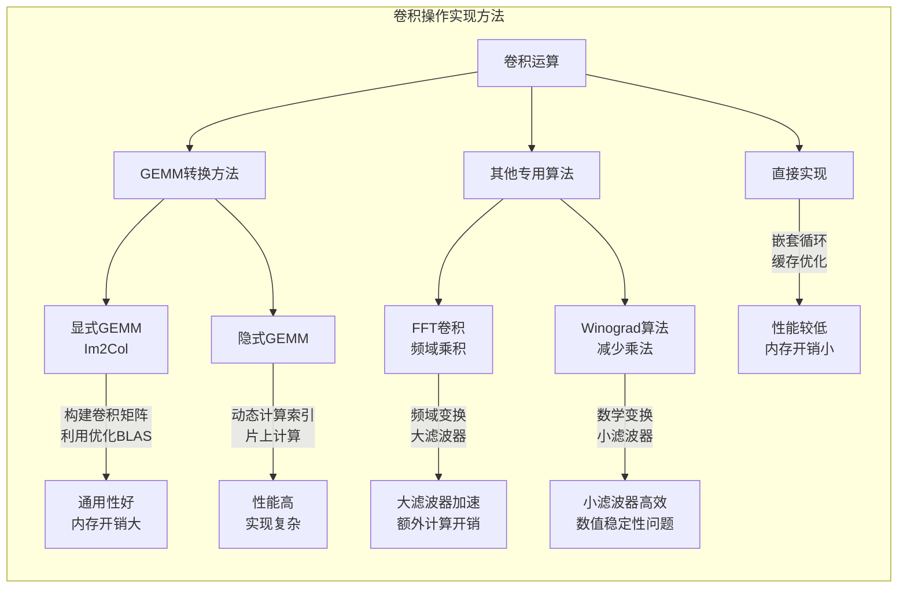

## 4. 操作融合优化

### 4.1 层融合基本原理

- **问题**：典型CNN包含连续操作序列(如Conv→BatchNorm→ReLU→Pooling)，朴素实现中每步都要写回全局内存再读出
- **解决方案**：将多个连续操作融合为单一计算核(kernel)
- **实现方式**：
  - 在同一个计算核函数中完成多个操作
  - 计算Conv结果后，立即应用BatchNorm、ReLU和Pooling
  - 中间结果保留在寄存器或快速片上内存中，避免写回全局内存
- **优势**：
  - 减少内存带宽需求(主要瓶颈)
  - 降低内存占用(无需存储中间结果)
  - 减少核函数启动开销
  - 有助于指令级并行和缓存优化

### 4.1.1 操作融合可视化

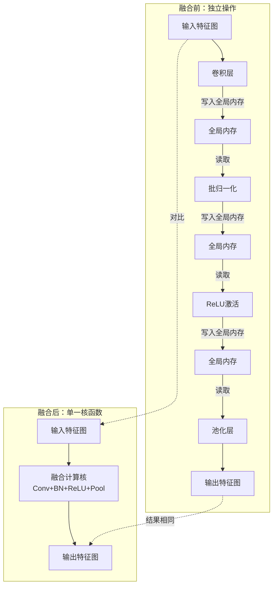

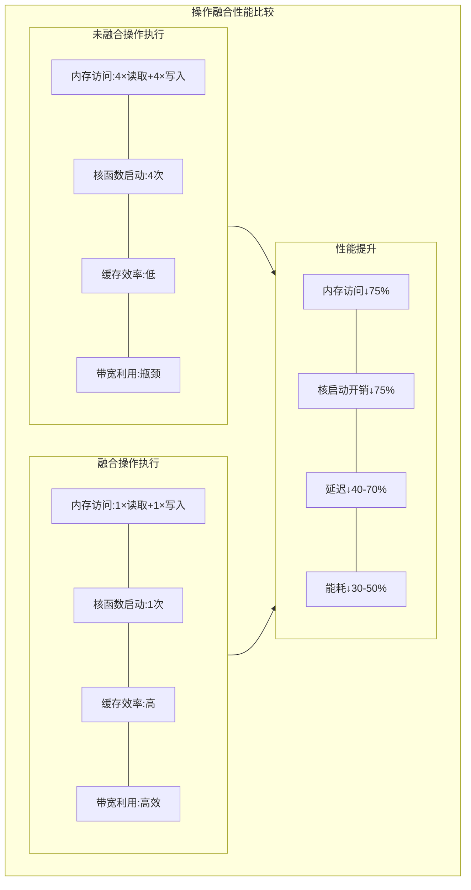

### 4.2 Transformer注意力机制融合

注意力机制是Transformer的关键组件，计算密集且内存密集：

- **Attention计算流程**：
  1. 计算查询-键相似度矩阵：S = QKᵀ (尺寸为N×N)
  2. 应用softmax归一化：P = softmax(S) (尺寸为N×N)
  3. 加权聚合值向量：O = PV
  
- **挑战**：
  - 序列长度N增加，内存占用呈O(N²)增长
  - 对于长序列(N=1000+)，存储完整的S或P矩阵需要GB级内存
  
- **融合Attention实现**：
  1. 将Q、K、V矩阵分块
  2. 迭代计算S和P的块，无需存储完整矩阵
  3. 增量更新输出O
  
- **数学表达**：
  ```
  对于Q的第i块和K、V的第j块：
  1. 计算Sᵢⱼ = Qᵢ × Kⱼᵀ
  2. 增量计算softmax并乘以Vⱼ
  3. 累加到输出Oᵢ
  ```

### 4.2.1 Transformer注意力机制可视化

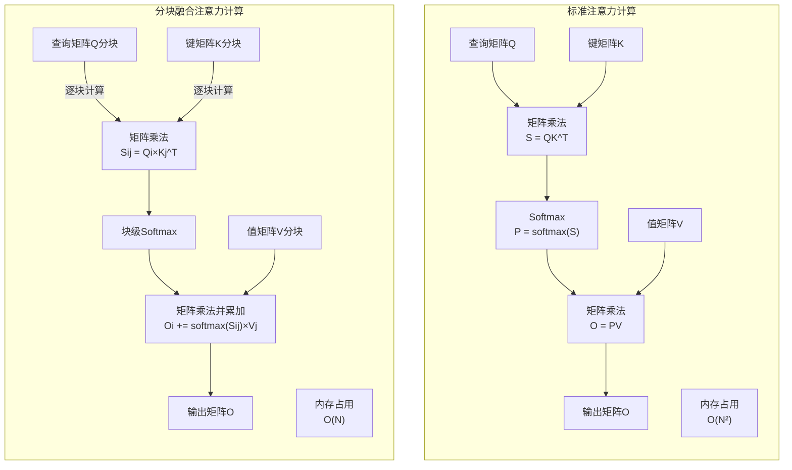

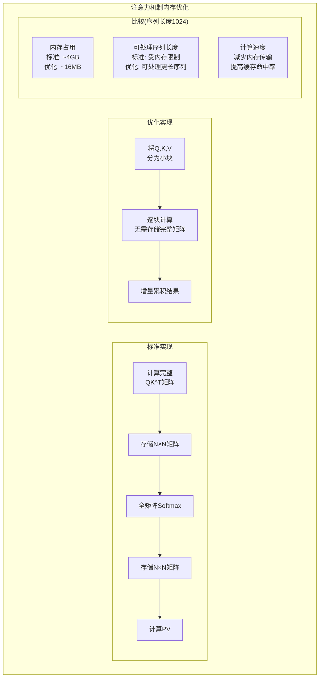

### 4.3 框架中的融合机制

- **手动定义融合操作**：
  - 库开发者预先实现常见融合模式(如Conv+BN+ReLU)
  - 简单高效，但缺乏灵活性
  
- **自动融合引擎**：
  - 将计算表示为操作图
  - 分析图结构，自动识别可融合的子图
  - 根据识别的模式生成或选择优化的融合核
  - 代表：TensorRT的层融合，TVM的算子融合
  
- **编译器方法**：
  - Halide：将算法和调度分离
  - XLA：TensorFlow的加速线性代数编译器
  - TVM：机器学习编译框架，自动生成优化代码
  - Triton：面向GPU的Python编程框架，简化融合算子开发

## 5. 模型压缩与低精度计算

为进一步提高效率，特别是在资源受限环境中：

### 5.1 量化技术

- **精度降低**：
  - FP32→FP16/BF16：半精度浮点，仍维持良好精度
  - FP16→INT8：整数量化，通常需要校准
  - INT8→INT4/INT2/Binary：极低位宽，精度损失大但效率高
  
- **优势**：
  - 减少内存占用和带宽需求(最高可达8×)
  - 提高计算吞吐量(如Tensor Cores专为低精度设计)
  - 降低能耗
  
- **量化方法**：
  - **训练后量化(PTQ)**：直接量化预训练模型，简单但精度可能下降
  - **量化感知训练(QAT)**：训练中模拟量化效果，精度更高但需要重训练

### 5.1.1 量化技术比较表

下表比较了不同数值精度格式的特点和适用场景：

| 数据格式 | 位宽 | 相对内存节省 | 相对计算加速 | 精度影响 | 适用场景 | 特殊硬件支持 |
|---------|------|------------|------------|---------|----------|------------|
| FP32 | 32位 | 基准 (1×) | 基准 (1×) | 无 | 训练，高精度要求 | 通用CPU/GPU |
| FP16 | 16位 | 2× | 2-4× | 轻微 | 训练，推理 | NVIDIA Tensor Cores, AMD Matrix Cores |
| BF16 | 16位 | 2× | 2-4× | 轻微，比FP16更好 | 训练，推理 | Google TPU, NVIDIA A100+ |
| INT8 | 8位 | 4× | 4-8× | 中等 | 主流推理 | NVIDIA TensorRT, Intel DL Boost |
| INT4 | 4位 | 8× | 8-16× | 显著 | 推理，容忍精度损失的场景 | 部分专用硬件 |
| INT2 | 2位 | 16× | 16-32× | 严重 | 特定推理任务 | 专用ASIC |
| Binary | 1位 | 32× | 32-64× | 极大 | 极简分类，特定场景 | 专用硬件 |

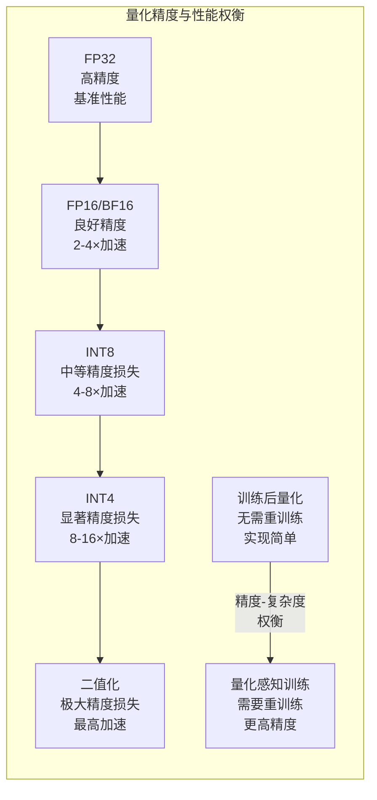

### 5.2 剪枝与稀疏化

- **权重剪枝**：移除不重要的连接(权重接近零)
- **结构化剪枝**：移除整个滤波器或通道
- **优势**：
  - 减小模型大小
  - 降低计算量
- **挑战**：
  - 稀疏计算需要专门优化才能获得实际加速
  - 不规则内存访问可能影响效率

## 6. GPU平台与DNN评估

### 6.1 GPU作为DNN评估的理想平台

- **高计算吞吐量**：
  - 数千个计算核心，专为大规模并行设计
  - 特殊计算单元(如Tensor Cores)加速特定操作
  
- **高内存带宽**：
  - 现代GPU内存带宽达TB/s级别
  - 有助于克服内存瓶颈
  
- **优化生态系统**：
  - cuDNN等库提供高度优化的DNN原语
  - CUDA生态提供丰富的开发工具
  
- **灵活性**：
  - 可编程性强，支持多种计算模式
  - 支持各种精度(FP32/FP16/INT8等)

### 6.1.1 硬件平台特性对比

下表比较了不同硬件平台在DNN评估中的特点：

| 特性 | GPU | CPU | FPGA | ASIC (TPU等) | 移动SoC |
|-----|-----|-----|------|------------|---------|
| **计算密度** | 高 (10-100 TFLOPS) | 中 (1-5 TFLOPS) | 中高 (根据配置) | 极高 (特定算子) | 低-中 (1-5 TFLOPS) |
| **内存带宽** | 高 (0.5-2TB/s) | 中 (50-150GB/s) | 中 (取决于配置) | 高 (针对特定模式) | 低-中 (10-50GB/s) |
| **能效比** | 中 (10-30 TOPS/W) | 低 (1-5 TOPS/W) | 高 (20-50 TOPS/W) | 极高 (>80 TOPS/W) | 高 (15-40 TOPS/W) |
| **灵活性** | 高 (通用编程) | 极高 (全能) | 中 (可重配置) | 低 (特定算子) | 中 (专用加速器) |
| **开发复杂度** | 中 (CUDA/ROCm) | 低 (成熟工具链) | 高 (硬件描述语言) | 低 (专用框架) | 中 (专用API) |
| **典型延迟** | 中 (ms级) | 高 (10ms+) | 低-中 (优化后) | 极低 (μs级) | 中-高 (设备限制) |
| **主要优势** | 通用性与性能平衡 | 编程简便,兼容性好 | 可定制，功耗优化 | 性能与能效极高 | 移动性，低功耗 |
| **主要劣势** | 功耗较高 | 并行性有限 | 开发难度大 | 缺乏通用性 | 性能受限 |
| **适用场景** | 训练与通用推理 | 小批量推理，CPU绑定任务 | 边缘计算，特定应用 | 大规模数据中心推理 | 移动设备推理 |

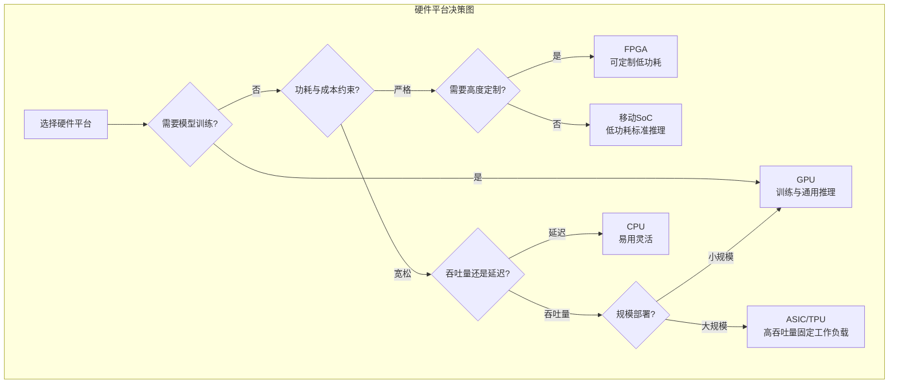

### 6.2 GPU的限制

- **通用性的代价**：
  - 为通用计算设计，不如专用硬件能效高
  - 过度灵活可能导致资源浪费
  
- **能耗与散热**：
  - 高性能GPU功耗高(数百瓦)
  - 不适合能量受限环境(如移动设备)
  
- **资源争用**：
  - 共享资源(如缓存、内存带宽)可能导致性能不稳定
  - 不同工作负载间干扰

## 7. 总结与前瞻

### 7.1 DNN评估效率的关键技术总结

- **算法优化**：GEMM转换、FFT、Winograd等提高计算效率
- **存储优化**：隐式GEMM减少内存占用，操作融合减少带宽需求
- **硬件适配**：量化与稀疏化适应硬件特性
- **编译技术**：自动优化代码生成，无需手工调优

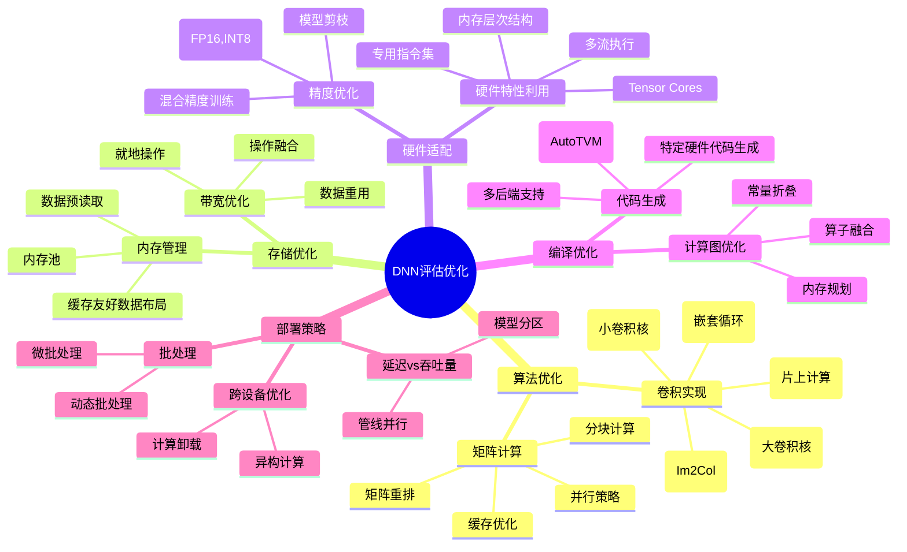

### 7.2 未来发展方向

- **硬件专用化**：
  - 专用AI加速器(TPU、神经网络处理器)
  - 低功耗边缘AI芯片
  
- **算法与硬件协同设计**：
  - 神经架构搜索(NAS)考虑硬件约束
  - 可硬件感知的模型压缩
  
- **动态优化**：
  - 运行时自适应策略
  - 根据资源可用性和任务要求调整计算精度和路径

DNN高效评估是算法、系统和硬件的交叉领域，需要多层面的优化策略才能实现最佳性能和能效比。未来的趋势是更紧密的软硬件协同设计和更智能的自适应优化技术。 