# CS149: 并行计算 - 第11讲：硬件专用化与能效优化

## 1. 计算系统的能量挑战

现代计算系统在各个规模下都面临着严峻的能量约束，这促使我们思考如何通过硬件专用化来提升计算效率。

### 1.1 不同规模系统的能量瓶颈

- **超级计算机**：巨大的机器规模导致电力消耗和冷却成本高昂，限制了可部署的系统规模和计算能力
- **数据中心**：能源占运营成本的主要部分，能效提升直接影响经济性和可扩展性
- **移动设备**：电池容量有限，同时存在散热约束（通常无风扇设计），严重限制可用算力

### 1.2 能量效率与性能的基本关系

核心等式：`功耗(Power) = 操作数/秒(Ops/second) × 每操作焦耳数(Joules/Op)`

- **性能(Performance)**：由`Ops/second`表示，即单位时间内完成的计算操作数
- **能量效率(Energy Efficiency)**：由`Joules/Op`的倒数表示，越低越好
- **硬件专用化目标**：在固定功率预算下，通过大幅降低`Joules/Op`来提高性能

### 1.3 能量效率与专用化程度的关系

```mermaid
graph LR
    title[("专用化程度与能量效率关系")]
    style title fill:none,stroke:none
    
    subgraph 能效提升倍数
        E1[1×] --> E2[10×] --> E3[20×] --> E4[50×] --> E5[100×] --> E6[1000×]
    end
    
    subgraph 处理器类型
        direction LR
        CPU[通用CPU\n最大灵活性] --> GPU[GPU\n并行计算] --> DSP[DSP\n信号处理] 
        DSP --> FPGA[FPGA\n可重构硬件] --> TPU[TPU等领域加速器\n特定领域] --> ASIC[专用ASIC\n单一功能]
    end
    
    subgraph 编程复杂度
        C1[标准语言\n(C/C++)] --> C2[CUDA/OpenCL] --> C3[专用API/库] --> C4[硬件描述语言\nHDL] --> C5[专用编译器] --> C6[不可编程\n硬件固定]
    end
```

```mermaid
xychart-beta
    title "计算每操作能耗比较 (对数尺度)"
    x-axis [通用CPU, 移动CPU, GPU, DSP, FPGA, 领域加速器, ASIC]
    y-axis "相对能耗 (nJ/Op)" 100 -> 0.1 logarithmic
    bar [100, 50, 10, 5, 2, 1, 0.1]
```

专用化程度与处理器特性的关系：

| 处理器类型 | 相对能效 | 相对性能密度 | 灵活性 | 开发成本 | 适用场景 |
|----------|---------|------------|--------|---------|----------|
| 通用CPU   | 1×      | 1×         | 极高   | 低      | 通用计算，复杂控制流 |
| 移动CPU   | 2-3×    | 1-2×       | 高     | 低      | 低功耗通用计算 |
| GPU      | 10×     | 5-20×      | 中高   | 中      | 并行计算，图形渲染 |
| DSP      | 20×     | 10-30×     | 中     | 中高    | 信号处理，媒体编解码 |
| FPGA     | 20-50×  | 10-50×     | 中     | 高      | 原型设计，可重构加速 |
| 领域加速器 | 30-100× | 50-200×    | 低     | 高      | 特定领域(如AI)计算 |
| 专用ASIC  | 100-1000× | 100-1000× | 极低   | 极高    | 大规模部署的单一功能 |

随着专用化程度提高，能效和性能密度显著提升，但灵活性下降，开发成本上升，这构成了硬件设计的基本权衡。

## 2. 通用处理器的能效瓶颈分析

为什么高性能的通用处理器(CPU/GPU)在能效方面仍存在显著劣势？理解这一问题是专用化设计的出发点。

### 2.1 通用处理器中的能量分布

在现代通用处理器上执行一条简单指令涉及复杂的处理流程，每个环节都消耗能量：

- **指令获取与解码**：地址翻译、缓存交互、指令解码、预测等
- **指令调度与控制**：依赖检查、资源分配、乱序执行控制等
- **寄存器文件访问**：读取操作数、写回结果
- **数据移动**：将数据从寄存器移动到执行单元和回写
- **算术计算**：在功能单元中执行实际的计算操作

关键问题：**真正的算术计算仅占总能耗的很小一部分**（通常不到20%），大部分能量消耗在指令供给和数据供给上。

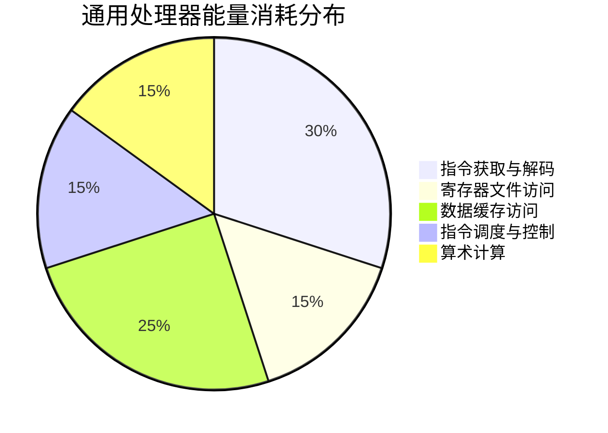

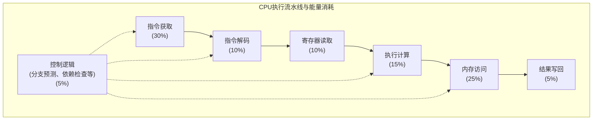

上图展示了通用处理器中能量消耗的典型分布。真正执行计算工作的功能单元往往只占总能耗的很小部分，这是现代处理器能效不高的根本原因。随着专用化程度提高，可以大大减少非计算环节的能耗，从而提高整体能效。

### 2.2 实例分析：视频编码器能量分布

以H.264视频编码器为例，即使使用SIMD指令优化后：
- 实际执行计算的功能单元(FU)仅消耗总能量的10-15%
- 其余85-90%能量用于指令获取、解码、寄存器访问和控制逻辑等

这种极低的计算能效是硬件专用化的主要动机。

## 3. 专用处理器的性能与能效优势

专用处理器通过为特定计算任务定制硬件，显著提高能效和性能密度。

### 3.1 不同处理器架构的对比

以快速傅里叶变换(FFT)为例，三种架构的性能和能效对比：

| 架构类型 | 相对性能密度 | 相对能效 | 灵活性 |
|---------|------------|--------|-------|
| CPU     | 1×         | 1×     | 最高   |
| GPU     | 5-7×       | 10×    | 中等   |
| ASIC    | 1000×      | 100×   | 最低   |

ASIC(专用集成电路)的显著优势来自于：
- 移除了通用处理开销(指令获取、解码等)
- 定制的数据路径和存储层次
- 针对特定算法优化的计算单元

### 3.2 硬件专用化程度与能效收益

从通用处理器到完全专用化的ASIC，存在一系列不同专用化程度的处理器选项：

- **能效优化CPU(如ARM)**：基线参考，编程最容易
- **吞吐量优化处理器(GPU)**：能效提升约10倍
- **可编程DSP**：能效提升约20倍，但编程更复杂
- **领域特定加速器(如TPU)**：能效提升30-50倍，通常需要特定编程模型
- **FPGA/可重构逻辑**：能效潜力高，但编程困难
- **固定功能ASIC**：能效提升100-1000倍，不可编程，设计成本极高

核心权衡：**可编程性/灵活性** 与 **效率/性能** 与 **设计/验证成本**

### 3.3 处理器专用化光谱可视化

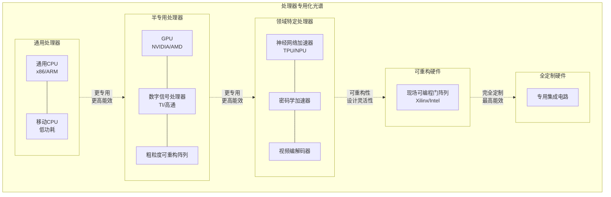

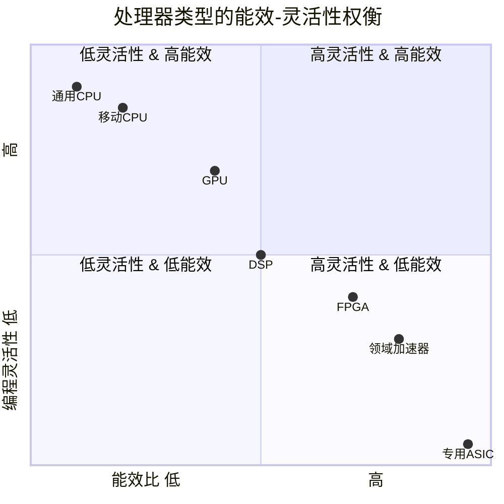

专用化程度与实现特性的关系：

| 处理器类型 | 主要设计约束 | 功能灵活性 | 编程模型复杂度 | 典型开发周期 | 典型能效收益 |
|----------|------------|----------|--------------|-----------|------------|
| 通用CPU   | 通用性      | 几乎无限制 | 最简单       | 即时       | 基准 (1×)  |
| GPU      | 数据并行计算 | 高        | 中等        | 数周      | 5-15×     |
| DSP      | 特定算法优化 | 中等      | 中高        | 数月      | 10-25×    |
| FPGA     | 设计约束    | 高度可定制 | 复杂        | 3-6个月   | 20-50×    |
| 领域加速器 | 领域算法    | 领域内灵活 | 领域特定    | 6-12个月  | 30-100×   |
| ASIC     | 固定功能    | 几乎不可变 | 不可编程    | 1-2年     | 100-1000× |

## 4. 专用处理器类型与特点

专用处理器覆盖了从半通用到完全定制的广泛光谱，各有特点和适用场景。

### 4.1 数字信号处理器(DSP)

DSP是介于通用CPU和完全专用硬件之间的可编程处理器：

- **架构特点**：
  - 指令流控制路径比通用CPU简化
  - 使用复杂指令(如SIMD, VLIW-超长指令字)摊销控制开销
  - 每条指令可执行多个操作，提高能效

- **典型特性**：
  - 优化的乘加指令(MAC)，支持高效处理信号处理算法
  - 专用的地址生成单元，支持固定模式数据访问
  - 零开销循环和特殊缓存结构
  
- **应用领域**：音频处理、调制解调器、嵌入式图像处理

- **代表产品**：高通Hexagon DSP，其VLIW架构允许单个指令包同时执行多种操作(加载、存储、向量计算)

### 4.2 专用集成电路(ASIC)

ASIC代表了硬件专用化的极致，为特定应用或算法定制硬件电路：

- **架构特点**：
  - 完全定制的硬件逻辑，功能固定
  - 定制数据路径和计算单元，最大化特定算法效率
  - 去除所有不必要的控制和灵活性开销

- **典型应用**：
  - **Anton超级计算机**：由DE Shaw Research开发，专为分子动力学模拟设计，包含512个计算粒子间力的ASIC和定制低延迟网络
  - **深度学习加速器**：如Google TPU、Apple Neural Engine等，专门优化矩阵乘法和卷积等DNN核心操作

- **优势与局限**：
  - 极高的性能和能效(比CPU高100-1000倍)
  - 设计和验证成本极高(百万美元级)
  - 完全不可编程，仅适用于特定任务

### 4.3 现场可编程门阵列(FPGA)

FPGA提供了ASIC和通用处理器间的中间解决方案，兼顾一定灵活性和高能效：

- **架构组成**：
  - **可配置逻辑块(CLB)**：包含查找表(LUT)和触发器(Flip-flop)
  - **可编程互连**：连接不同逻辑块的配置网络
  - **硬核资源**：内存块(BRAM)、DSP单元(乘法器)等固定功能块
  - **I/O单元**：支持各种接口标准

- **工作原理**：
  - **查找表(LUT)**：N输入LUT可实现任意N输入布尔函数
  - **触发器**：保存状态，实现时序逻辑
  - 复杂逻辑通过连接多个LUT和触发器实现

- **应用场景**：
  - 低量产专用设备的原型设计和部署
  - 可重配置的数据中心加速(如Amazon EC2 F1实例)
  - 需要硬件级定制但又可能变更的应用(如网络设备)

- **优势与挑战**：
  - 较ASIC更灵活，可重新配置
  - 较通用处理器更高效(能效提升10-30倍)
  - 编程复杂(需要硬件描述语言或高级综合工具)
  - 性能和能效低于ASIC

### 4.3.1 FPGA架构与工作原理可视化

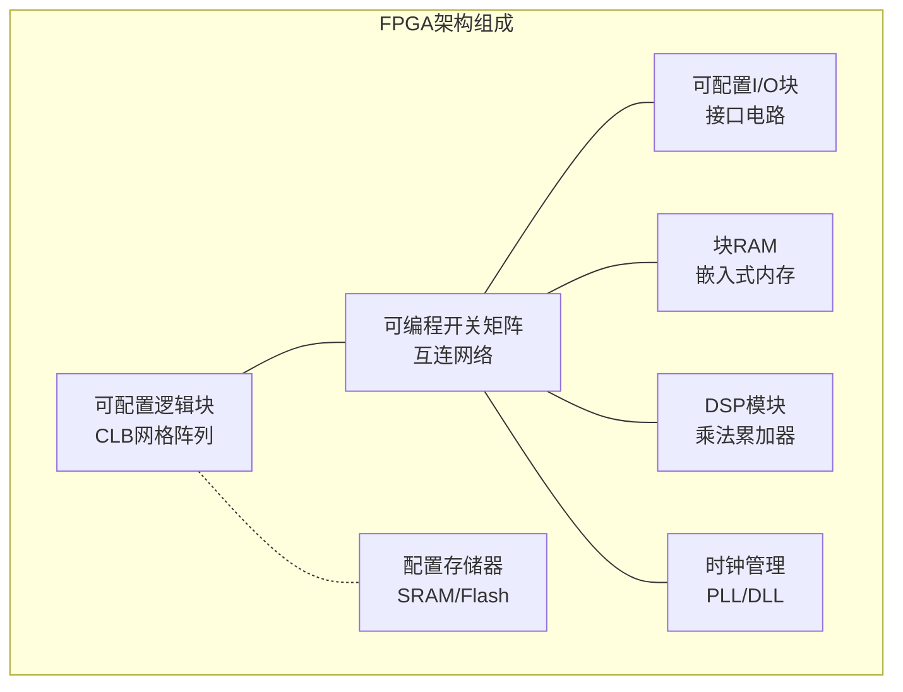

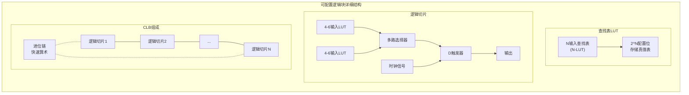

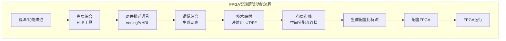

工作原理说明：
1. **配置阶段**：FPGA通过加载比特流配置各个逻辑块和互连
2. **运行阶段**：配置好的电路像专用ASIC一样高效运行
3. **重配置**：可以随时加载新的比特流，改变硬件功能

FPGA相比ASIC的能效损失主要来自：
- **互连开销**：可编程互连比固定布线占用更多面积和能耗(约70%)
- **逻辑密度**：LUT实现逻辑的效率低于直接设计的门电路
- **时钟频率**：可编程路径导致时序更长，频率更低

但FPGA的灵活性和可重配置优势，使其成为硬件专用化和灵活性间的有效折衷方案。

## 5. 深度学习专用加速器

深度神经网络(DNN)是专用硬件设计的典型应用领域，其规则的计算模式和庞大的计算量为专用化提供了完美场景。

### 5.1 DNN计算模式与专用化机会

DNN计算具有几个关键特点，使其非常适合专用硬件加速：

- **计算密集型**：大量矩阵-矩阵乘法和卷积操作
- **规则性**：重复的计算模式和数据访问
- **精度需求灵活**：许多任务可接受低精度计算
- **内存访问瓶颈**：数据移动是主要性能和能效限制因素

这些特点为专用硬件设计提供了多个优化方向。

### 5.2 特殊指令支持与优化策略

针对DNN优化的处理器设计主要考虑以下策略：

- **摊销指令处理开销**：使用更复杂的指令，每条指令执行更多实际计算
  - 示例：从单一浮点运算到矩阵乘累加指令，单位操作能量开销大幅降低
  - 典型指令：4×4矩阵乘累加(MMA)，每指令执行64个基本操作

- **低精度数值格式**：
  - **半精度浮点(FP16)**：相比FP32减少一半内存占用和带宽需求
  - **脑浮点(BF16)**：维持FP32的指数范围但减少尾数精度
  - **INT8/INT4量化**：进一步降低精度，显著提高能效和计算密度

- **计算硬件成本比较**：
  - 8位整数加法器：能量和面积成本只有32位浮点加法器的约1/30
  - 8位整数乘法器：能量和面积成本只有32位浮点乘法器的约1/20
  - 内存访问(尤其是DRAM)能量成本远高于计算本身

### 5.3 Google TPU架构案例分析

Google张量处理单元(TPU)是DNN专用加速器的典型代表：

- **整体架构组成**：
  - **矩阵乘单元(MMU)**：核心是256×256的脉动阵列(Systolic Array)
  - **统一缓冲区(Unified Buffer)**：512KB大型片上SRAM，存储激活值
  - **权重FIFO**：用于流式传输模型权重
  - **累加器(Accumulators)**：存储MMU的中间结果
  - **激活流水线**：执行非线性激活函数和池化操作

- **芯片面积分配**：
  - 计算单元(MMU+Accumulators+Activation)占比高(约30%+)
  - 片上内存(Unified Buffer)占比大(29%)
  - **控制逻辑占比极小(2%)**，体现了专用化设计的效率优势

- **脉动阵列(Systolic Array)详解**：
  - **结构**：规则排列的处理单元(PE)矩阵
  - **工作原理**：数据(权重和输入激活)通过PE阵列脉动流动，避免全局数据移动
  - **效率优势**：
    - 每个PE只与相邻单元通信，减少长距离数据移动
    - 每个数据被多个PE重用，提高计算密度
    - 简化控制逻辑，提高能效

- **性能与能效**：相比同期CPU/GPU，TPU在推理性能/瓦特上有10-30倍的提升

### 5.3.1 TPU架构与脉动阵列可视化

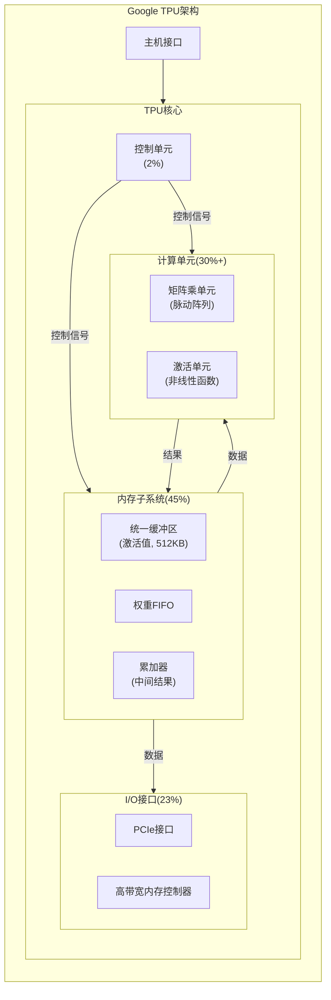

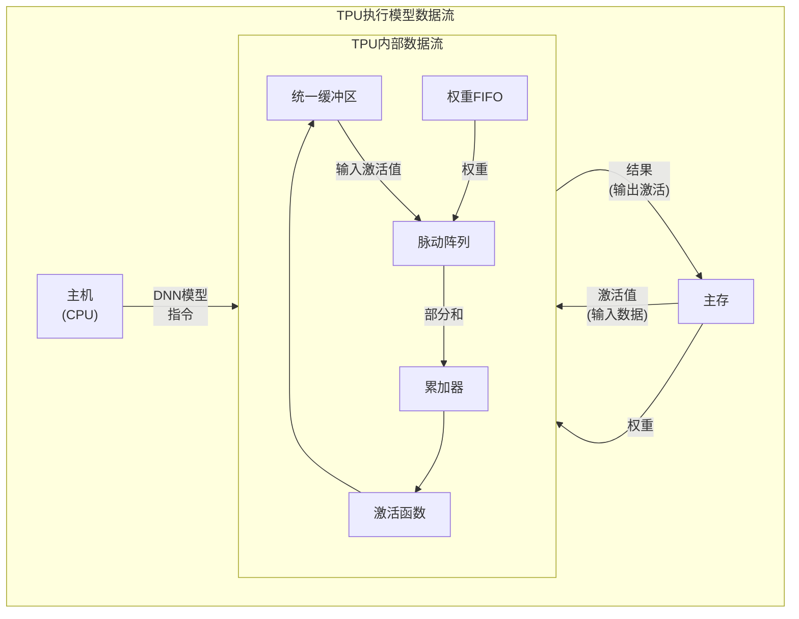

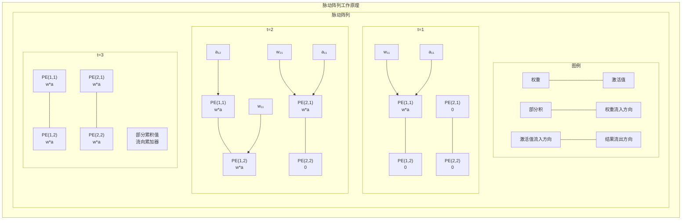

脉动阵列的工作过程：
1. **数据进入**：权重从左侧进入，激活值从上方进入
2. **脉动流动**：数据像心脏脉动一样在PE阵列中流动
3. **局部通信**：每个PE只与相邻PE通信，无需全局数据总线
4. **计算复用**：每个权重和激活值在流过阵列时被多个PE使用
5. **结果累积**：部分结果从右下方流出到累加器

这种设计的关键优势在于：
- **减少数据移动**：95%的数据移动是本地的(相邻PE间)
- **提高计算密度**：每个数据在芯片内被多次使用
- **简化控制**：规则的数据流动模式无需复杂控制逻辑
- **大规模并行**：可轻松扩展到数百或数千个PE

### 5.4 大模型训练与专用硬件

随着模型规模的增长，专用硬件在训练大型模型方面也发挥着关键作用：

- **计算需求增长**：大型语言模型(如GPT-3)需要petaflop/s-days级别的训练计算量
- **计算量趋势**：训练所需计算量呈指数级增长(每3.4个月翻倍)
- **训练成本挑战**：硬件和能源成本急剧上升
- **专用训练系统**：如Google TPU v3/v4 Supercomputer，通过高速互连连接数千个TPU芯片

## 6. 内存系统与数据移动

在专用硬件设计中，数据移动已成为主要的能效瓶颈，理解和优化内存访问对提高整体系统效率至关重要。

### 6.1 数据移动的能量成本

在现代系统中，数据移动的能量成本远高于计算本身：

| 操作 | 典型能量成本 |
|------|-------------|
| 整数/浮点运算 | ~1-20 pJ |
| 从本地SRAM读取64位 | ~26 pJ |
| 从LPDDR DRAM读取64位 | ~1200 pJ |

关键洞察：**DRAM访问的能量成本比计算高出约100倍**，在某些情况下，重新计算某些值可能比存储后再加载更节能。

### 6.1.1 数据移动能耗可视化

```mermaid
xychart-beta
    title "不同操作的相对能耗 (对数尺度)"
    x-axis ["32位整数加法", "32位浮点乘法", "从寄存器访问", "从L1缓存访问", "从L2缓存访问", "从L3缓存访问", "从本地DRAM访问", "从远程内存访问"]
    y-axis "相对能耗 (pJ)" 1 -> 10000 logarithmic
    bar [1, 4, 1, 10, 50, 200, 1200, 4000]
```

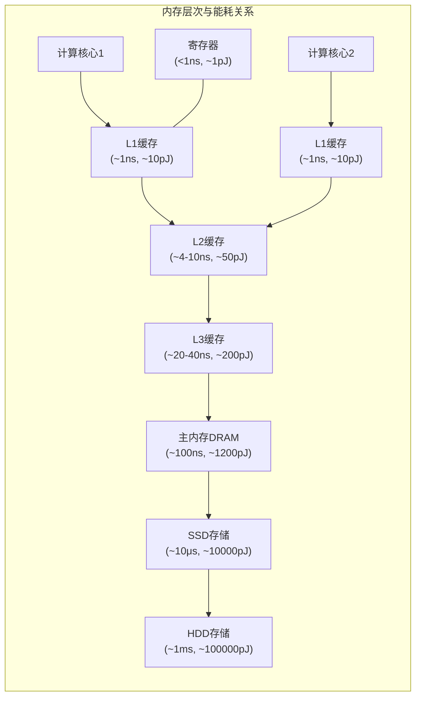

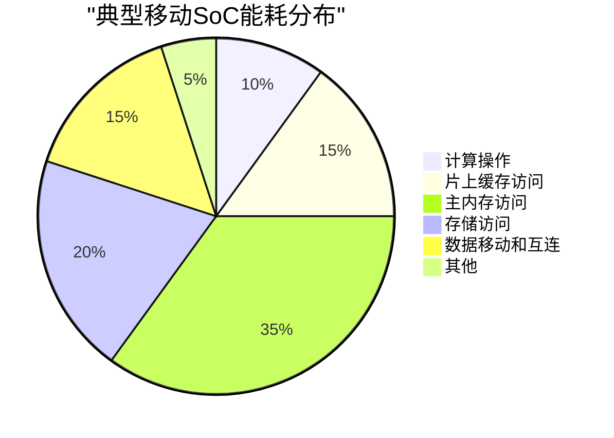

从数据能耗上看数据移动：
- 距离是关键因素：数据移动距离每增加10倍，能耗约增加10倍
- 数据移动通常占系统总能耗的50-70%
- 数据移动能耗呈对数增长：本地移动~pJ，片上移动~nJ，芯片间移动~μJ
- 在能效优化设计中，关键原则是"**移动计算到数据**"而非"移动数据到计算"

**计算重用与数据移动的权衡**：
- 如果一个数据点被计算重用N次，而计算能耗是C，内存访问能耗是M
- 当 N×C < M 时，重计算比重新加载更节能
- 这导致一些反直觉的设计：某些情况下丢弃中间结果并重计算比保存更有效

### 6.2 DRAM工作原理与性能特点

理解DRAM内部结构和工作方式有助于优化数据访问模式：

- **DRAM基本结构**：
  - 内存阵列由行和列组织的存储单元(一个晶体管+一个电容/位)组成
  - 行数据被读入**行缓冲区(Row Buffer)**，然后从中选择所需字节

- **基本访问操作(读取一字节)**：
  1. **预充电(Precharge)**：准备位线(~10ns)
  2. **行激活(Row Activation/RAS)**：将目标行加载到行缓冲区(~10ns)
  3. **列选择(Column Selection/CAS)**：从行缓冲区选择目标字节(~10ns)
  4. **数据传输**：将字节传输到数据总线

- **关键性能特性**：
  - **行缓冲区命中**：如果访问已激活行中的数据，可跳过预充电和行激活(节省~20ns)
  - **访问延迟非固定**：最差情况(新行访问)比最佳情况(行缓冲区命中)慢2-3倍
  - **突发模式(Burst Mode)**：一次命令传输连续多个数据(通常为缓存行大小64字节)，摊销访问延迟
  - **多Bank并行**：DRAM内部分为多个Bank，可并行处理不同地址命令，提高总体吞吐量

- **系统级组织**：
  - **DIMM(内存条)**：多个DRAM芯片并联，形成更宽的接口(如64位)
  - **多通道内存**：增加内存通道(每个有独立控制器)，倍增带宽

### 6.2.1 DRAM结构与访问流程可视化

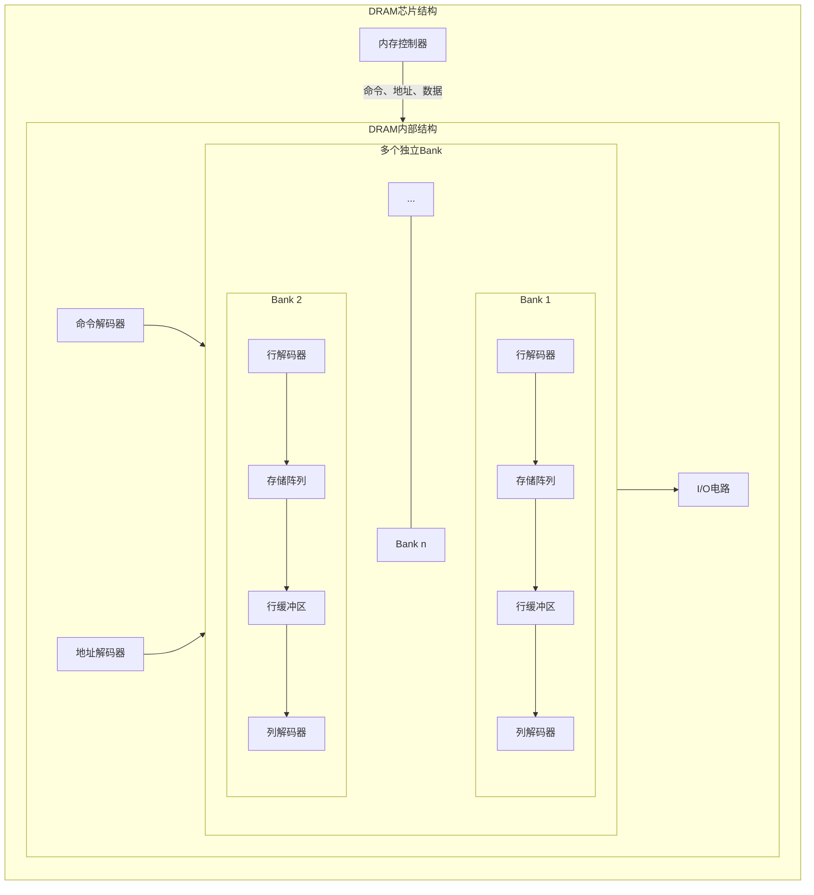

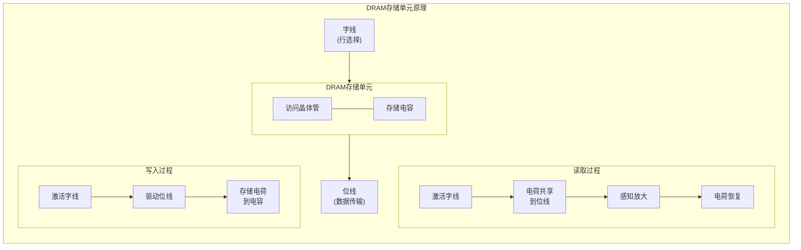

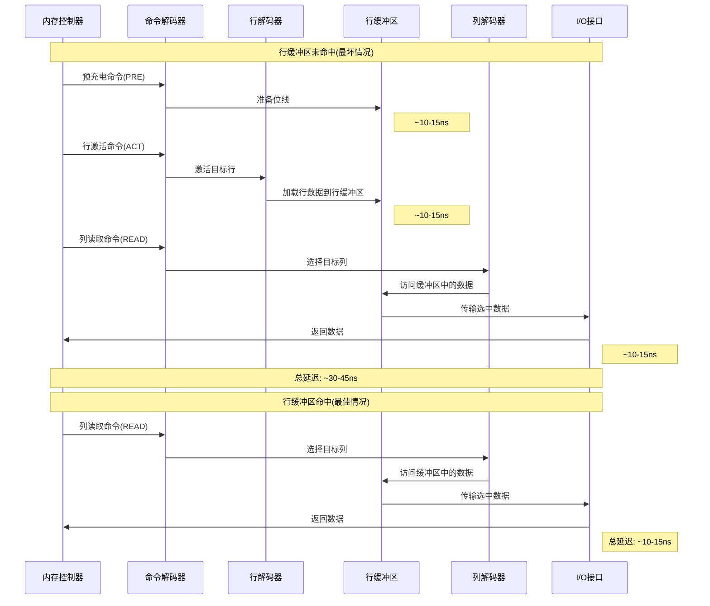

**DRAM访问优化技巧**：
1. **行缓冲区局部性**：连续访问同一行数据可减少约2/3的访问延迟
2. **Bank级并行**：将常用数据分布在不同Bank，允许并行访问
3. **突发传输**：尽可能进行连续数据传输，充分利用突发模式
4. **行缓冲区管理**：一些控制器实现"开放行策略"，保持热门行激活状态
5. **内存交错**：在多通道系统中，交错地址映射可并行化访问

**对程序员和优化的启示**：
- 空间局部性(顺序访问)对DRAM性能至关重要
- 避免随机访问模式会显著提高内存性能
- 应用层数据布局应考虑DRAM硬件特性

### 6.3 解决内存瓶颈的创新技术

为应对内存带宽和能效挑战，硬件架构引入了多种创新技术：

- **芯片堆叠技术(HBM - High Bandwidth Memory)**：
  - 通过硅通孔(TSV)垂直连接多个DRAM裸片和逻辑裸片
  - 提供极宽的接口(如1024位)，相比传统DRAM带宽提升4-8倍
  - 缩短信号传输距离，大幅降低能耗

- **HBM优势总结**：
  - **带宽**：提供TB/s级带宽，满足计算加速器需求
  - **能效**：每比特传输能耗降低70%以上
  - **尺寸**：相同容量下占用空间减少94%

- **应用案例**：高端GPU(NVIDIA V100/A100/H100, AMD MI系列)广泛采用HBM技术支持高计算密度

### 6.3.1 HBM与传统DRAM对比

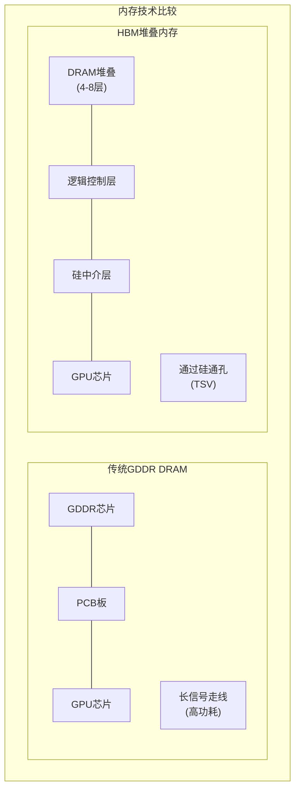

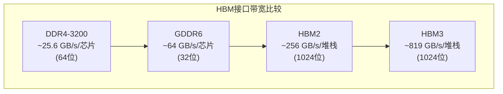

**HBM与传统DRAM技术对比**：

| 特性 | 传统DDR4 SDRAM | GDDR6 | HBM2/HBM3 |
|-----|---------------|-------|----------|
| **接口宽度** | 64位/芯片 | 32位/芯片 | 1024位/堆栈 |
| **时钟频率** | 1.6-3.2 GHz | 10-14 GHz | 1.6-3.2 GHz |
| **每堆栈容量** | N/A | N/A | 4-24 GB |
| **每堆栈带宽** | ~25 GB/s | ~64 GB/s | 256-819+ GB/s |
| **每瓦带宽** | ~10 GB/s/W | ~20 GB/s/W | ~40 GB/s/W |
| **延迟** | 中 (~45-60ns) | 高 (~100ns) | 中 (~50ns) |
| **封装面积** | 大 | 大 | 小 (1/5类似容量DDR) |
| **典型应用** | 服务器/桌面内存 | 游戏GPU | 高性能计算GPU/加速器 |

**HBM内部架构特点**：
- **多Die堆叠**：4-8层DRAM Die通过TSV垂直连接
- **宽接口**：每个堆栈有8个128位通道(总计1024位)
- **低电压运行**：比GDDR更低的工作电压(1.2V vs 1.35V)
- **短互连**：信号传输距离大大缩短，降低能耗和延迟
- **伪通道**：进一步细分每个通道，提高并行度

**HBM技术演进**：
- **HBM1**：最高128GB/s带宽，每堆栈1-4GB容量
- **HBM2**：最高256GB/s带宽，每堆栈2-8GB容量
- **HBM2E**：最高460GB/s带宽，每堆栈2-16GB容量
- **HBM3**：最高819GB/s带宽，每堆栈4-24GB容量
- **HBM3E**：预计提供1TB/s+带宽，更大容量

### 6.4 数据局部性优化策略

在硬件和软件设计中，提高数据局部性是解决内存瓶颈的核心策略：

- **软件优化**：
  - 调度计算以最大化数据重用
  - 数据布局优化，提高缓存利用效率
  - 块化/分块计算，确保工作集适合缓存大小

- **硬件创新**：
  - 智能DRAM请求调度
  - 更深的缓存层次和专用缓冲区
  - 近内存计算(Near-Memory Computing)
  - 硬件加速数据压缩

- **通用原则**：
  - 将数据存储靠近处理器
  - 将计算移近数据
  - 用计算换数据传输(如压缩或重计算)

## 7. 总结与未来展望

### 7.1 硬件专用化的核心价值

硬件专用化通过下列方式显著提升计算效率：

- **减少指令处理开销**：移除通用处理器的控制逻辑和灵活性开销
- **定制数据路径**：为特定算法优化数据流动和存储访问模式
- **专用计算单元**：根据应用需求定制算术单元和精度
- **最大化片上数据重用**：减少对外部内存的访问

### 7.2 专用化设计权衡

硬件专用化涉及多维度的复杂权衡：

- **灵活性 vs. 效率**：更专用的设计通常能效更高但应用范围更窄
- **设计成本 vs. 运行效率**：ASIC设计成本高但运行效率最佳
- **通用性 vs. 市场规模**：完全专用设计可能难以获得规模经济效益
- **开发难度 vs. 性能收益**：专用硬件通常需要专门的编程模型和工具

### 7.2.1 硬件专用化的多维权衡可视化

```mermaid
mindmap
  root((硬件专用化\n设计权衡))
    灵活性与效率
      通用性越强效率越低
      专用性越高能效越优
      软件兼容性与优化度
      应用领域覆盖范围
    经济和成本因素
      初始开发成本
        设计成本
        验证成本
        掩膜成本
      运行成本
        能耗
        冷却成本
        维护成本
      规模经济
        生产规模
        摊销成本
        市场接受度
    性能考量
      计算密度
      内存带宽
      能源效率
      延迟敏感度
      可扩展性
    开发生态
      编程模型复杂度
      工具链成熟度
      开发周期长度
      技术人才可用性
    部署与适应性
      更新升级能力
      错误修复灵活度
      对算法变化的适应
      长期可维护性
```

```mermaid
graph TB
    subgraph "硬件设计决策流程"
        Start["需求分析"] --> Q1{"是否需要\n极高性能?"}
        Q1 -->|"是"| Q2{"应用领域\n是否狭窄?"}
        Q1 -->|"否"| CPU["使用通用CPU"]
        
        Q2 -->|"是"| Q3{"预计产量\n规模?"}
        Q2 -->|"否"| GPU["使用GPU或FPGA"]
        
        Q3 -->|"大规模\n(>10万)"| ASIC["设计专用ASIC"]
        Q3 -->|"中等\n(千到万)"| FPGA["使用FPGA"]
        Q3 -->|"小规模\n(数十到数百)"| DSA["领域专用加速器"]
        
        ASIC & FPGA & DSA --> Eval["评估性能/功耗/成本"]
        Eval --> ROI{"投资回报\n是否合理?"}
        
        ROI -->|"是"| Dev["进入开发"]
        ROI -->|"否"| Recon["重新考虑方案"]
    end
```

**硬件专用化决策的关键考量**：

| 考量因素 | 通用CPU | DSP/GPU | FPGA | 领域加速器 | ASIC |
|---------|--------|---------|------|-----------|------|
| **上市时间** | 立即可用 | 数周-数月 | 3-6个月 | 6-12个月 | 1-2年+ |
| **前期成本** | 低 | 中 | 中-高 | 高 | 极高 |
| **单位成本** | 高 | 中-高 | 高 | 低-中 | 极低(大量生产) |
| **功率效率** | 差 | 一般-好 | 好 | 很好 | 极好 |
| **性能** | 低 | 中-高 | 中-高 | 高 | 极高 |
| **灵活性** | 极高 | 高 | 中 | 低 | 几乎无 |
| **维护成本** | 极低 | 低 | 中 | 高 | 极高 |
| **适用场景** | 快速原型，<br>多样化计算 | 高性能计算，<br>图像处理 | 原型设计，<br>中等规模部署 | 大规模部署，<br>特定领域 | 超大规模部署，<br>固定功能 |

硬件专用化决策流程通常遵循以下步骤：
1. 根据应用需求定义性能、功耗和成本目标
2. 评估不同实现方案的技术可行性
3. 分析每种方案的总体拥有成本(TCO)
4. 考虑市场和技术演进因素
5. 平衡短期收益与长期灵活性

### 7.3 未来趋势

计算专用化领域的关键发展方向：

- **领域特定架构(DSA)**：介于通用处理器和ASIC之间，为特定领域(如AI、图形、密码学)优化
- **可重构计算**：提高FPGA的易用性，降低专用化的门槛
- **异构系统**：将不同专用化程度的处理器集成在同一系统
- **软硬协同设计**：软件和硬件架构的协同优化，适应特定应用领域
- **近内存与内存内计算**：将计算移动到数据附近，根本性解决数据移动瓶颈

在功耗和热设计功率(TDP)成为主要限制因素的情况下，硬件专用化将继续成为提升计算性能和能效的关键路径。 